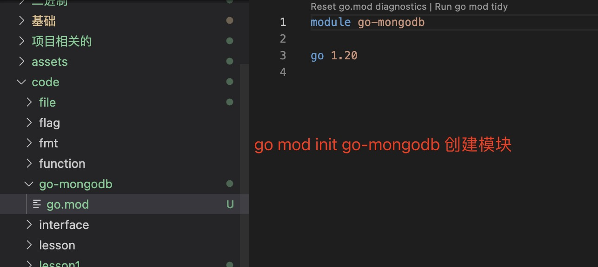
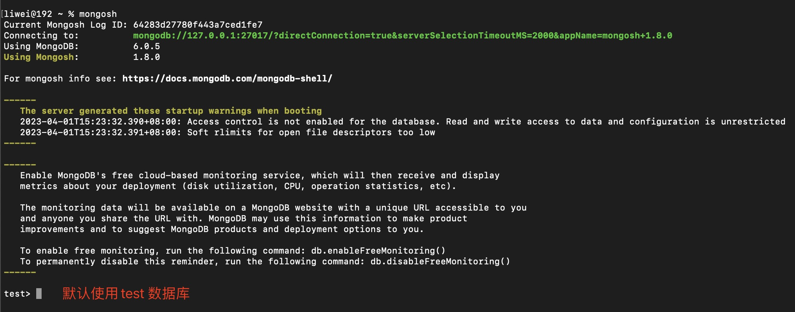

1. 在code 目录中创建go-mongodb 文件夹

2. 进入go-mongodb 文件夹，创建go.mod

    ```go
    go mod init go-mongodb
    ```

    

3. 添加mongodb 驱动

   ```go
   go get go.mongodb.org/mongo-driver/mongo
   ```

   > go 终端代理使用socks5,export http_proxy=socks5://127.0.0.1:10000

4. mongosh 客户端连接工具

   