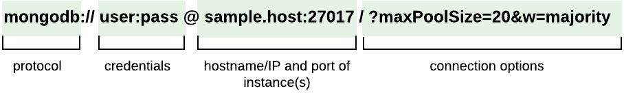

1. mongodb 连接url

   

   + maxPoolSize：连接池中的最大连接数。默认值为100。

   + minPoolSize: 连接池中的最小连接数。默认值为0。

   + maxIdleTimeMS: 连接在被删除和关闭之前可以在池中保持空闲的最大毫秒数。

   + waitQueueMultiple:驱动程序乘以的数字maxPoolSize
 值，以提供允许等待连接从池中变为可用的最大线程数。

   + waitQueueTimeoutMS: 线程可以等待连接变为可用的最长时间（以毫秒为单位）。有关默认值，请参阅文档。并非所有驱动程序都支持此选项。

   > 选项配置链接：https://www.mongodb.com/docs/manual/reference/connection-string/#std-label-connections-connection-options
