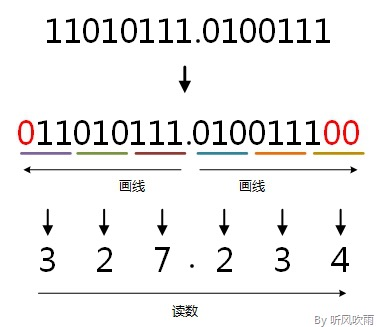
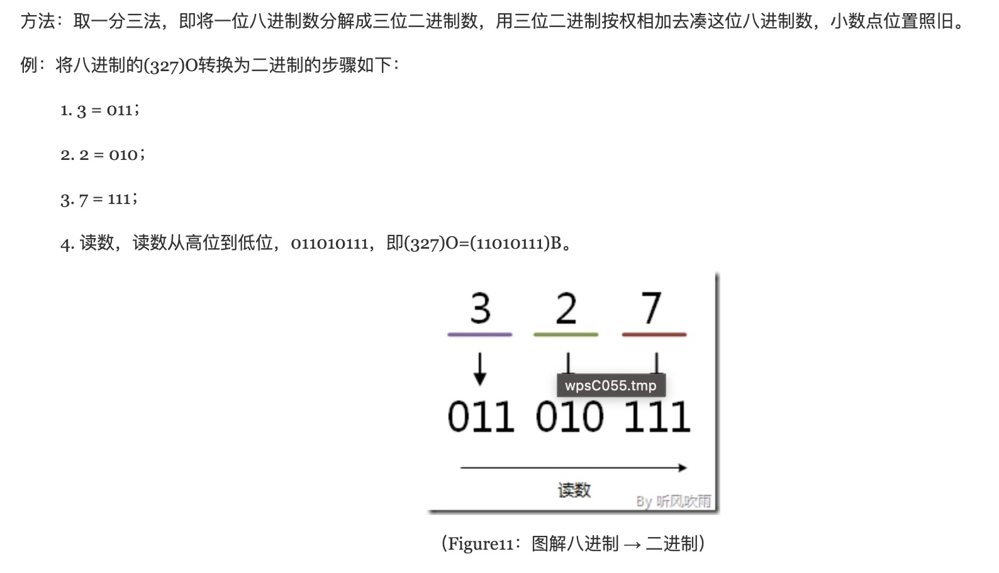

1. 二进制只能是0  和 1 

2. 八进制是0-7，不能出现8

3. 因为2的3次方=8，所以一个8进制数可以占三个位置

+ 二进制转八进制

   取三合一法，即从二进制的小数点为分界点，向左（向右）每三位取成一位，接着将这三位二进制按权相加，然后，按顺序进行排列，小数点的位置不变，得到的数字就是我们所求的八进制数。如果向左（向右）取三位后，取到最高（最低）位时候，如果无法凑足三位，可以在小数点最左边（最右边），即整数的最高位（最低位）添0，凑足三位。

   

+ 八进制转二进制

   每一位数分开三位，

   