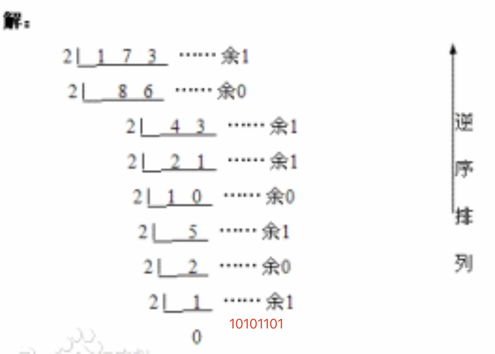
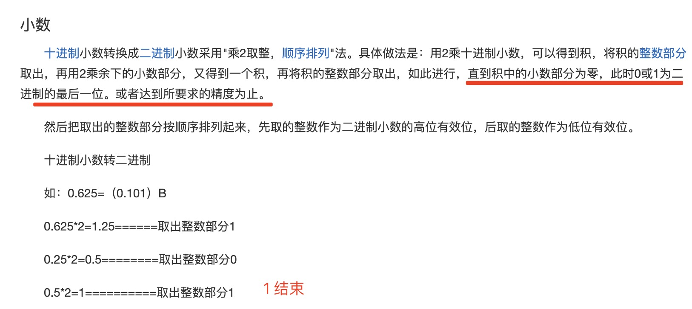
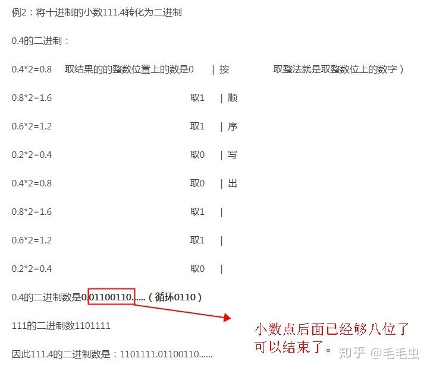
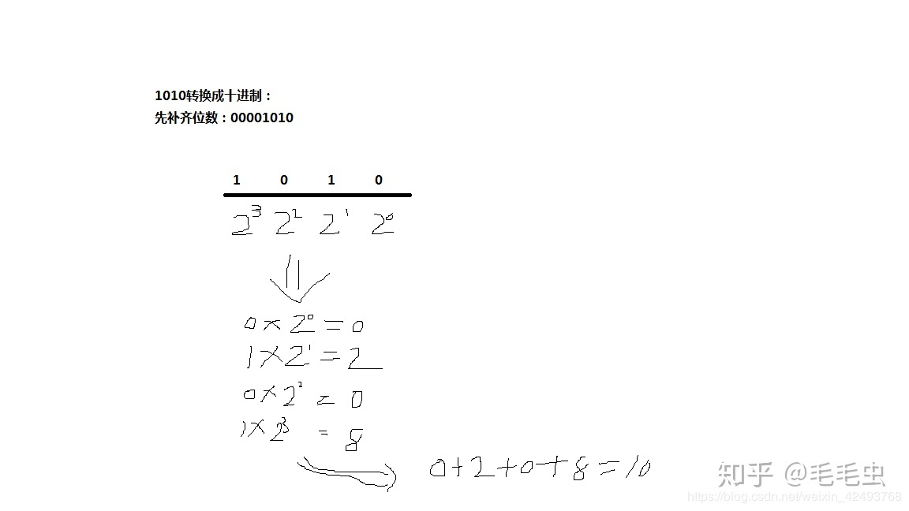
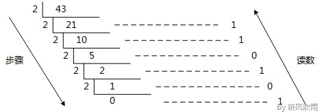
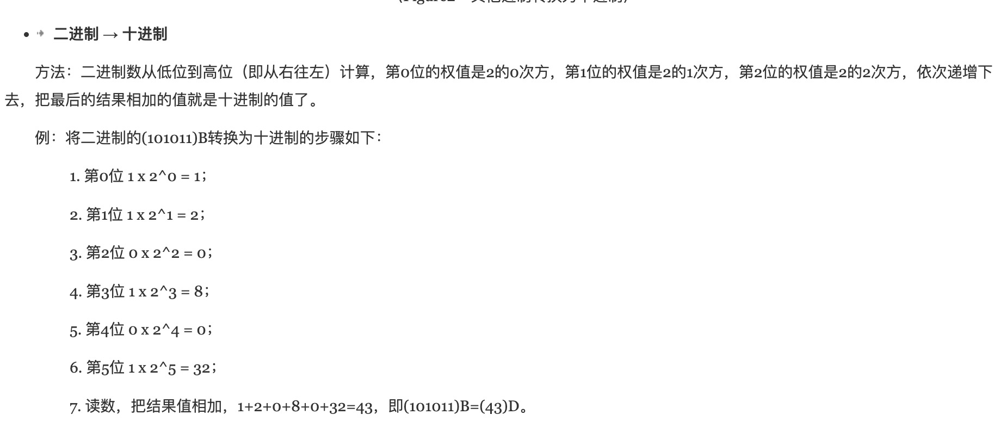
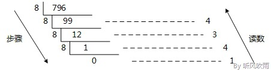
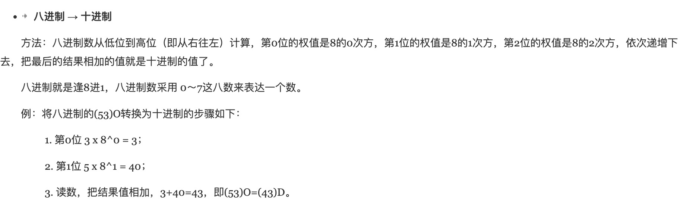
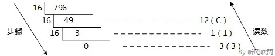
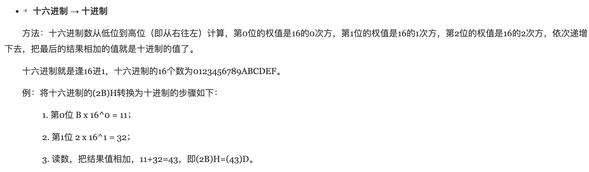

1. 十进制可以是任意数字

2. 二进制只能是0 和 1

3. 十进制转二进制： 使用除法，除以2一直到商为0，余数从下往上

   

   

   >`如果小数点位数乘以2一直不到0 或1 ，但是到8位即可停止`

   

4. 二进制转十进制

   

   小数部分使用2的负n次方，然后加起来

   

   

5. 八进制：只有0-7，没有8

+ 十进制转8进制

   

+ 八进制转十进制

   

6. 十六进制：0-9，a-f
   
   a 代币10，b:11,c:12,d:13,e:14,f:15

+ 十进制转十六进制

   

+ 十六进制转十进制

    