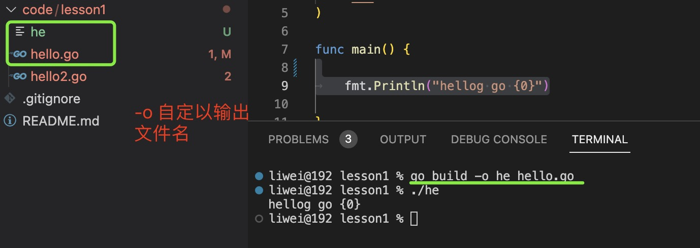
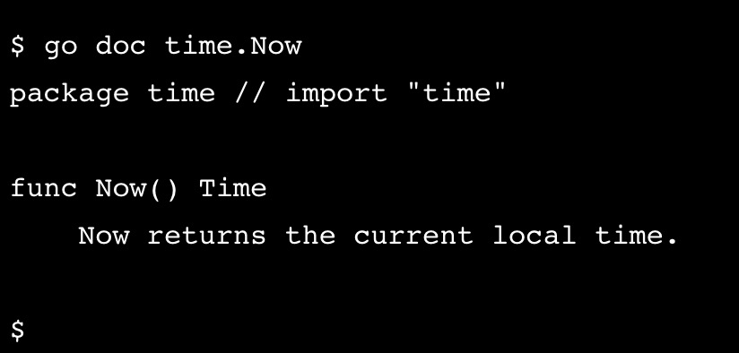

0. go 类似于node.js 的包管理网站https://pkg.go.dev/

1. go help

2. go mod init 初始化模块

        go mod init example/hello

   >go mod init命令创建一个 go.mod 文件来跟踪代码的依赖项

3. go run 开发时直接运行go文件

       go run main.go

      设置参数

       go run main.go -w 123 -flag(bool 类型true)

      设置环境变量

        export FOO=Hello go run main.go

        FOO=hello go run main.go

4. go build： 构建go 程序,打包成可以执行的二进制文件

   + 在linux 或者 Mac 上生成和项目名称相同的文件

        运行：

                ./application

   + 在window 上生成application.exe

             运行   application.exe
   
   + 使用参数 -o 自定义输出文件名字

         go build -o he hello.go

         默认情况下会输出名为hello 的二进制文件，但是-o 更改为名称为he 的二进制文件
   
      

5. go env 查看和设置go 的配置

   

6. go get 下载安装第三方库，代理使用socks5 格式

   ```go 
     // 安装godotenv 环境变量工具
   go get github.com/joho/godotenv
   ```


6. go install: 安装第三方依赖, 但是必须先试用go get 添加依赖到go.mod 中


7. go doc packageName ： 查看这个包的文档

   比如：

         go doc fmt

         go doc fmt.Println

   

8. go test 执行单元测试命令

9. go version 返回go 版本号