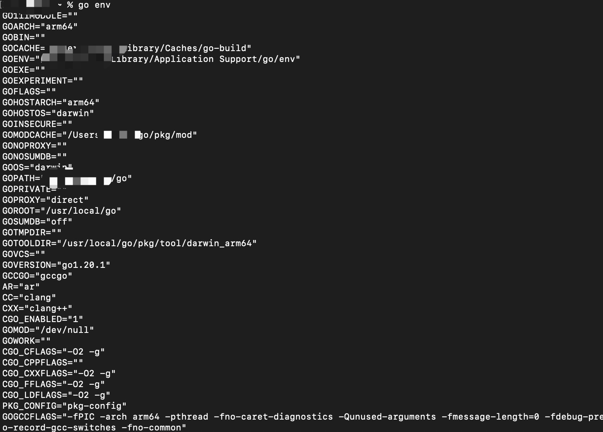

0. go 类似于node.js 的包管理网站https://pkg.go.dev/

1. go help

2. go mod init 初始化包名

        go mod init example/hello

   >go mod init命令创建一个 go.mod 文件来跟踪代码的依赖项

3. go run 开发时直接运行go文件

4. go build： 构建go 程序

   + 在linux 或者 Mac 上生成和项目名称相同的文件

        运行：

                ./application

   + 在window 上生成application.exe

             运行   application.exe

5. go env 查看和设置go 的配置

   

6. go install

