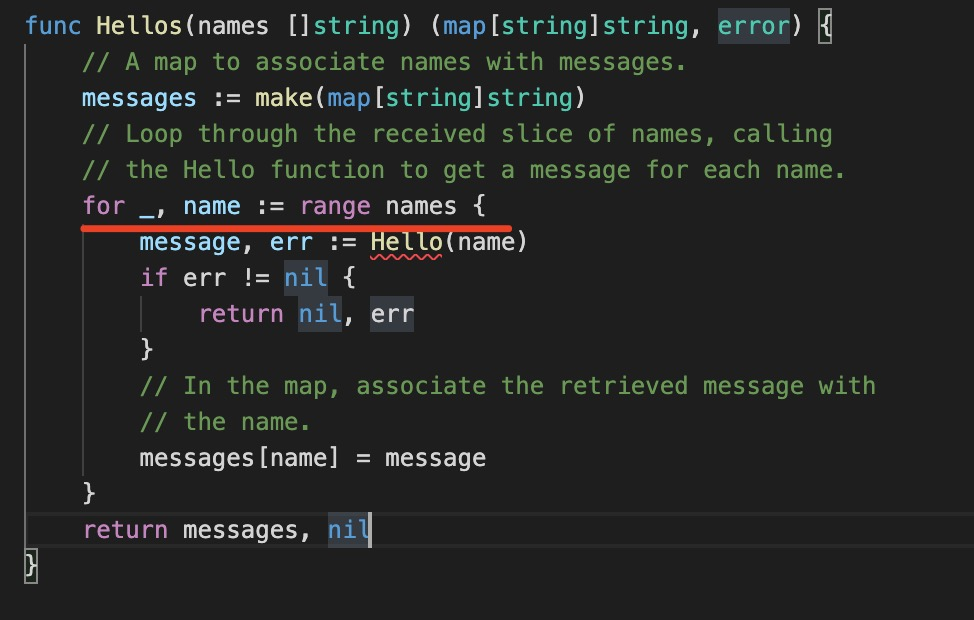

1. go 的后缀名为.go

2. go 每一个文件必须在一个包(package) 下

   一个文件夹下的所有文件同属一个包

3. go 有一个入口(根)文件，包名必须为main, 而且入口函数必须为main

    ```go
        package main

        import "fmt"

        func main(){
            fmt.PrintLn("hello go!")
        }
    ```

4. ***go 语言和其他语言不一样的地方，导入的包或者定义的变量没有使用，会报错编译不通过***

   

   

5. 注释

+ 单行注释： //

+ 多行注释：/* */

6. go 函数可以返回多个值

7. 在go中可以返回多个值，但是有时候不想要其中的某个值，可以使用_(单下划线) 接收这个值

   

8. go 区分大小写

9. go 是强类型语言

10. go 必须有一个入口文件(package main 包)和一个名称为maind的入口函数