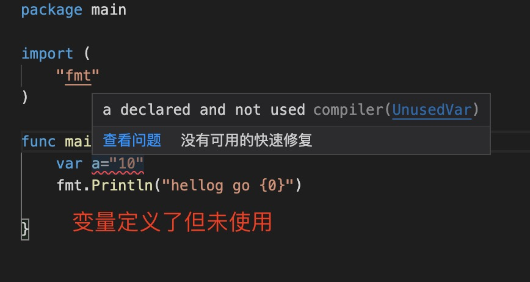

1. 

    ```go
        var message string 
        message = fmt.Sprintf("嗨，%v。欢迎！"，"name")
    ```
2. 在 Go 中，:=运算符是一种在一行中声明和初始化变量的快捷方式（Go 使用右侧的值来确定变量的类型）

    > ***注意：这种简写形式只能用于局部变量***

3. 变量定义使用var 定义

    ```go
        var 变量名称 <type>

        var name string

        var age int8
    ```

4. >***变量定义为使用，会报错，编译不通过***

   

5. var 定义的变量都有默认值，

+ int,float: 0

+ bool: false

+ string : ""