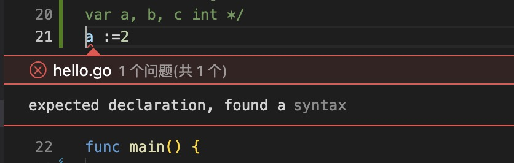

1. go 定义变量使用var

    ```go
        var message string 
        message = fmt.Sprintf("嗨，%v。欢迎！"，"name")
    ```


2. 在 Go 中，:=运算符是一种在一行中声明和初始化变量的快捷方式（Go 使用右侧的值来确定变量的类型）

    > ***注意：这种简写形式只能用于局部变量***

3. 变量定义使用var 定义

    ```go
        var 变量名称 <type>

        var name string

        var age int8
    ```

    两种形式定义变量：

    + 没有初始化值，使用类型定义默认值

            var name string // 默认值为“”
    
    + 使用初始化值

            var name string ="hello go!"
    
    + 使用初始值，省略类型，根据初始化值推断

            var name ="hello go"
    
      > `如果没有初始化值，则类型不能省略`

      

4. >***变量定义为使用，会报错，编译不通过***

   

5. var 定义的变量都有默认值，

+ int,float: 0

+ bool: false

+ string : ""

6. go 可以使用var 一次性定义多个

   

   

   

7. 在函数内部使用:=简短式声明变量

+ ：= 是var name = 的简写

      a:=2;

      var a=2;

+ := 使用简短写法，必须赋值

   

+ := 只能用于函数内部，不能在函数外部使用

   

+ := 可以声明多个

    

    >`:= 是 var 变量 = 的缩写，是变量的声明。声明过的变量不能再使用:=,不然会被认为声明变量`

    

+ := 声明多个变量时，必须保证左边至少有一个新的变量

    
    

