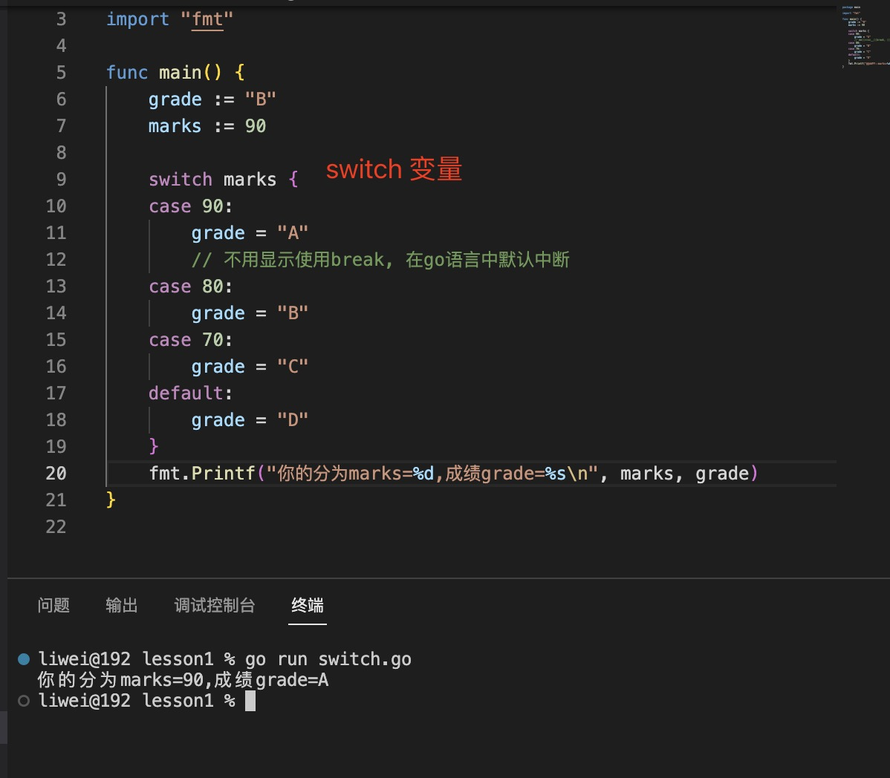
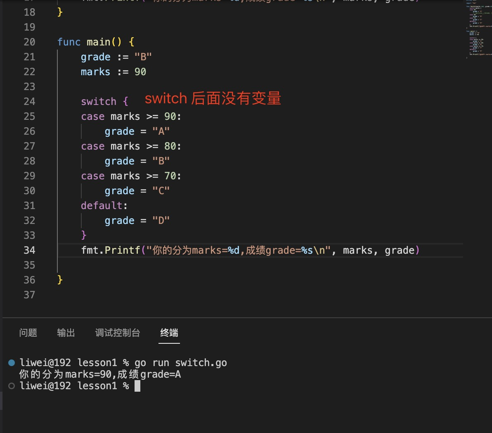
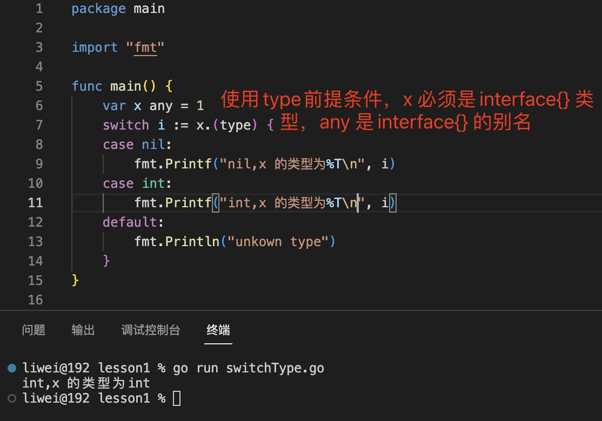

1. 在go 语言中与其他语言不一样的是，每个case 中不用显示用break 中断，go 语言中case 是默认中断的。

   >要想穿透case 必须使用fallthrough

   default: 默认语句

   >`switch语句同样拥有初始化子语句，和if一样均是写在关键字后面，只能有一句语句`

2. switch

+ 正常switch

   

+ 比较switch

   

+ 类型switch

   