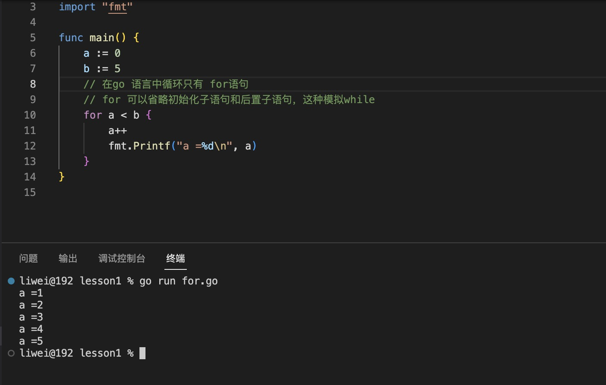
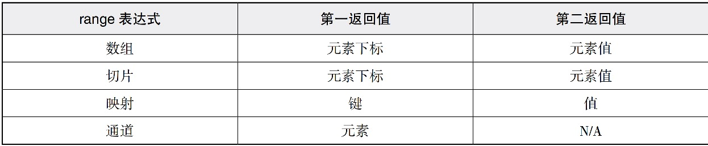

1. for 配合全局len() 返回长度

   在go 语言中循环语句只有for, 没有while 和 do..while

   可以使用 for 模拟while 或者do ... while

   >for 语句后面的三个子语句我们称为：初始化子语句、条件子语句和后置子语句，这三者不能颠倒顺序，其中条件子语句是必需的，条件子语句会返回一个布尔型，true则执行代码块，false则跳出循环。

   意思初始化子语句和后置子语句可以省略，类似while

   

   这种事以下方式的简写：

   ```go
    for ;a<b;
   ```


    

2. for   rang : 对数组，slice, map 等数据结构进行迭代

   

+ 数组和slice 返回下标索引和数组中的元素

        for index,value := range Array{
            // index 下标索引
            // value 每一个元素的值
        }

+ 

   