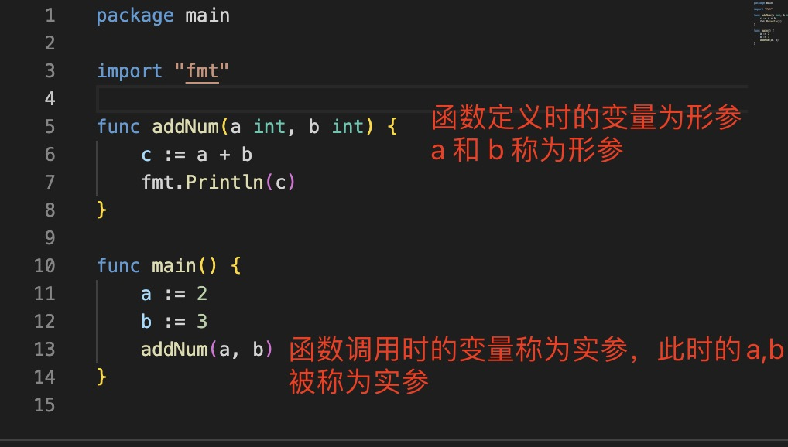
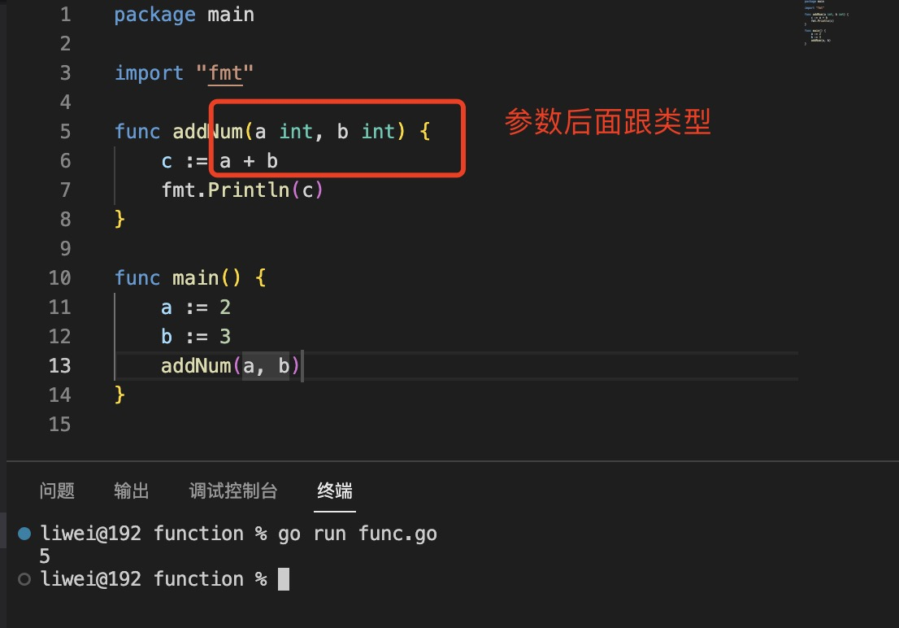
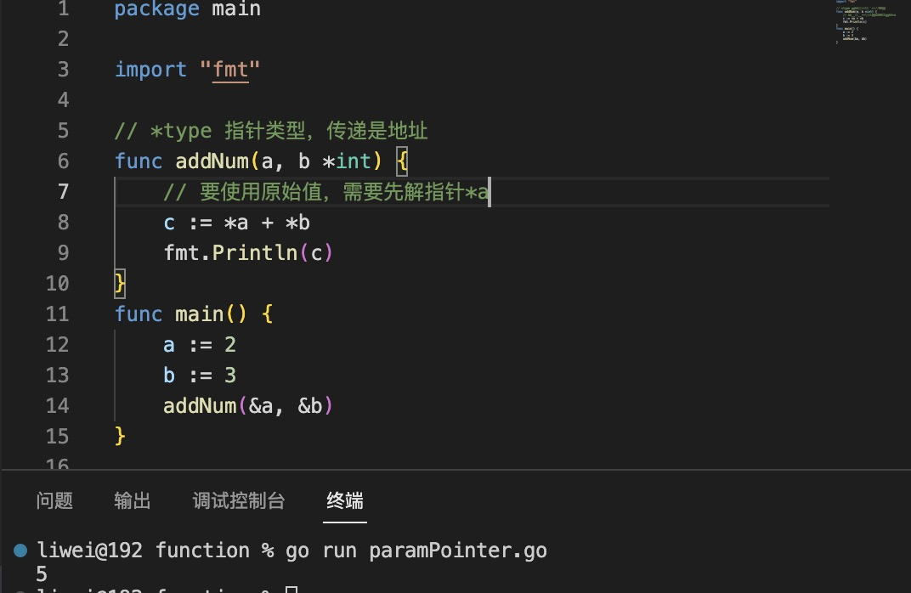
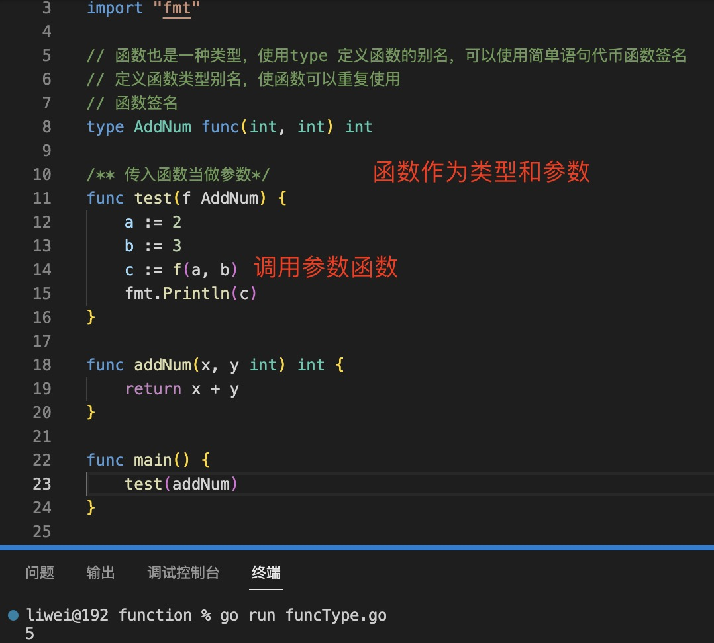
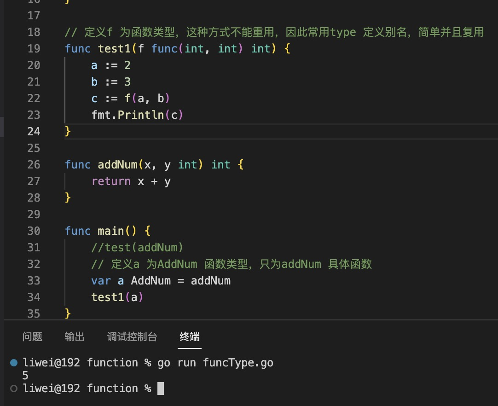
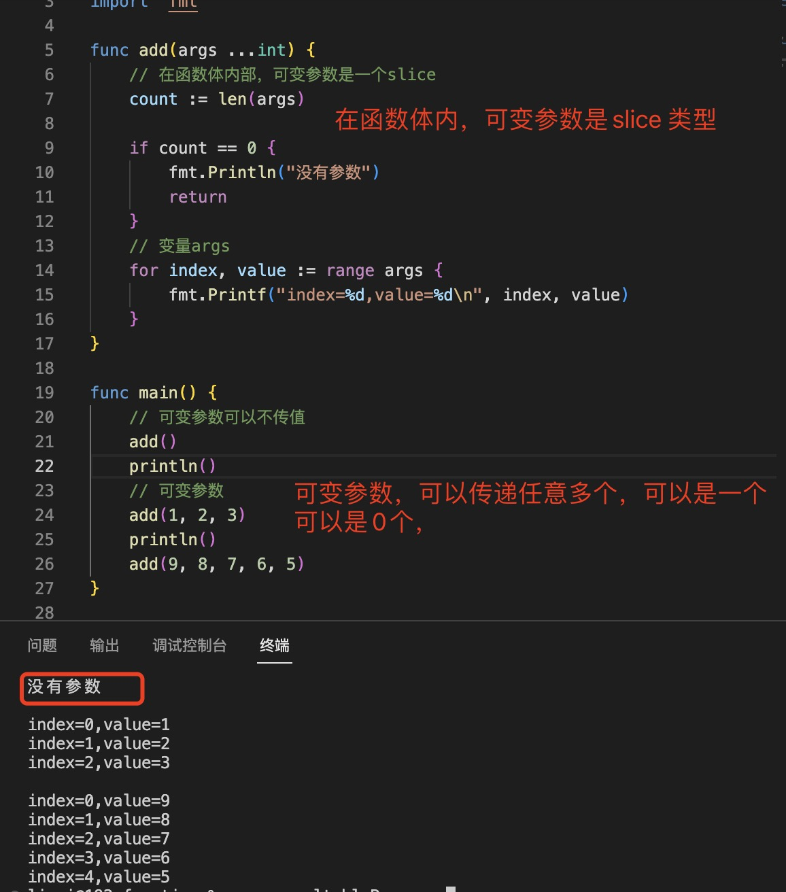
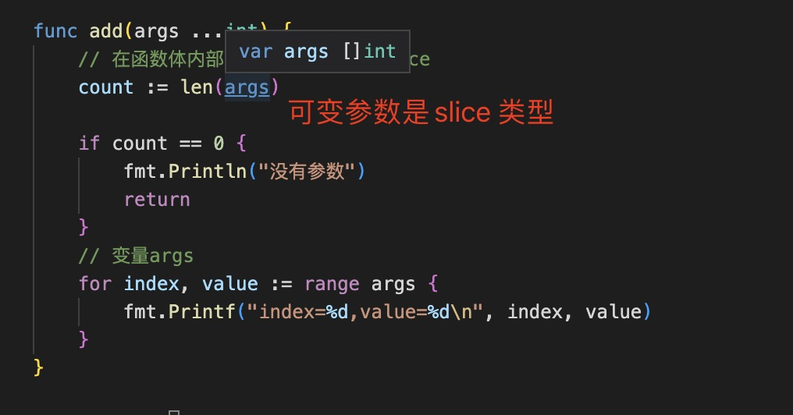

1. 形参与实参

+ 形参： 函数定义时的变量称为形参

+ 实参： 函数调用时的变量称为实参

2. 在go 语言中，函数可以有多个参数，每个参数后面带有类型

   

+ 如果相邻的若干个参数类型相同，可以使用简写，比如 x,y int

   

3. 在参数中使用变量指针

   

4. `函数作为参数`

   函数在go语言中也是一种变量

   

   

5. 可变参数，函数有着不定数量的参数在很多时候都会遇到。Go 语言函数支持可变参数（简称变参）

   在Go语言中，函数的最后一个参数如果是...type的形式，那这个函数就是一个变参函数，它可以处理变长的参数，而这个长度可以是0。注意的是在变参函数中，无论变参有多少个，它们的类型全部都一样。

   > 注意：`可变参数只能是最后一个参数，他们有相同的类型，长度可以是0`

   > 可变参数在函数体即{} 里面，是slice

   > 任意类型可以使用interface{} 或者别名any

   

   