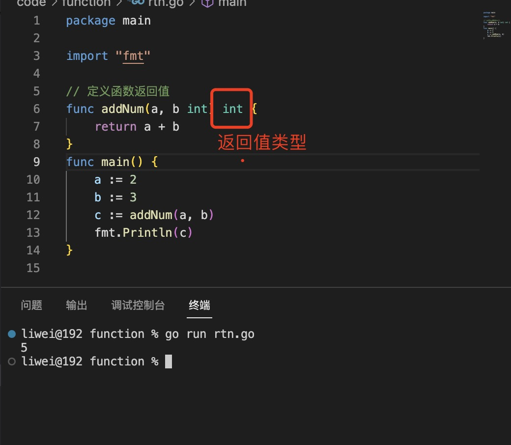
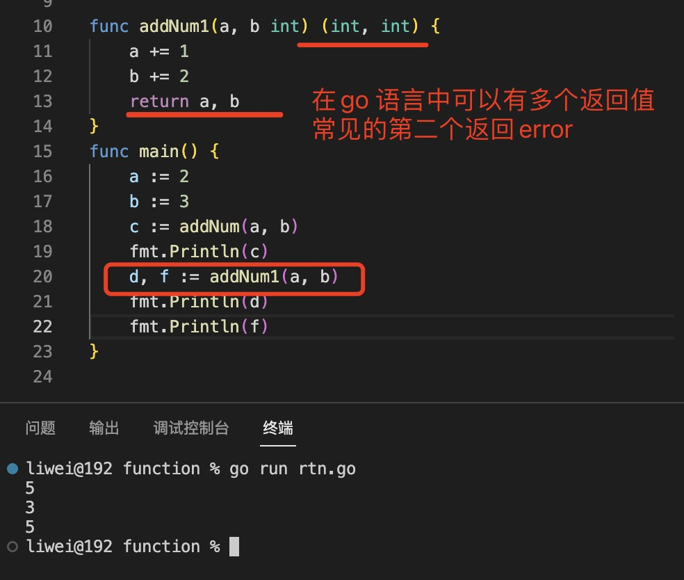
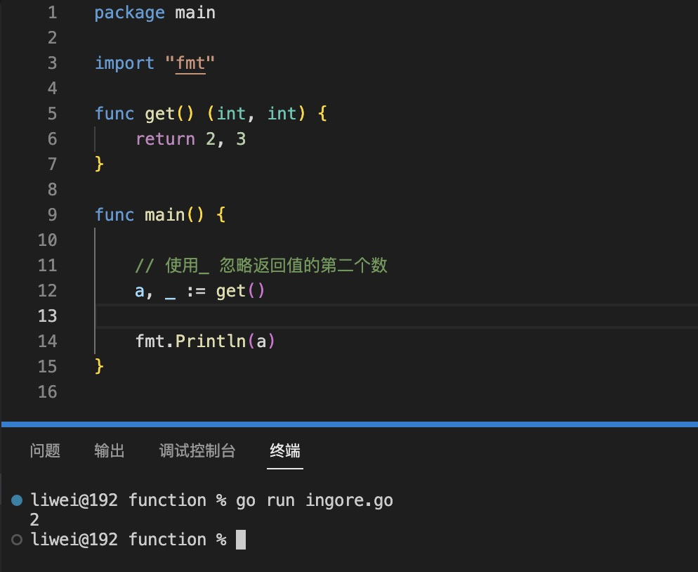
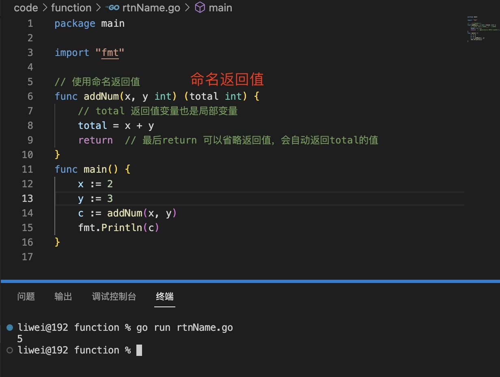
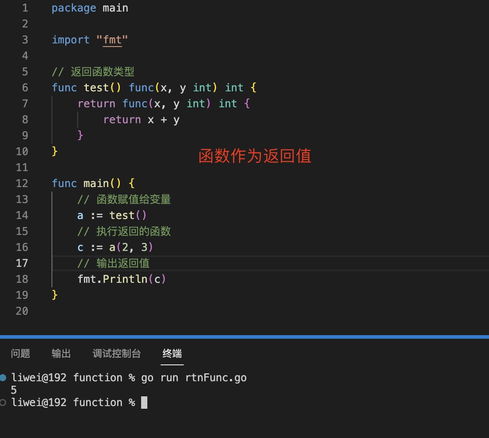

1. 函数返回值,需要先定义返回值的类型

   

2. 在go 语言中，可以返回多个参数

   

   > 返回多个值，如果有我们不需要的值，可以使用_(下划线忽略该值)

   

3. 命名返回，返回值亦可以使用命名的方式

   Go 函数的返回或结果“参数”可以命名并用作常规变量，就像传入参数一样。`当命名时，它们在函数开始时被初始化为其类型的零值`；如果函数执行return不带参数的语句，则结果参数的当前值用作返回值。

   

4. 返回函数类型：闭包

   

5. 