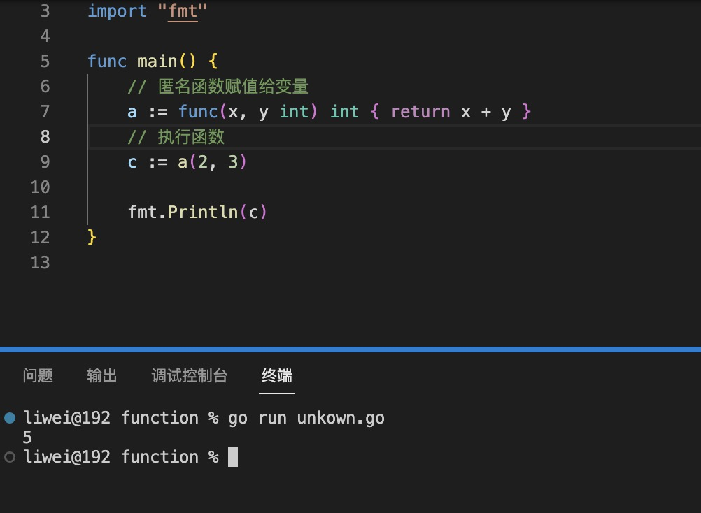
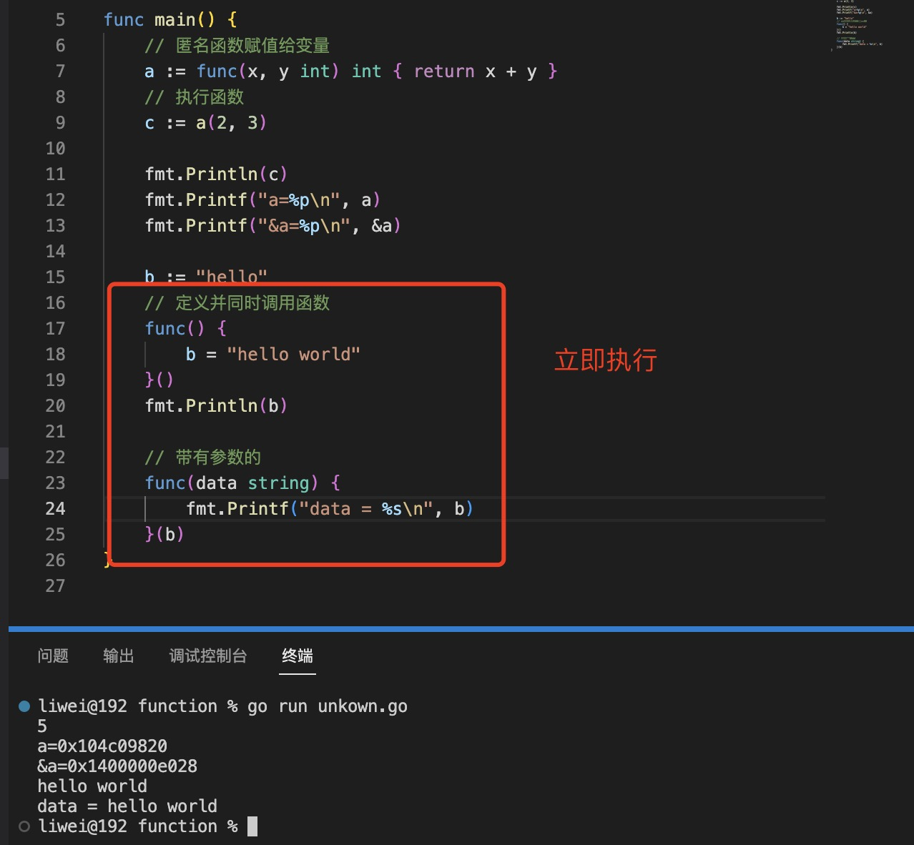

1. 匿名函数是指不需要定义函数名的一种函数定义方式

   匿名函数的调用有两种方式：

+ 将匿名函数赋值给变量

+ 定义并同时调用匿名函数


2. 将匿名函数赋值给变量

   例如：

   ```go
    func(x,y int) int{ return x+y }
   ```

   在这个函数声明中并没有命名函数名称，所以这样的一个函数不能够独立存在，但可以被赋值于某个变量，即保存函数的地址到变量中

   ```go
    a:=func(x,y int) int{ return x+y }

    c:=a(2,3)
   ```
   

   >参数列表的第一对括号必须紧挨着关键字 func，因为匿名函数没有名称。花括号{}涵盖着函数体

3. 定义并同时调用匿名函数

   

4. 用于defer

   