1. go 语言中的值类型和引用类型

+ 值类型：int,uint,float32,float64,bool, 数组，结构，rune,string

   值类型存储的是值

   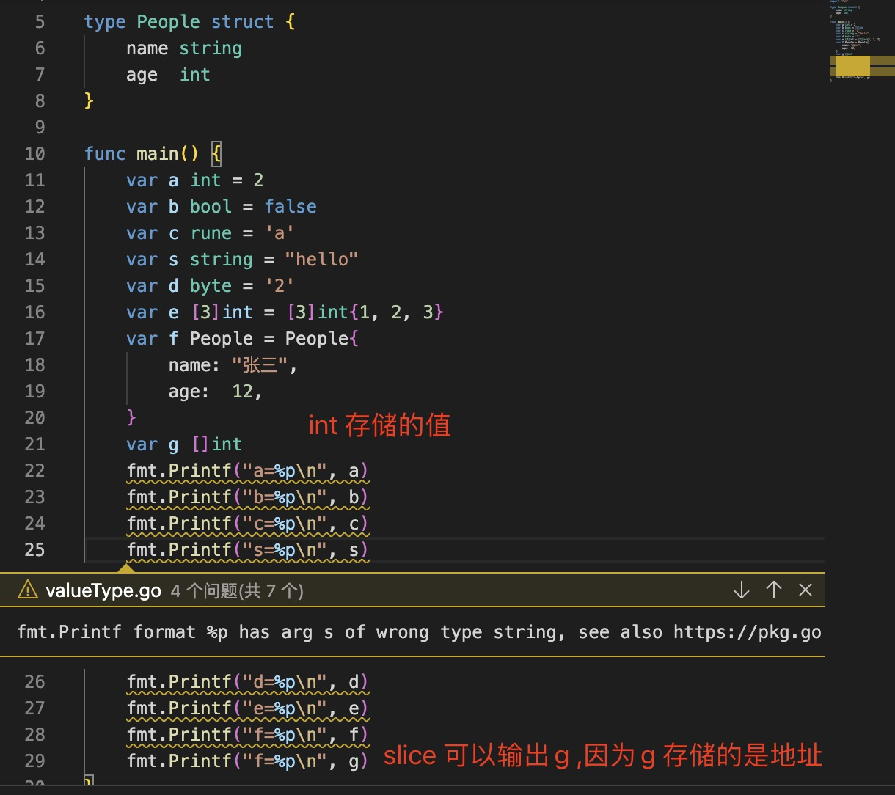

+ 引用类型：slice,map,interface,channel,func,指针

  变量存储的是引用类型的地址

  > `引用类型的零值是nil`

  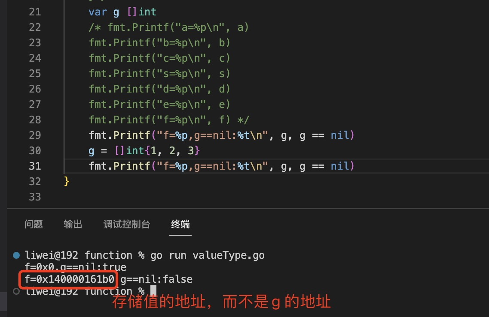

2. 在go 语言中，只有值传递，传递的是参数的副本。 但是不同的是·`值类型变量保存的是value, 而引用类型变量保存的是指向值的地址。`

 +  当副本是value 时，改变副本的值，并不会改变原有变量的值

    + int 类型
      
      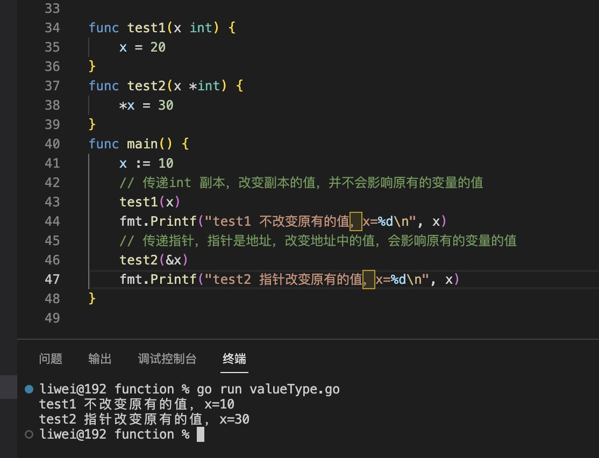
    
    + string 类型

      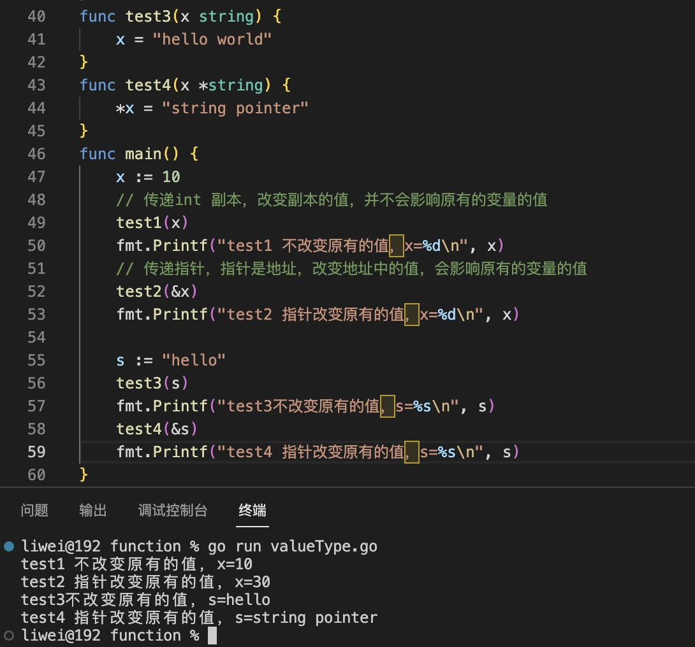
    
    + struct 类型

      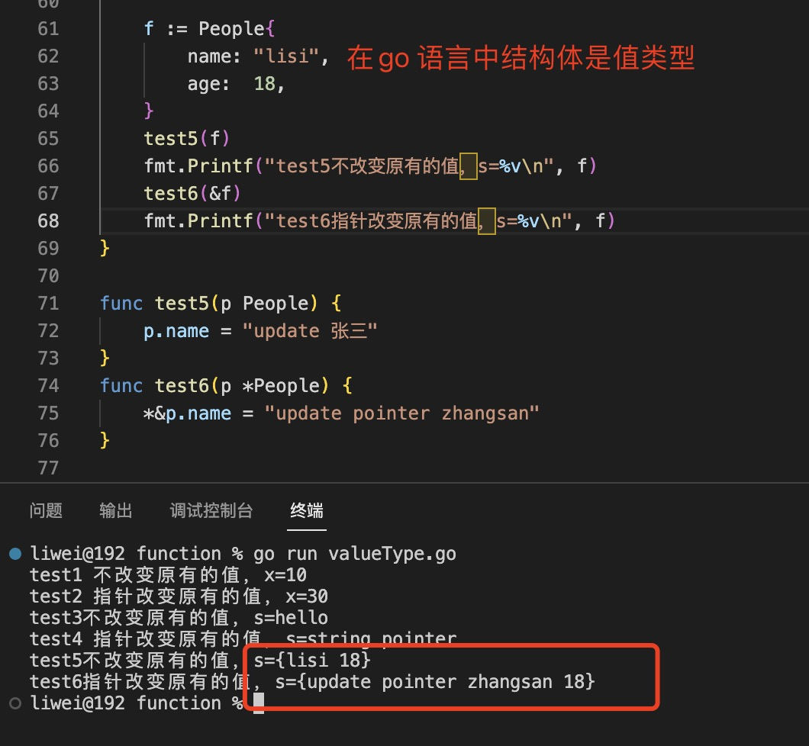

 +  当副本是 指向value的地址时，改变副本的值，会改变原有变量的值
    
    > `注意：这里说的改变指为改变其里面的元素或者属性，而不是重新赋值。重新赋值(=) 会重新分配新的内存地址，从而使参数和原来的参数断开了联系，实参与函数中的参数变量不在有关联`

    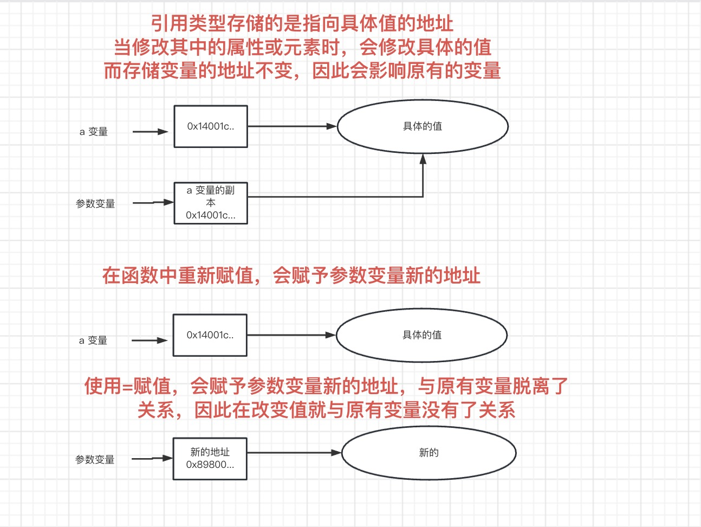

    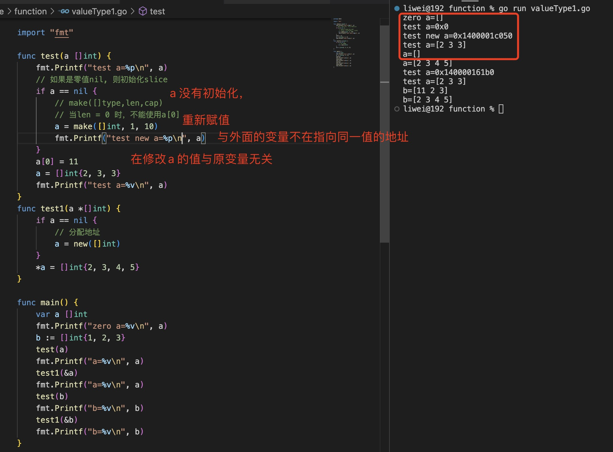

    当slice 有初始值：

    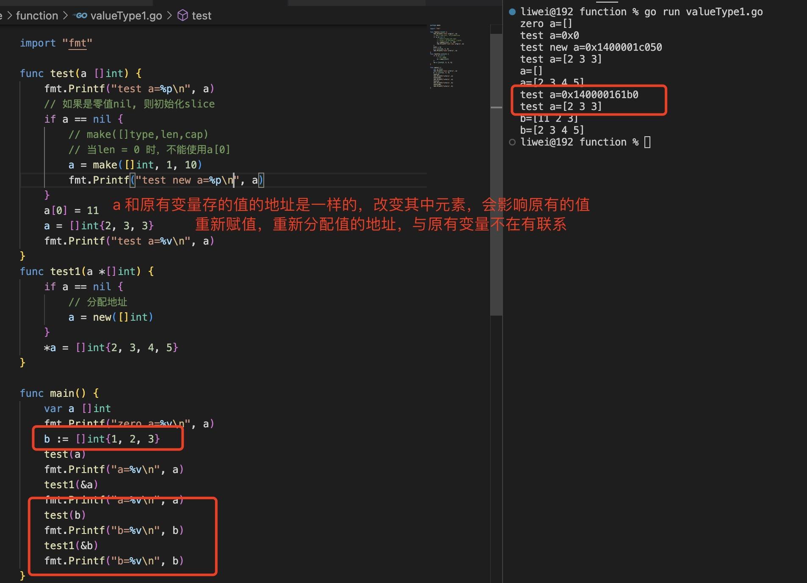

3. 指针是一个特殊的，而且在go 语言中，每种类型都有对应的指针类型，当传递指针时，传递的变量的地址，更改值会改变原有的值

   使用指针的好处：

  + “传指针使得多个函数能操作同一个对象”

  + “传指针比较轻量级（8B），毕竟只是传内存地址，可以用指针传递体积大的结构体。如果传递值，在每次创建副本上面就会花费相对较多的系统开销（内存和时间）。所以当要传递大的结构体的时候，用指针是一个明智的选择”
  
     > 参见结构体方法

+ “传递指针给函数不但可以节省内存（因为没有复制变量的值），而且赋予了函数直接修改外部变量的能力，所以被修改的变量不再需要使用return返回。”

   

  > `注意：指针是变量的指针，而不是值的指针。但是注意函数中使用new 重新初始化指针变量`

  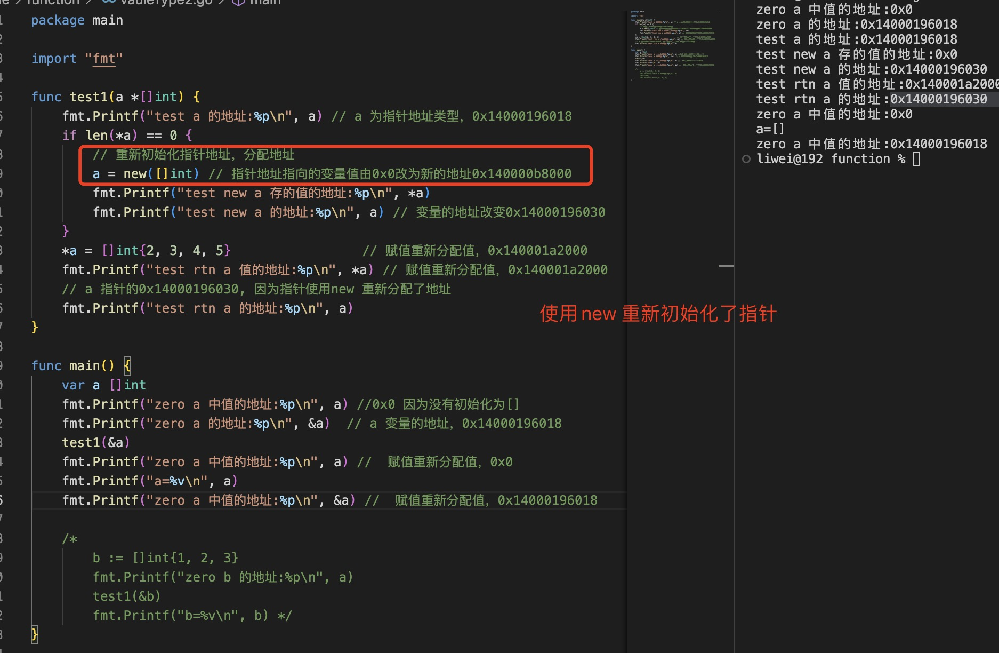

 + 没有重新初始化的情况：

   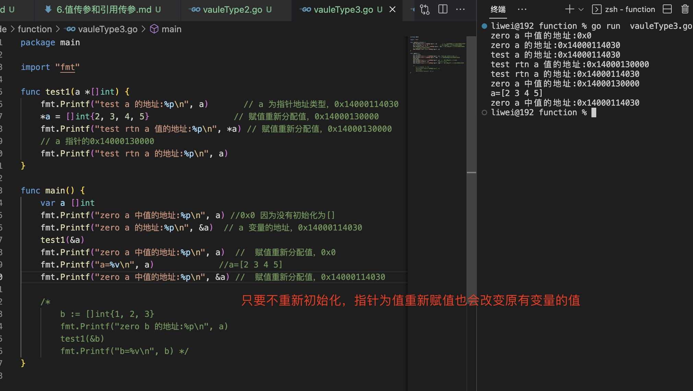

 + 改变变量属性值或元素值

   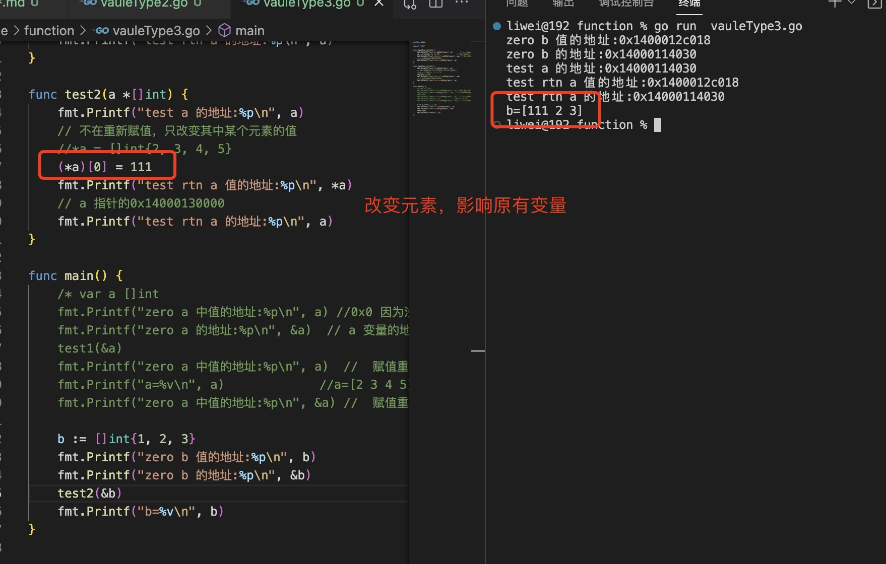
