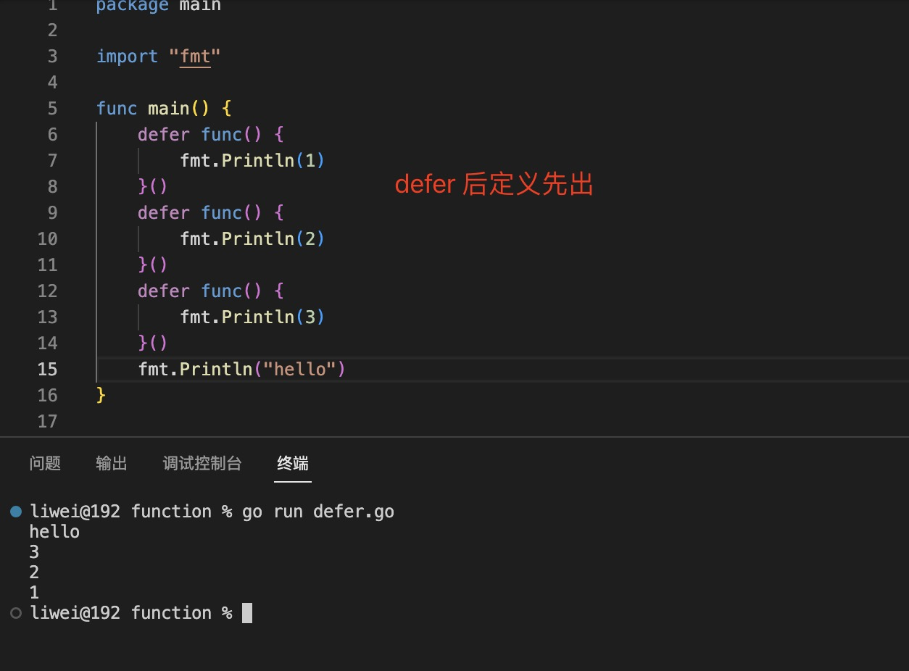
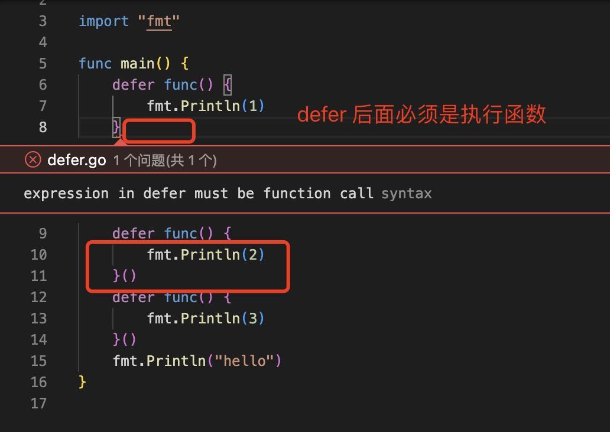

1. defer用于延迟调用指定函数，defer关键字只能出现在函数内部

     defer 后面的表达式必须是外部函数的调用，上面的例子就是针对 fmt.Println 函数的延迟调用。defer有两大特点： 
 
 + （1）只有当defer语句全部执行，defer所在函数才算真正结束执行。 
 
 + （2）当函数中有 defer 语句时，需要等待所有 defer 语句执行完毕，才会执行 return语句。 

    `因为defer的延迟特点，可以把defer语句用于回收资源、清理收尾等工作。使用defer语句之后，不用纠结回收代码放在哪里，反正都是最后执行`

2. 执行顺序，如果一个函数中有多个defer , 遵循后进先出的顺序，即后定义的先执行

   

   > defer 函数必须是立即执行函数

    