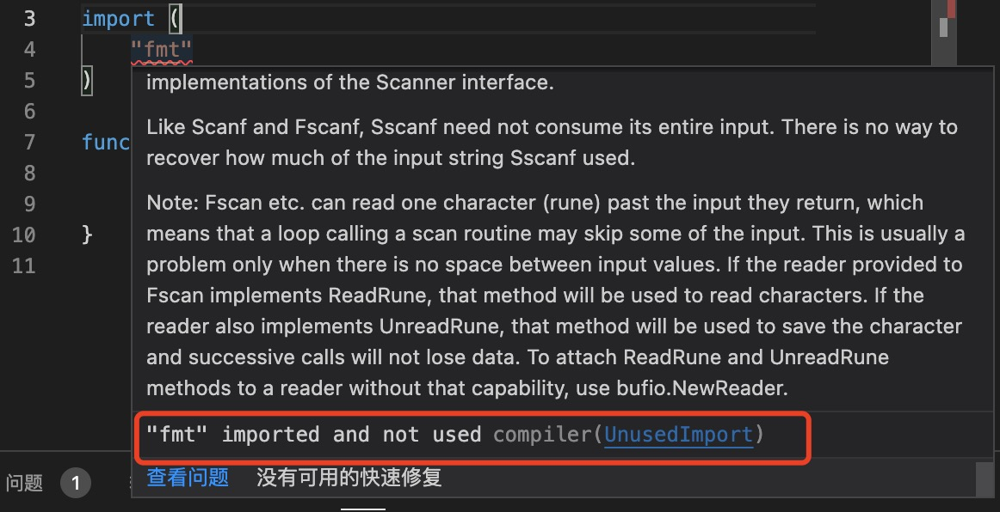

1. go 使用import 导入包, 导入的包名用引号("") 阔气来

   > 在go 中与其他语言不一样的地方，当导入的包未使用时会报错。

    

2. 单个导入包

    ```go

        import "fmt"

    ```

3. 导入多个包，用（）括号括起来

    ```go

        import (
	        "fmt"
	        "strconv"
	        "strings"
        )
    ```

4. 为包提供别名，解决包名相同的冲突.包的重命名不仅可以用于解决包名冲突，还可以解决包名过长、避免与变量或常量名称冲突等情况。


    ```go
        import (
             p1 "package1"
             "package2"
        )       
    ```

    p1  就是package1 的别名，后面就是用别名调用package1 中的成员

4. 导入包忽略包，只是为了执行包中的init 函数

   ```go
   import (
    _ "fmt"
   )
   ```

5. 使用相对路径导入包

   ```go

   import "./test"

   ```