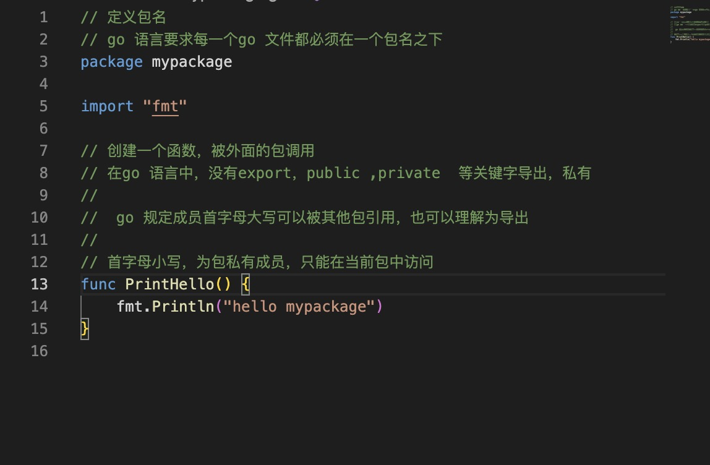

1. go 新版本引入了module 管理，Go module的引入，Go 项目可以位于文件系统上的任何位置，而不仅仅是 Go 定义的特定目录。

   > 以前go 版本要求go 项目目录必须在gopath 路径src 目录下，现在有了module 管理， go 项目可以放在任意位置

2. go module 使用go.mod 文件管理模块

    ```go
    使用go mod init 初始化go.mod 文件
    go mod init moduleName 
    ```

    

    go.mod 中还有require 和 replace 配置

3. 与标准的 Go 包类似，一个模块可以包含任意数量的包和子包

4. 创建一个go module 示例

+ 创建项目文件夹  module, 并初始化go.mod 文件

  

+ 创建main.go 文件，里面包含启动函数main() 函数

   

   > 起始文件名不一定要叫main.go ，但是里面必须是main 包，里面函数也必须是main 函数，起名叫main.go 方便一眼就知道这事main 入口函数所在

+ 创建一个新的模块，mypackage.go

   

+ 在main.go 中调用mypackage 中的方法

   通过module 名称/package名称

   

   