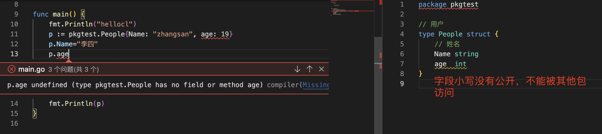

1. go 语言使用package 定义包

   go 语言规定每个文件必须处于一个包中

   > 在go 语言中，默认导出的成员(变量，结构，类型，函数等) 以大写字母开头的为导出，可以在其他包中调用

   >`注意：在同一个文件夹下不能有两个或者两个以上的package 名称，比如service 文件夹下的文件都同属一个package, package name 可以同文件夹名称相同，也可以不同，建议最好是相同的，这样看见文件名就知道引用的包名了。当出现问题时容易查找`

2. 结构体导出

+ 首先结构体名称首字母必须大写

+ 要导出的字段名首字母必须大写

  