1. go 语言中有字符的概念，为rune 类型，使用单引号括起来

   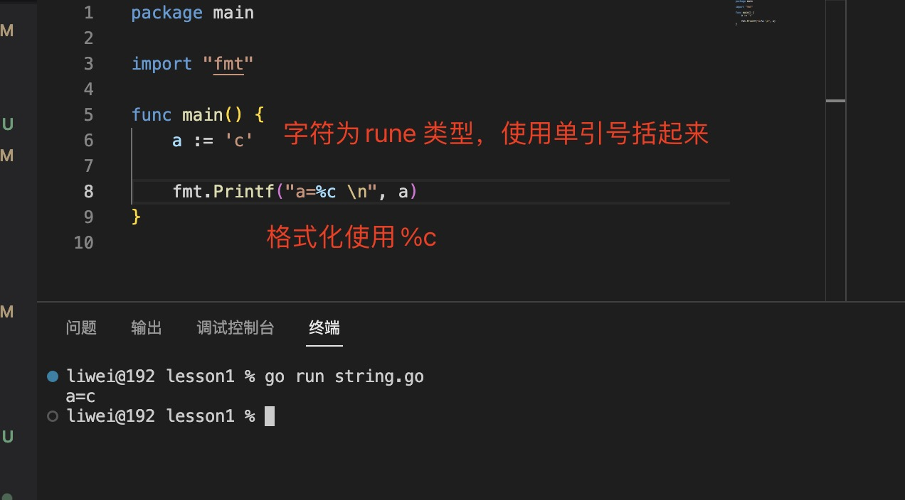

2. rune 字符类型格式化使用%c

3. 字符串使用 string类型标识，使用双引号括起来

   > string 的零值为空

   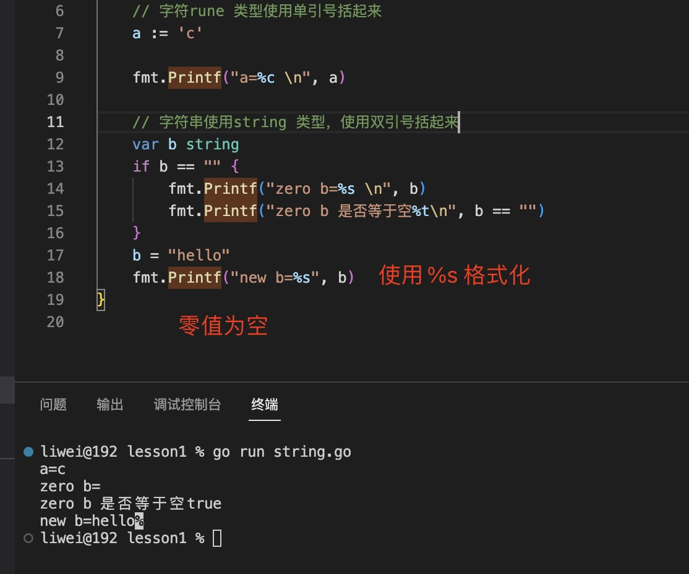

   > string 格式化使用%s

4. 字符串下标索引，获取字符，从0 到len(str)-1

   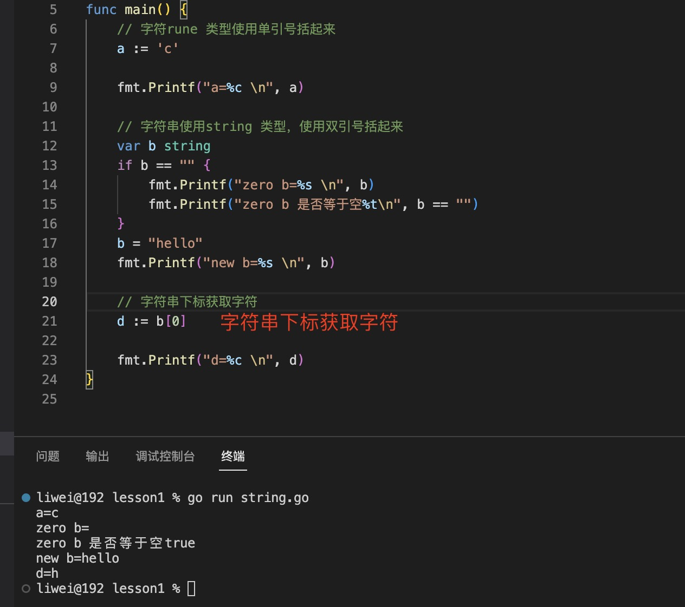

5. 字符串连接 使用+号

   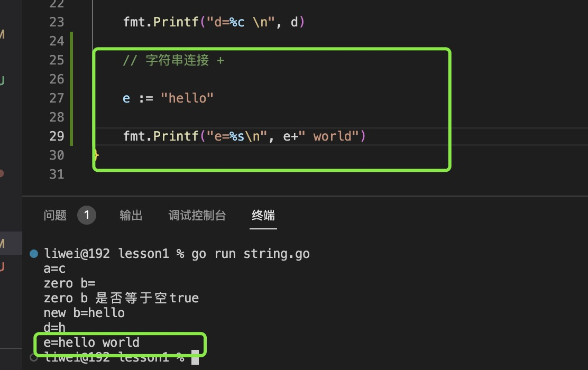

6. 字符串切片[i:j]（截取字符串）， 从下标0 开始截取字符串，到j 结束（不包括j）

+ 如果i 没有表示从0开始

  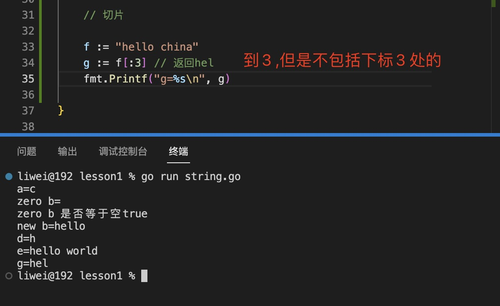

+ 如果j 没有标识从i 开始，一直到结束

  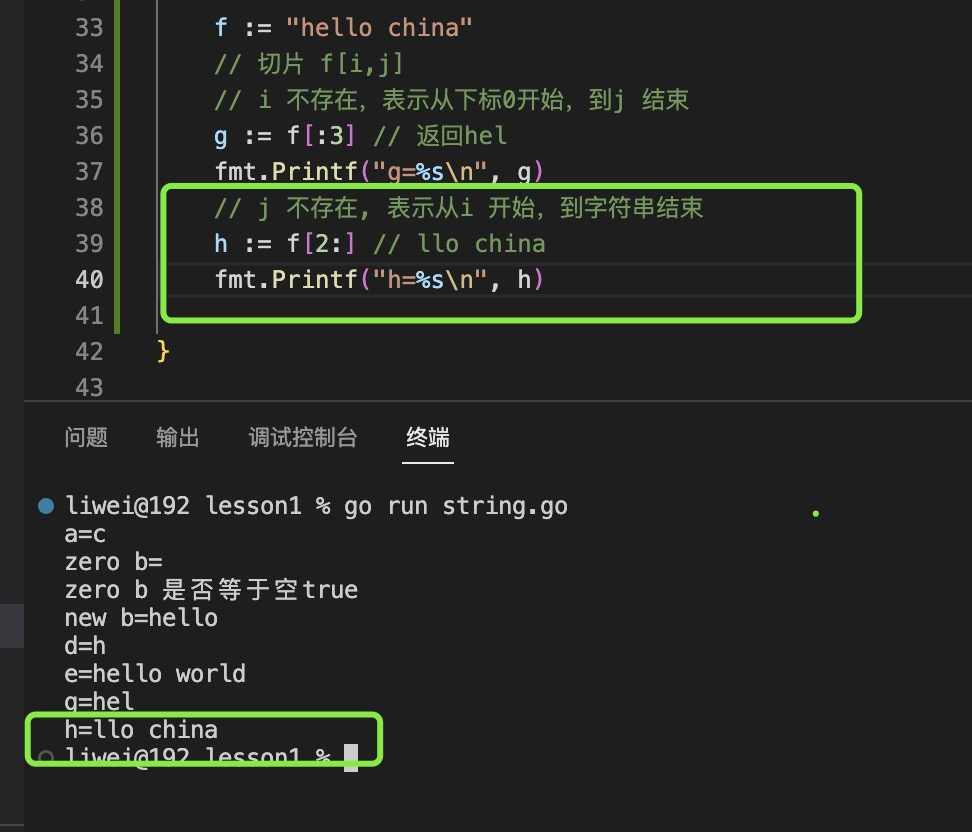

+ i,j 都存在，从i 到j(不包括j)

  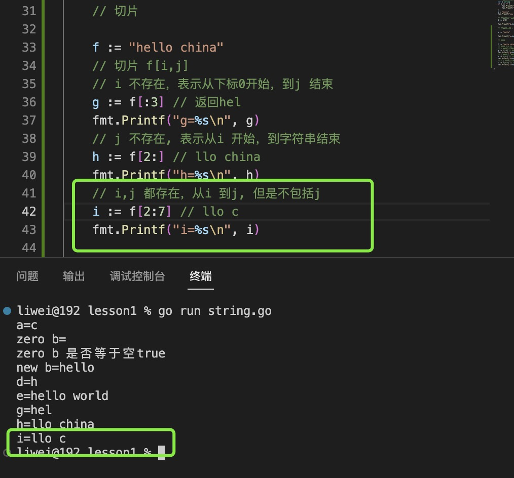

7. string 字符串的其他的操作，放到了strings 和 strconv 库中

8. 字符串和数字转换

+ 数字转字符串，使用strconv.Itoa

+ 字符串转数字哦，使用strconv.Atoi (A to i)

  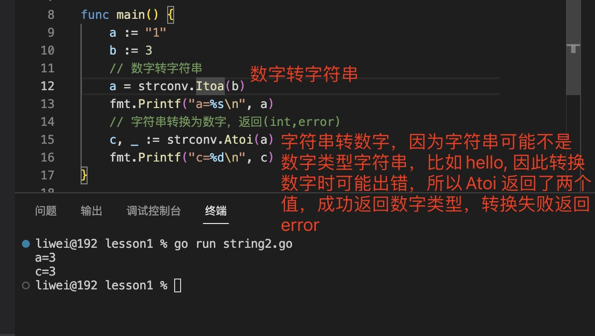

+ 数字转字符串，使用fmt.Sprintf

9. `在Go 语言中，字符串是可以使用==和＜等符号进行比较的，通过比较逐字节的编码获得结果`

10. 遍历字符串

+ 通过len 获取字符串长度，通过下标获取字符串

  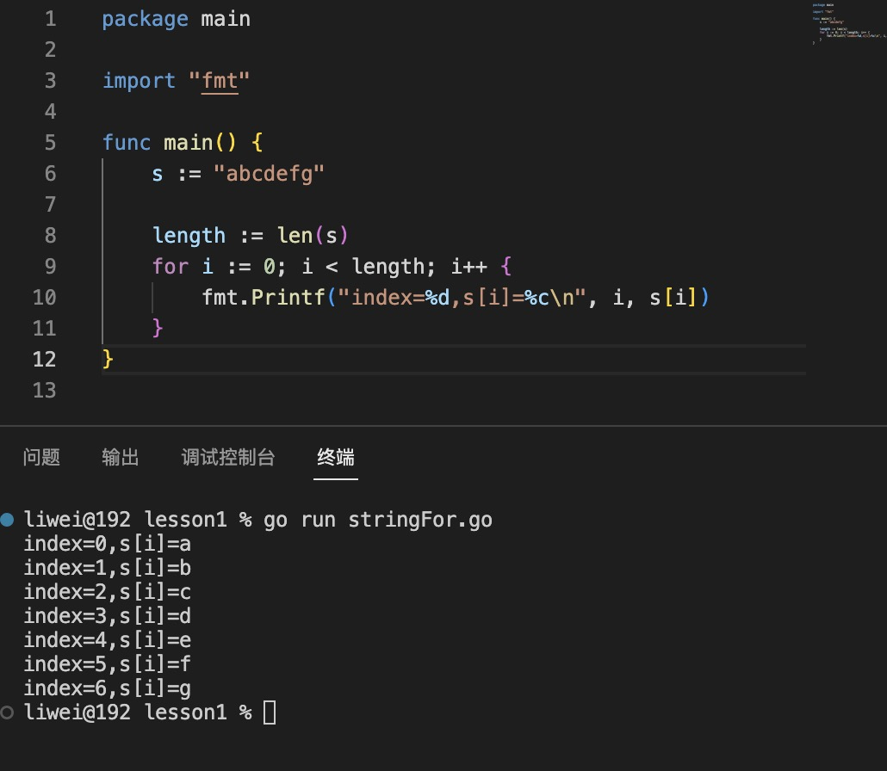

+ 通过for..range 遍历字符串

  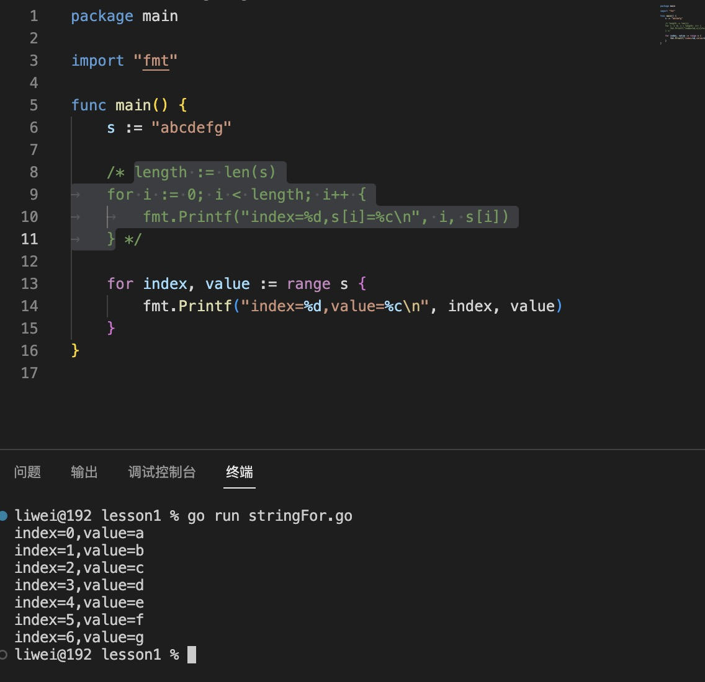
 
 11. 字符串内容不能修改，也就不能用 s[i]这种方式修改字符串中的UTF-8编码，如果确实要修改，那么可以将字符串的内容复制到另一个可写的变量中，然后再进行修改。一般使用[]byte或[]rune类型。 

  如果要对字符串中的字节进行修改，则转换为[]byte格式，如果要对字符串中的字符进行修改，则转换为[]rune格式，转换过程会自动复制数据。

   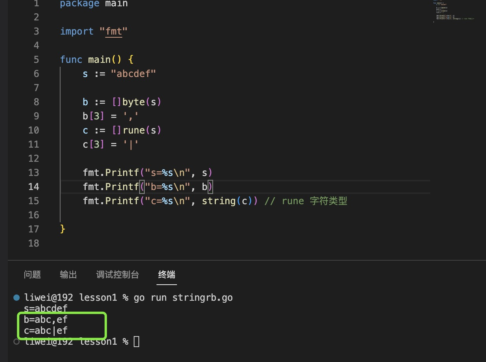

   > string 与 []byte 和[]rune 之间的转换
