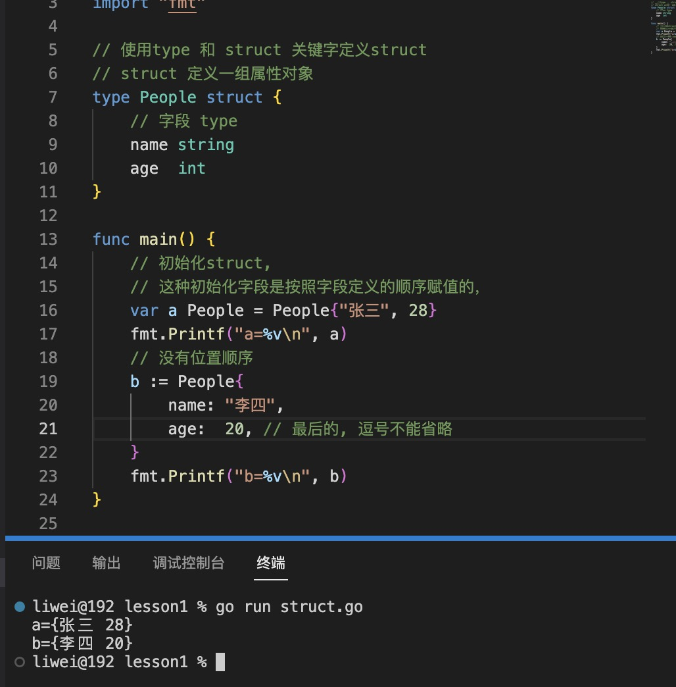
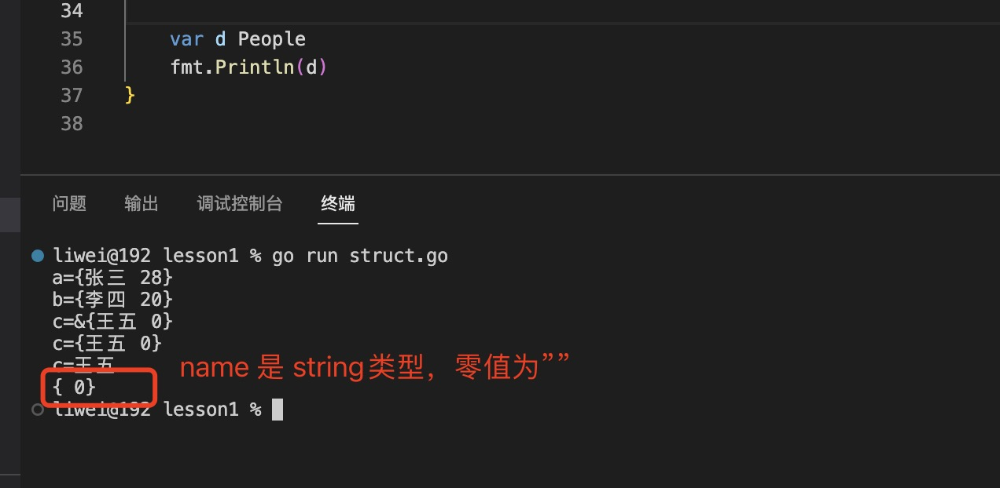
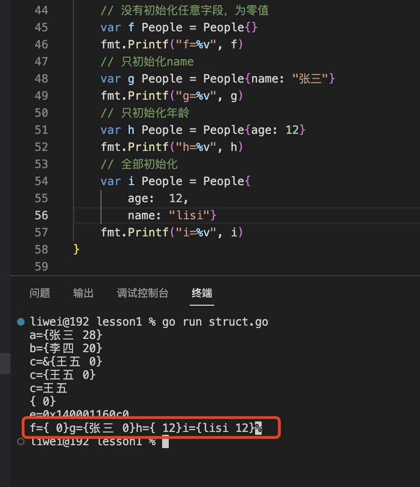
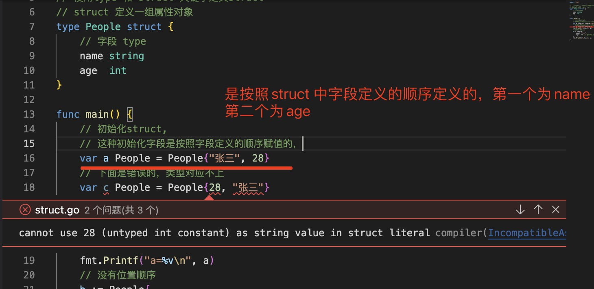
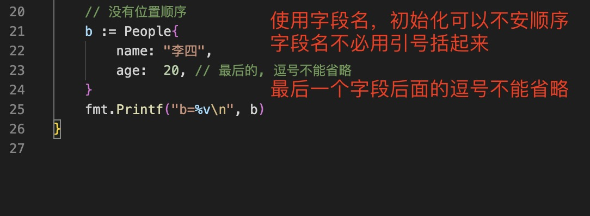
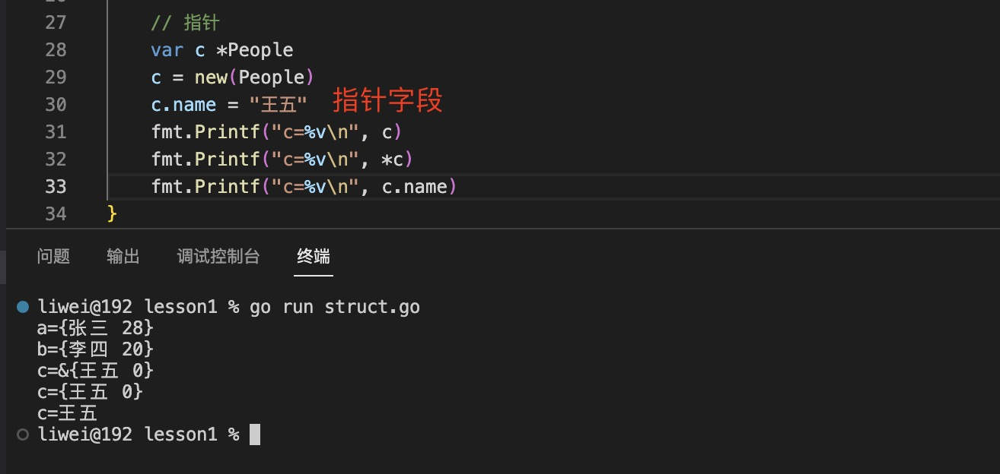
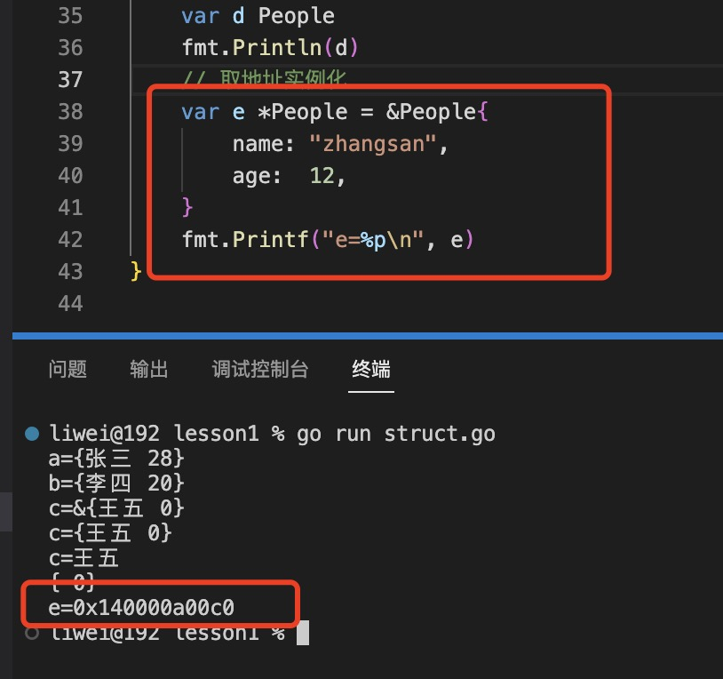
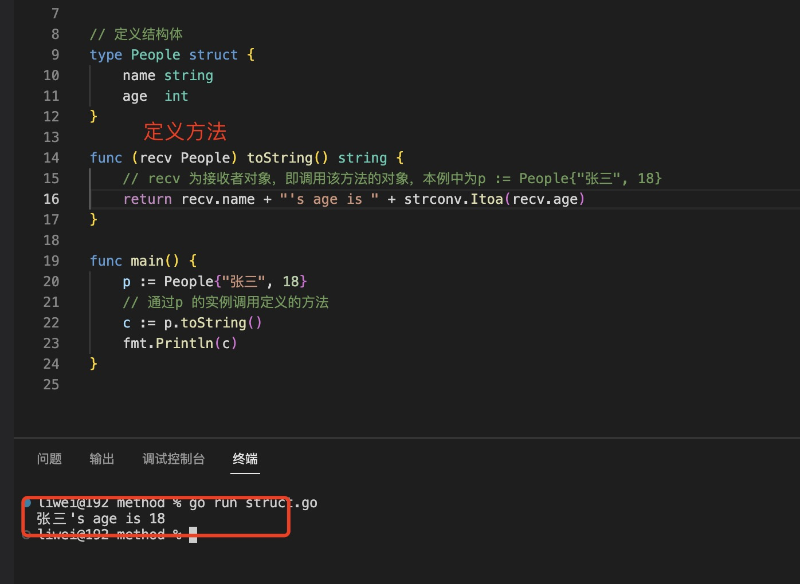
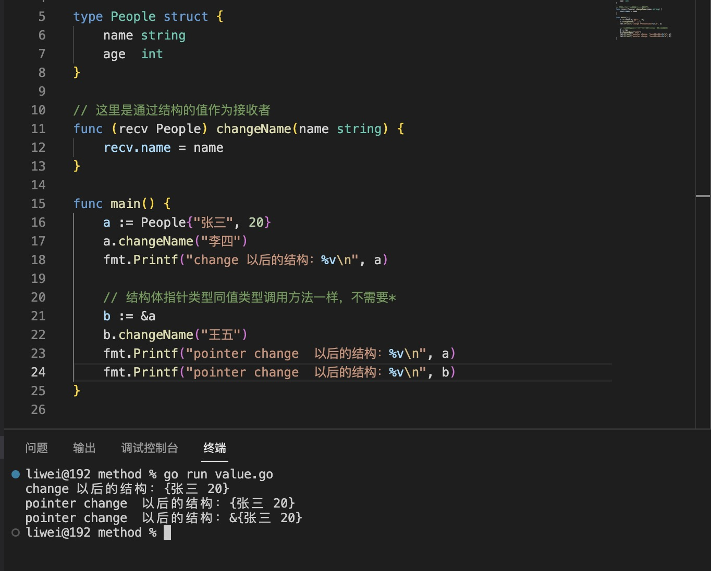
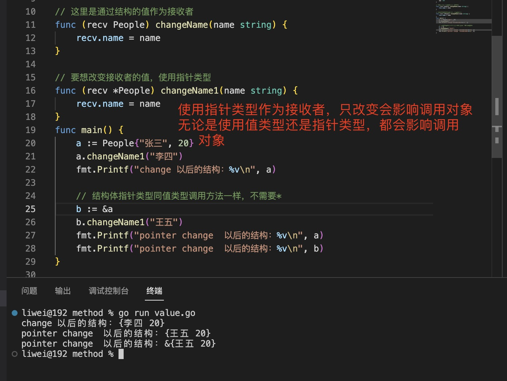

1. struct 使用type 定义

    ```go
      type structName struct{
         filed type
         filed2 type
      }
    ```
  

  > 零值： 字段的类型的零值
  
  

  > struct 是值类型

2. 初始化

+ 初始化可以不初始化所有字段

  

+ 使用字段定义位置顺序

  

  

+ 使用字段名

  

+ 初始化指针

  

  取地址实例化

  ```go
  var d *People =&People{
    name:"zhangsan",
    age:12,
  }
  ```
  

3. 访问字段

   > 无论使用那种方式实例化，就是指针都可以直接使用. 方式访问字段

   

   无论变量是一个结构体类型还是一个结构体类型指针，都可以使用相同的选择器符号（selector-notation）来引用结构体的字段
  
4. 方法：

   在结构体类型上可以定义两种方法，分别基于指针接收器和基于值接收器。显然，从之前的内容中得知，值接收器意味着复制整个值到内存中，内存开销非常大，而基于指针的接收器仅仅需要一个指针大小的内存。
   
+ 方法，`接收者也是方法中的一个变量，表示当前调用者对象`

  

+ 结构是值类型，当结构作为接收者时，默认是赋值结构的副本

  > 结构无论是值类型，还是结构指针，都可以通过. 访问字段或方法。

   

  > 接收者为值类型，方法里面多接收者进行修改不会改变原有的对象，无论调用的时候使用的是值类型的还是指针类型的结构体

  > 要想改变接收者的值，接收者使用指针类型

   

   