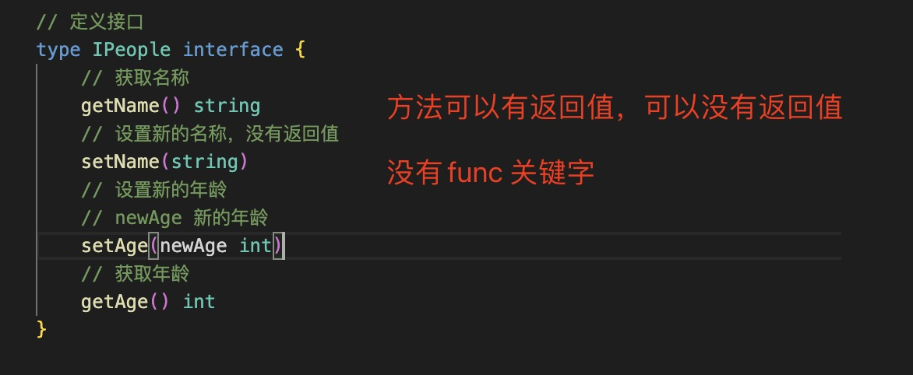

1. go 语言中接口与其他语言中的接口完全不一样。

   其他语言中，必须显示声明实现该接口

   接口定义方式：

   ```go
   type InterfaceName interface{

   }
   ```
   > 接口类型的零值nil

2. 接口中定义了一组方法，但是只有方法的声明，没有实现

   

3. interface{} 表示是任意类型

4. interface 类型变量有一个 变量.(Type) 

   ```go
    if t,ok:=iter.(int);ok{ // 如果该接口类型变量是int 类型，ok 则为true, t 是类型

    }
   ```
   

5. interface 变量.(type): 返回接口变量的具体类型

   

   一个接口可以有很多个结构或者其他实现该接口，而interface.(type) 返回了当前变量具体是哪个实现了接口，比如io.Reader ，实现了io.Reader 有string reader, byte reader, file reader ,网络连接Conn 等

6. 实现接口

   只要实现了接口中所有方法，就可以认为实现了接口

   

   > 如果是使用指针类型定义的接收者，那么使用接口时，也必须传递指针

     
   
   > 如果使用变量作为接收者，那么可以使用指针，也可以使用变量

      
   
6. 接口类型 被定义为一组方法签名，接口类型的值可以包含实现这些方法的任何值。

   接口类型用于变量或者参数，值是任何实现该接口的任意值

   

   > `注意: 如果方法使用的接收者是指针类型，那么对应实现接口的是该结构的指针类型`

   

