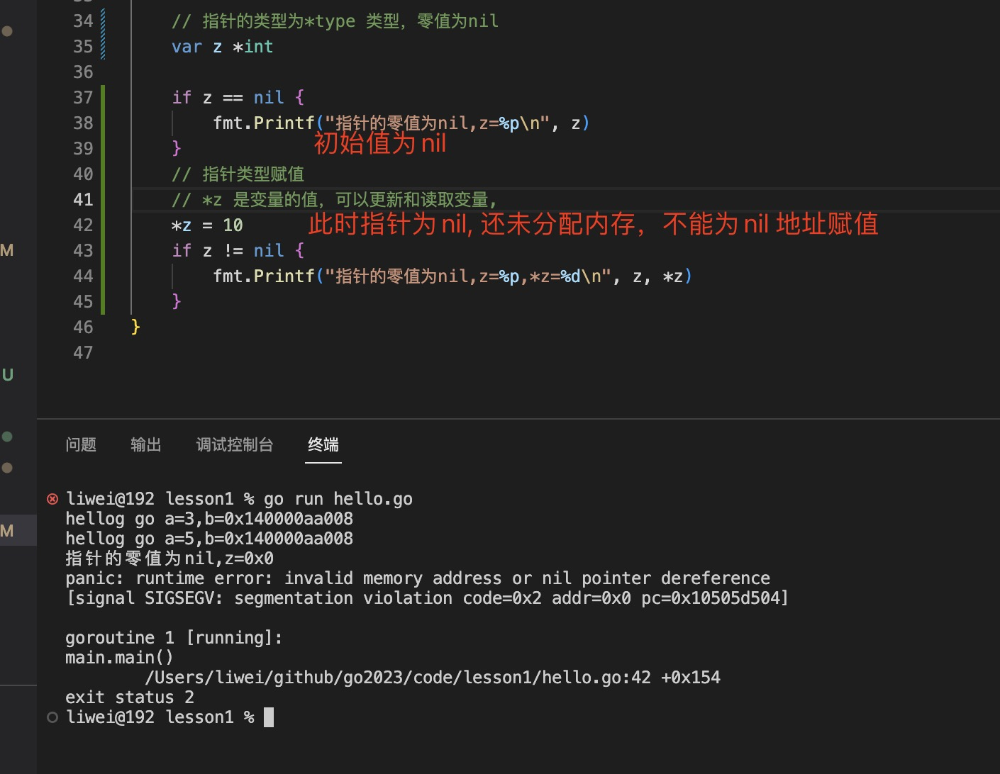

1. nil 是一个空值，表示尚未分配内存， 相当于其他语言类中的null,None,

   不能为nil 值做任何写入操作，比如空指针赋值

   

2. 判断一个变量是否nil

   ```go
       if err != nil {
       }
   ```

3. nil 类型是指针，slice,map,函数,的零值

   只能赋值给slice,map,func,interface,channel,指针