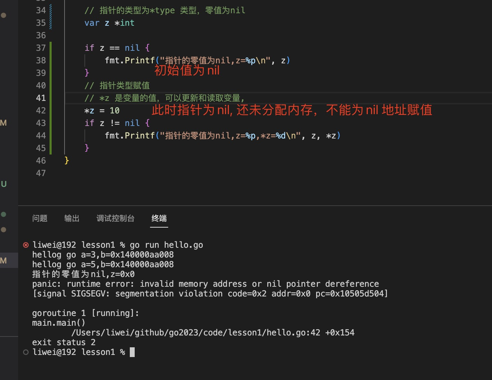
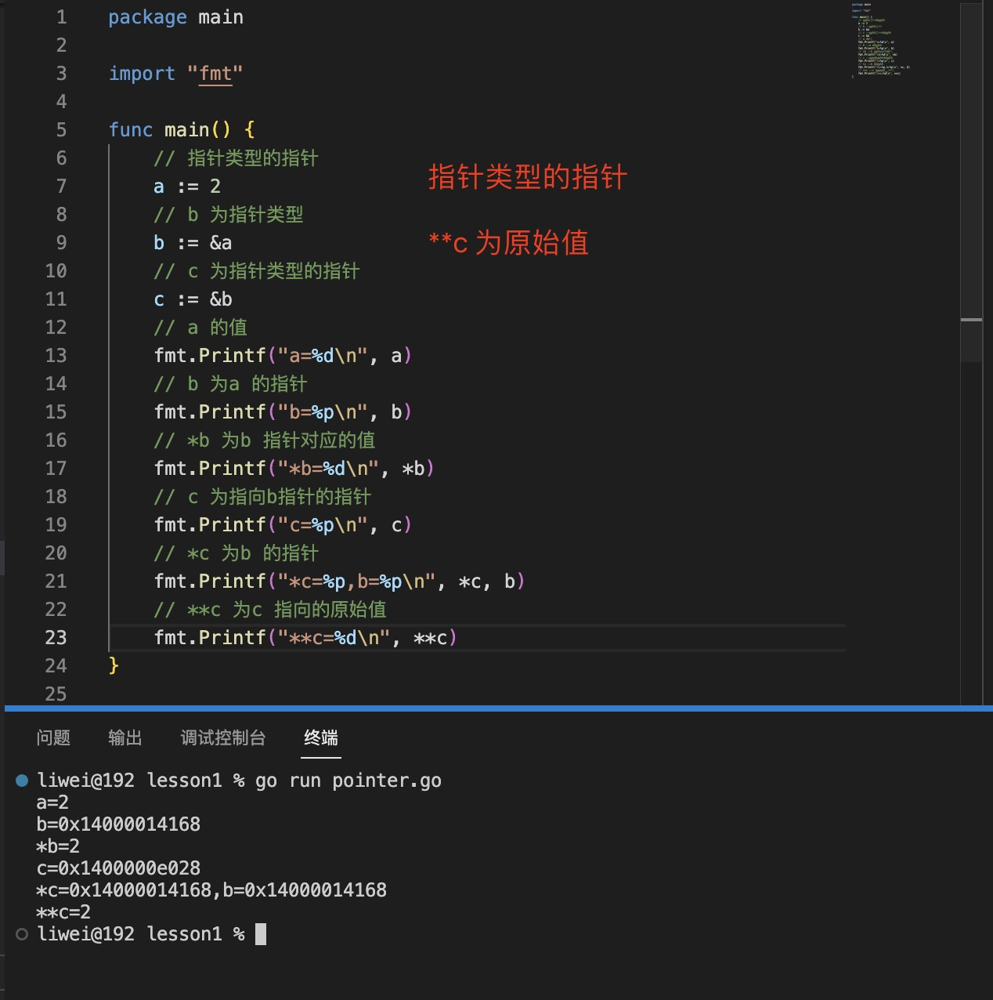
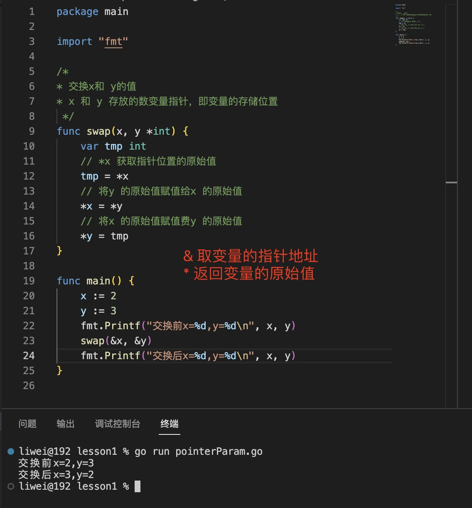

1. 指针指向变量的地址

   

   

   指针类型变量定义格式

   var name *type

   例如：

   ```go
    var name *int // int 类型的指针
   ```
   
   > 使用new 初始化指针，指针的零值为nil, 不能为nil 直接复制，可以使用new 初始化一个地址，然后在这个地址上存值

   ```go
    var a *string // 此时a 为nil
    a=new(string) // 初始化地址
   ```

+ &name: 指向name 的存值的地址

+ *name: * 获取指针类型的值

   

2. `指针的零值是nil, 指针是可以比较的，两个指针只有指向同一个变量，或者同时是nil 时才相等`

3. <span style="color:green">***指针类型使用 \*Type 定义, 比如int 型指针 \*int***</span>

   

   指针类型赋值，使用*p = 

   

   > 如果一个指针为空（nil）指针,不能直接通过*z 这种方式赋值，因为*z 只是取地址，不是重新分配地址，nil 的话系统还并没有给 *i 分配地址，所以这时给 *i 赋值肯定会出错

   解决办法：

   + 给指针分配一个新的地址

     

   + 使用z 赋值地址

     

4. 指针使用%p 初始化

5. 指针类型的指针

    ```go
    var b **int
    ```
    
    

6. 指针类型数组

+ 指针数组或slice

   ```go
      var name []*int // 指针类型slice, 其中每一个元素都是指针类型
   ```

   
   

+ slice 或数组的指针

   ```go
   var name *[]int // []int slice 的指针，name 是一个指针，原始值是[]int 类型的元素
   ```

   

7. 指针类型的参数

  

   > 指针类型的参数传递的是指针的地址，只有很短的一段十六进制数字。可以节省内存空间

   > 因为参数传递的是指针地址，对原始值操作会改变传入参数的值，可参照其他语言引用类型传递