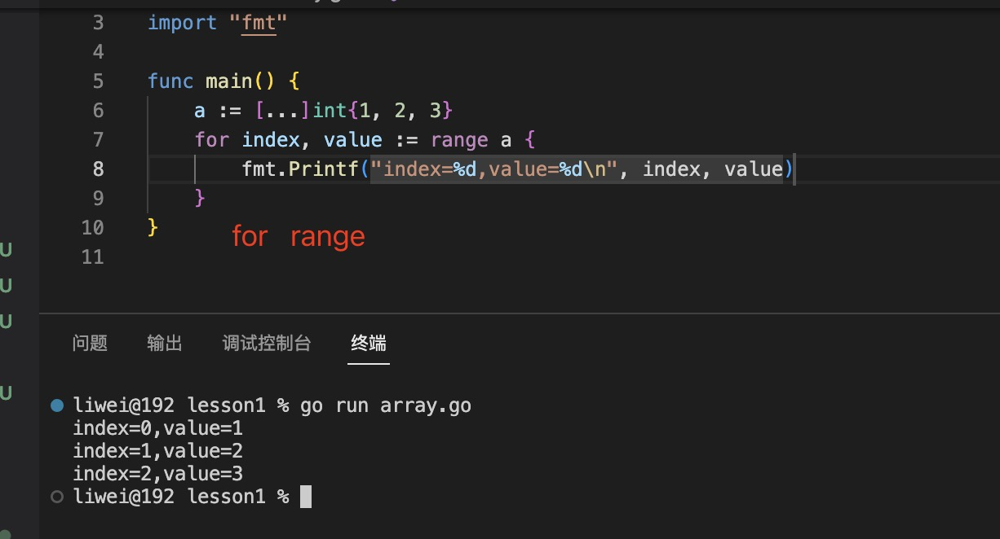

1. 在go 语言中，数组类型为固定长度的。数组类型是一组相同类型的集合，比如int,

   数组中的元素是相同类型，比如int 型数组，里面每一个元素都必须是int 类型的

   > any 和 interface{} 可以是任意类型

   > 数组类型是值类型，传递的是值的副本

   数组在使用前需先声明，声明时必须指定数组的大小且数组大小之后不可再变。

   > 定义

      ```
      var 数组变量名 [数组长度]元素类型

      var student [3]string
      ```

   > 数组定义时就知道了数组的长度，而且以后不可以改变，每一个元素的零值为数组类型的零值，比如int 类型，那么每一个元素的零值都是0

   + 如果使用...替代数组的长度，Go 语言会根据初始化时数组元素的数量来确定该数组的长度

   ```go
    array := [...]int{10,20,30,40}
   ```


2. 数组使用下标来读取和修改元素

3. 初始化数组

   ```
   var student = [3]string{"Tom","Ben","Peter"}
   ```

4. 使用len 返回数组长度

5. 使用for ... range 循环数组，返回索引和数组元素

   

6. 如果直接将数组作为函数的参数，则在函数调用时数组会复制一份作为函数参数。因此，在函数体中无法修改传入的数组的内容，因为函数内操作的只是所传入数组的一个副本。 

   如此一来，从内存和性能角度看，在函数间传递数组是一个开销很大的操作。特别是当这个变量是一个数组时，意味着整个数组，不管有多长，都会完整复制，并传递给函数（别忘了在函数之间传递变量时，默认以值的方式传递）。

   > 解决内存的问题使用数组的指针，只传递简短的地址，指针字段需要8B