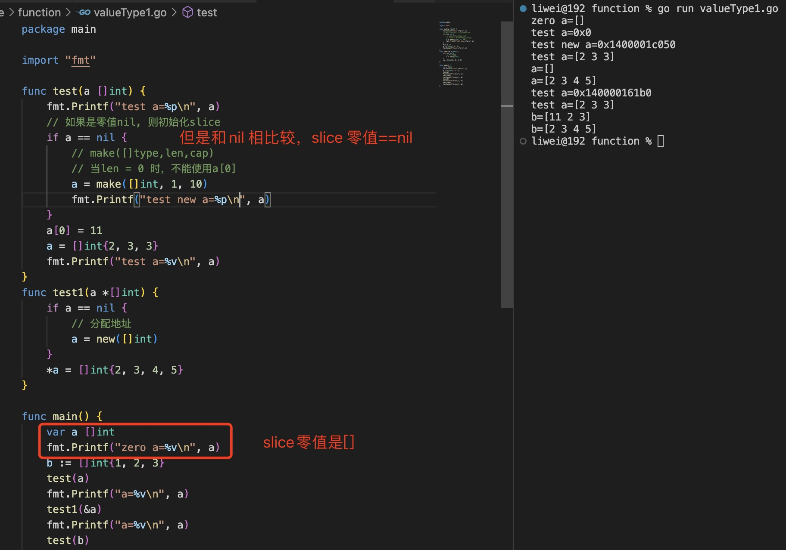
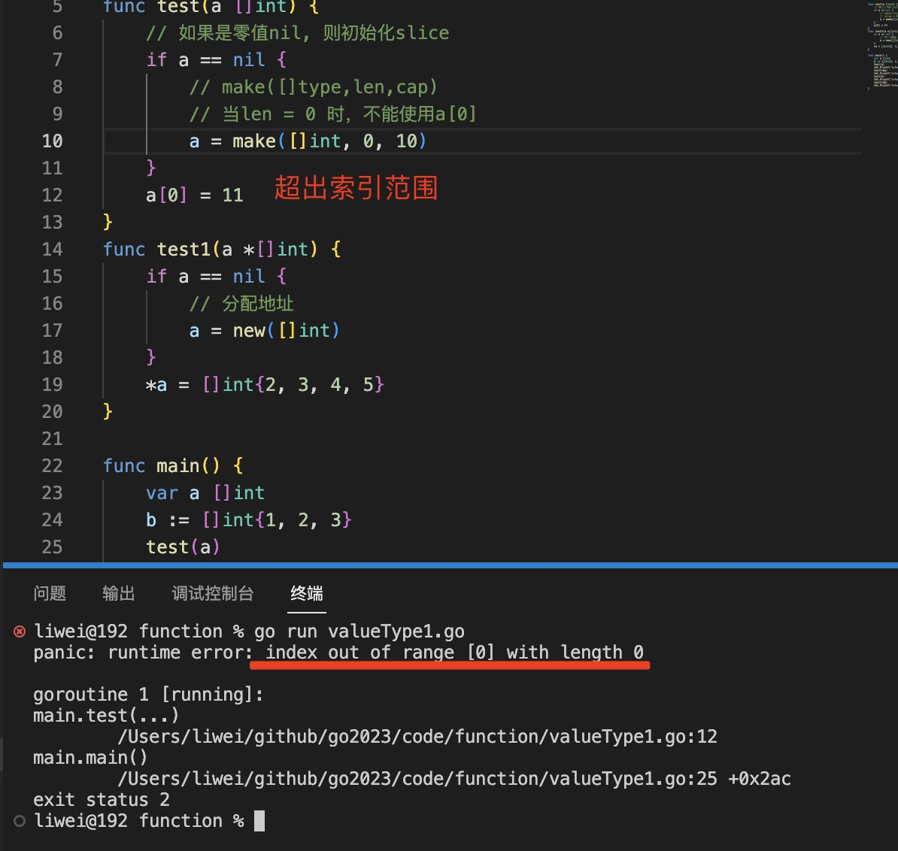

1. slice 是没有固定长度的数组,但是切片本身并不存储任何元素，而只是对现有数组的引用。

   >`slice 的零值为[]，但是等于nil，nil切片还可以用来表示空集合`,

   

   slice 包括地址，长度和容量

   var 切片变量名 []元素类型

   ```go
   var sliceTest []int

   ```


+ 字面量直接初始化

    ```go
    var sliceTest []int = []int{1,2,3,4}
    ```

+ 通过make 初始化

   make([]元素类型,切片长度,切片容量)

    ```go
      var student []int =make([]int,2,10)
      // 长度不为0，会自动填充切片元素类型的默认值
    ```

    

+ 地址：slice 的地址一般指slice 中第一个元素所指向的内存地址，用十六进制表示

+ 长度：slice 中实际存在的元素个数，使用len(slice) 获取

+ 容量：cap(slice) 返回slice 的容量

2. 通过切片的方式生成新的slice [i:n]

    ```go
    var student = [...]string{"Tom","Ben","Peter"}
    var student1 = student[1:2]
    ```

3. append() 追加元素到slice 

   当切片不能再容纳其他元素时（即当前切片长度值等于容量值），下一次使用append()函数对切片进行元素添加，容量会按2倍数进行扩充

   ```go
   student1 = append(student1,"Danny")//对student1切片的元素添加，会覆盖引用数组对应的元素
   ```

4. 删除元素

   Go语言没有为删除切片元素提供方法，所以需要我们手动将删除点前后的元素连接起来，从而实现对切片中元素的删除

   ```go
    var student = []string{"Tom","Ben","Peter","Danny"}
    student = append(student[0:1],student[2:]...)
   ```

5. 遍历slice

   ```go
   var student = []string{"Tom","Ben","Peter","Danny"}
   for k,v :=range student{
      fmt.Println("切片下标： ",k,"，对应元素",v)
    }
    ```
6. 