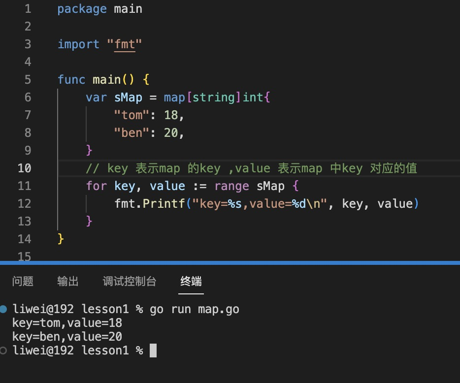

1. map 类型是一个键值对类型，使用map 定义.

   映射（map）是一种无序的键值对的集合，map的键类似于索引，指向数据的值

    ```
    map[typeKey]typeValue

    ```

+ 字面量初始化

   ```go
   var sMap=map[string]int{
    "Tom":20,
    "Ben":18,
   }
   ```
   

   >注意：和js 不一样，这里的key 如果是string 类型，则必须用双引号括起来，不然会被当做变量来处理，而没有找到变量就会保存

   

+ 使用make 初始化

   ```go
   var sMap2 = make(map[string]int)
   ```

2. 使用for ...range 遍历

  

3. 使用key 作为下标读取，设置，更新value

   

4. 删除key

   delete(map,key) 要删除的key