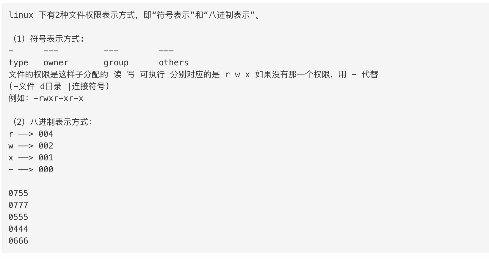
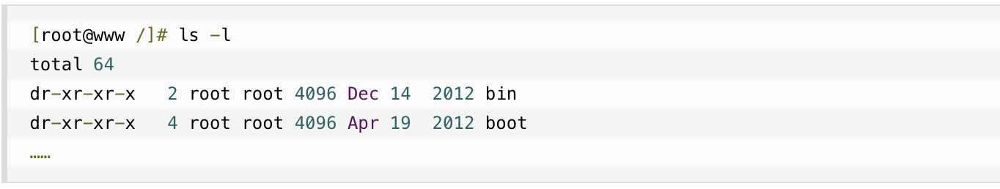
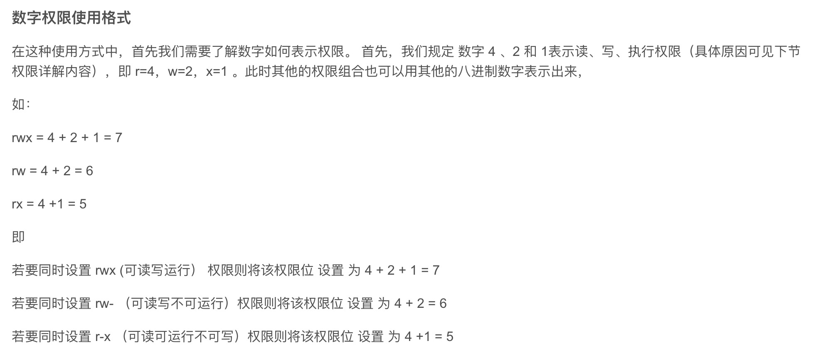
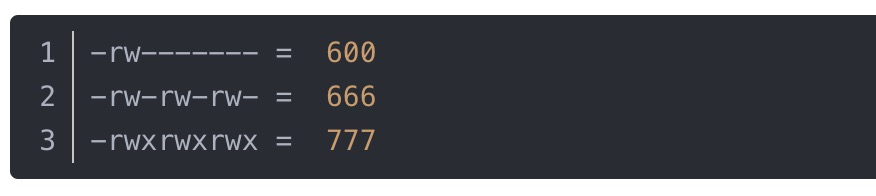

1. 文件操作一般包括文件目录，文件 的创建，修改，重命名，权限，删除，软连接等操作

   而这些操作又涉及到目录，文件路径，文件扩展名等

2. 目录在不同系统中存在部分差异，操作系统主要分为Windows和Unix两类，Windows文件系统的特点是分盘，每个盘符有自己的根目录，形成多个树形并排结构，也
就是我们常说的C盘、D盘等。`Unix类文件系统只有一个根目录，也就是“/”`。***需要注意的是，Windows的目录不区分大小写，也就是说，“C:\windows”和“C:\WINDOWS”表示的是同一个目录，而Unix系统是区分大小写的***。

3. 目录和文件权限

   

   

   在 Linux 中第一个字符代表这个文件是目录、文件或链接文件等等。

+ 当为 d 则是目录
+ 当为 - 则是文件；
+ 若是 l 则表示为链接文档(link file)；
+ 若是 b 则表示为装置文件里面的可供储存的接口设备(可随机存取装置)；
+ 若是 c 则表示为装置文件里面的串行端口设备，例如键盘、鼠标(一次性读取装置)。

   接下来的字符中，以三个为一组，且均为 rwx 的三个参数的组合。其中， r 代表可读(read)、 w 代表可写(write)、 x 代表可执行(execute)。 要注意的是，这三个权限的位置不会改变，如果没有权限，就会出现减号 - 而已。

   

   >`Linux文件属性有两种设置方法，一种是数字，一种是符号。`

   Linux 文件的基本权限就有九个，分别是 owner/group/others(拥有者/组/其他) 三种身份各有自己的 read/write/execute 权限。

   文件的权限字符为： -rwxrwxrwx ， 这九个权限是三个三个一组的！其中，我们可以使用数字来代表各个权限，各权限的分数对照表如下：

+ r:4

+ w:2

+ x:1

   每种身份(owner/group/others)各自的三个权限(r/w/x)分数是需要累加的，例如当权限为： -rwxrwx--- 分数则是：

+ owner = rwx = 4+2+1 = 7
+ group = rwx = 4+2+1 = 7
+ others= --- = 0+0+0 = 0

   

   > `go语言中权限采用8进制，分三组，比如全部用户0777`

   

4. 在go 语言中操作文件和目录用到的库

+ path: 操作和管理路径

+ os: 目录和文件的操作

+ io(input/output): 

+ io/ioutil: 虽然io包提供了不少函数方法，但有时候使用起来并不是那么方便。为此，标准库中提供了一些更加常用、方便的I/O操作函数，将其封装在“io/ioutil”这个库中

   > 新版本中io/ioutil 库中的方法以取消，使用在os 中对应的方法

+ bufio: 实现带有buffer 的I/O