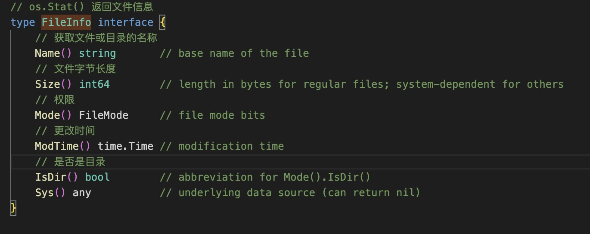

1. os.State(path string) (FileInfo,error): 查看文件和目录基础信息

   

+ Name(): 返回名称

+ Size(): 如果是文件，返回文件大小

   `当读取文件时，知道了文件字节长度，可以一次性读取文件全部内容`

   

   > `一次性读取可能因为文件过大，而导致内存溢出`

+ IsDir(): 是否是目录

+ FileMode(): 返回权限 0777