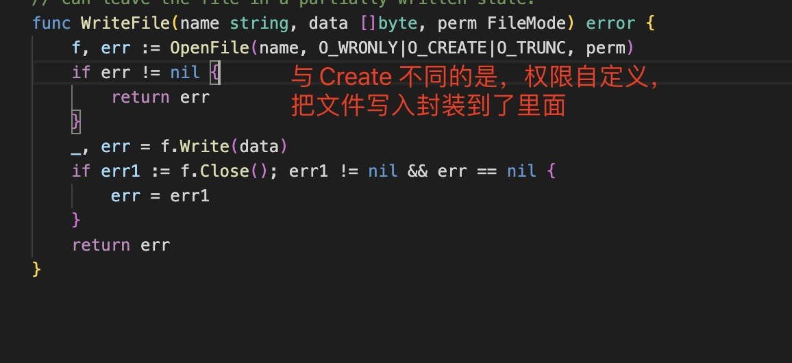

1. os.Create(): 如果文件不存在，则以0666 的权限创建文件，如果文件已存在，则会移除文件中所有内容。

   

+ 路径使用不存在的文件路径，以0666权限创建文件

    

+ 文件路径存在，但是文件中的内容会被清除，然后使用新的数据填充

   

2. os.WriteFile(): 底层还是OpenFile,只是多了自定义文件权限

   

   同上面一样

   

3. 