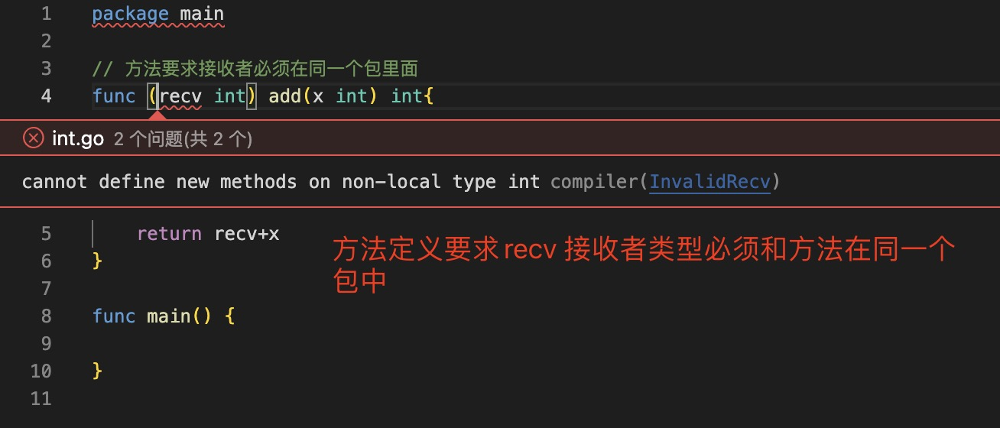
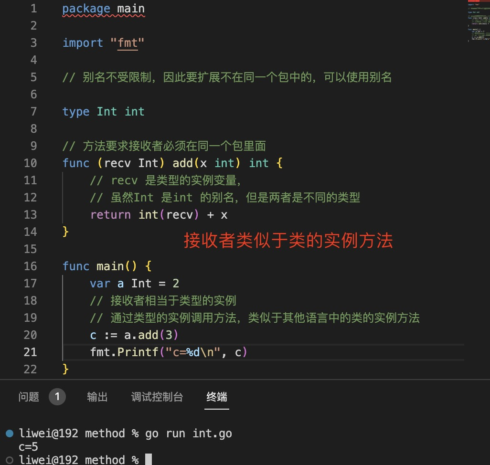
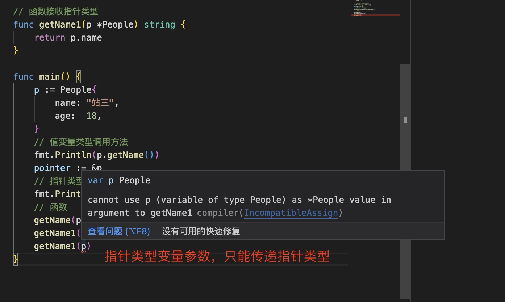
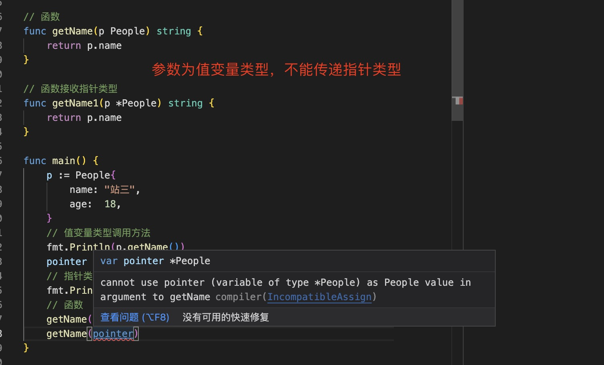
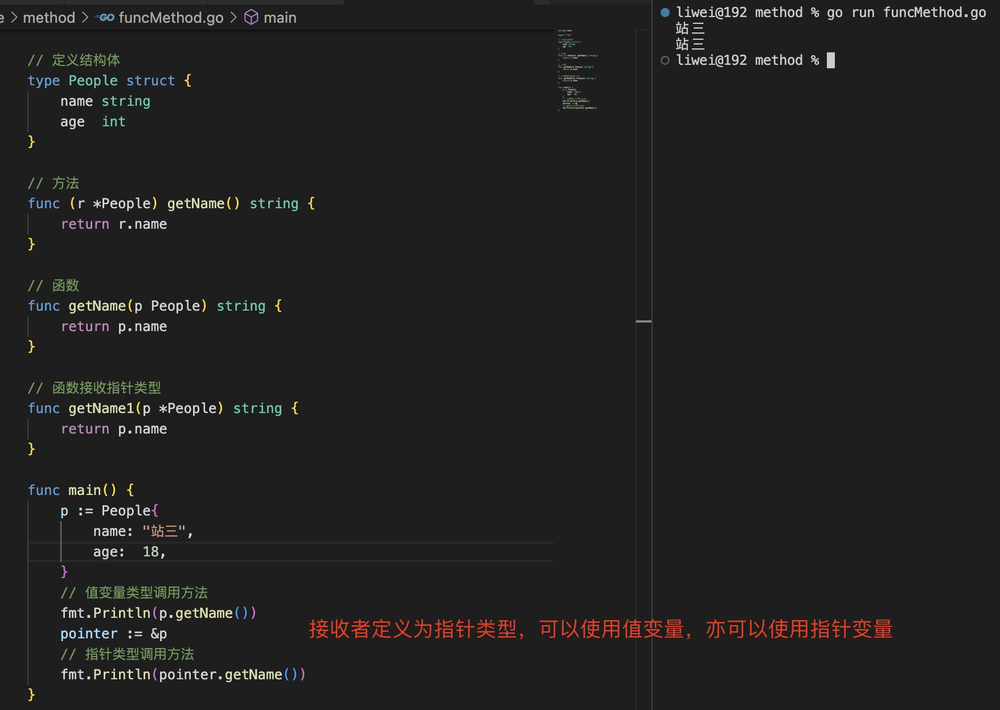

1. 在Go语言中，Go方法是作用在接收者（receiver）上的一个函数，接收者是某种类型的变量。所以在Go语言里方法是一种特殊类型的函数。

   + 接收者几乎可以是任意类型（接口、指针除外），包括结构体类型、函数类型，可以是int、bool、string或数组别名类型。
   
   + 接收者不能是一个接口类型，因为接口是一个抽象定义，但是方法却必须是具体的实现。 
    
   + 接收者也不能是一个指针类型，`但需要注意的是它可以是任何其他允许类型的指针`

   ```go
    func (recv type) methodName(param_list) (return_list) {
        // recv 为接收者
        // 在方法名之前，func关键字之后的括号中指定接收者。
        
    }
   ```
   > 接收者是该类型的实力变量，类似于其他语言中的this 或self

   > 类型与在它上面定义的方法必须在同一个包里定义，像 int、float 或类似的类型属于Go语言的基本类型，开发者无法在基本类型上定义方法，除非修改Go语言的源代码。

      

   > 别名类型并不受这个规则限制，可以把非本地包定义的类型指定一个别名，然后在别名类型上定义方法。

   

2. 函数与方法的比较：

+ 当函数中变量为指针类型使，传递的必须是指针

   

   

+ 当方法中的接收者是指针时，可以使用变量或者指针做接收者都可以

  

3. 定义方法接收者时，通常给定类型上的所有方法都应该具有值或指针接收器，但不能同时具有两者。

   