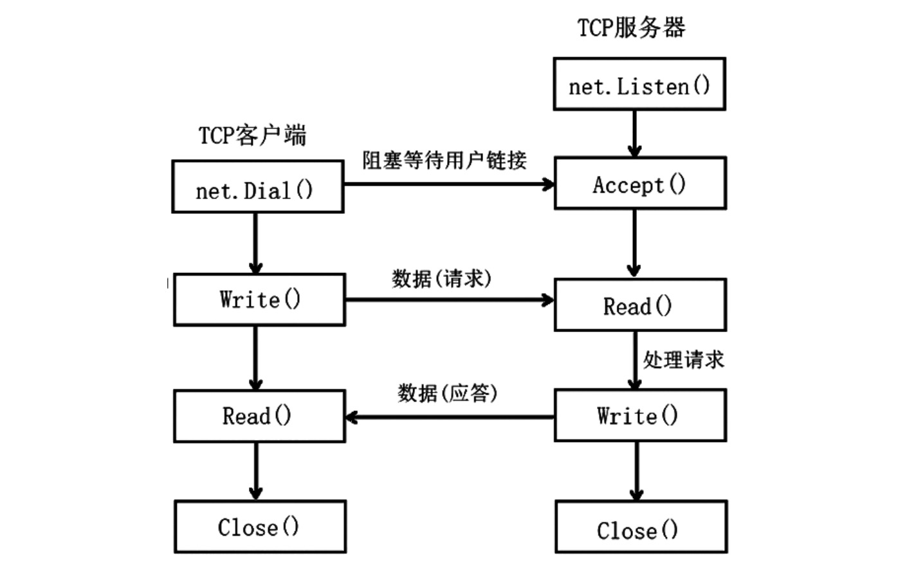

1. 由协议(tcp),ip 地址，端口号决定了唯一网络进程

2. socket 一般分为服务器端和客户端

   

+ 服务器端监听端口号，使用net.Listen，返回Listener 对象

  

  + 使用net.Listen() 创建Listener 实例

   ```go
   func Listen(network, address string) (Listener, error)
   ```

  Listen 通告本地网络地址。

  网络必须是“tcp”、“tcp4”、“tcp6”、“unix”或“unixpacket”。

   对于 TCP 网络，如果 address 参数中的主机为空或文字未指定的 IP 地址，Listen 将侦听本地系统的所有可用单播和任播 IP 地址。要仅使用 IPv4，请使用网络“tcp4”。该地址可以使用主机名，但不建议这样做，因为它最多会为主机的一个 IP 地址创建一个侦听器。如果地址参数中的端口为空或“0”，如“127.0.0.1:”或“[::1]:0”，则会自动选择一个端口号。Listener 的 Addr 方法可用于发现所选端口。

   有关网络和地址参数的说明，请参见 func Dial。

   Listen 在内部使用 context.Background；要指定上下文，请使用 ListenConfig.Listen。


+ 客户端连接服务器，通过协议，ip 地址，端口，使用net.Dial()

3. 服务器端

+ 创建监听对象，使用net.Listen

   

+ 服务器端接收客户端连接 Accept

+ 接收

+ 服务器关闭连接

4. 客户端

+ 连接服务器，使用net.Dial

+ 发送数据到服务器端

+ 接收服务端的数据

+ 关闭网络连接

5. Conn: 连接对象