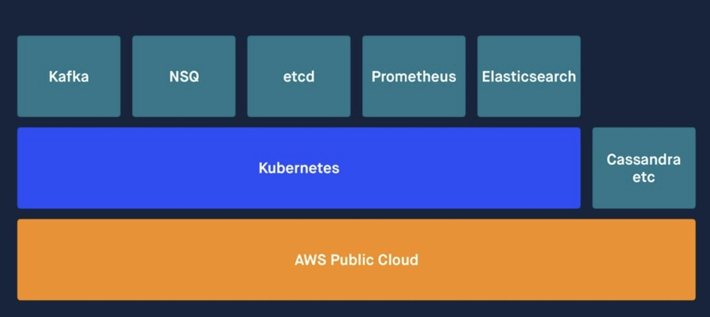
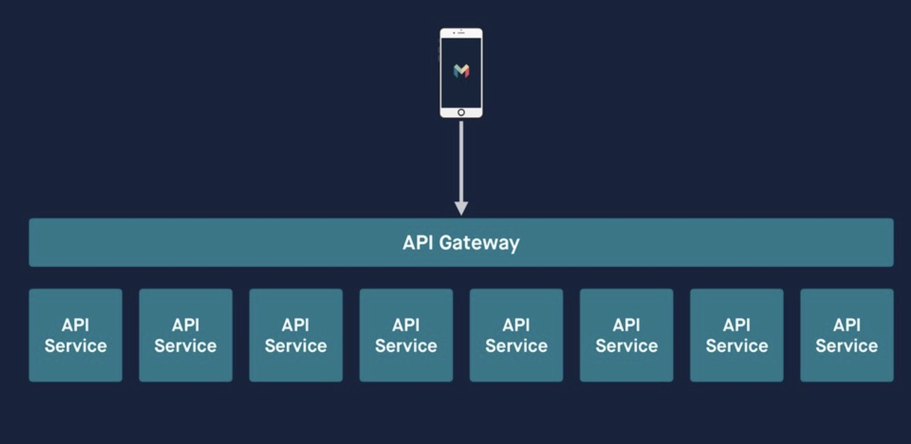
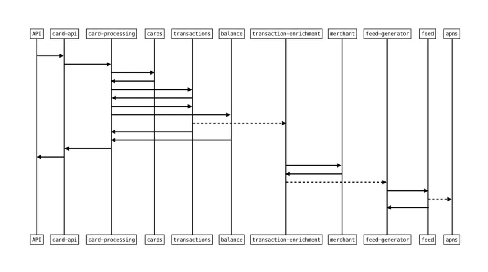
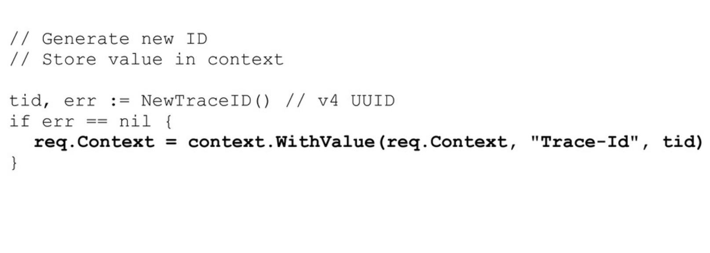
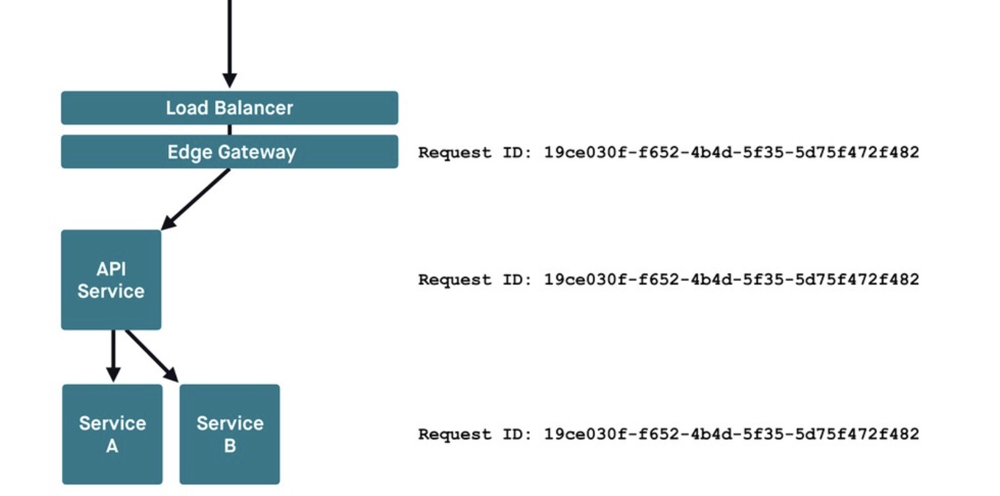
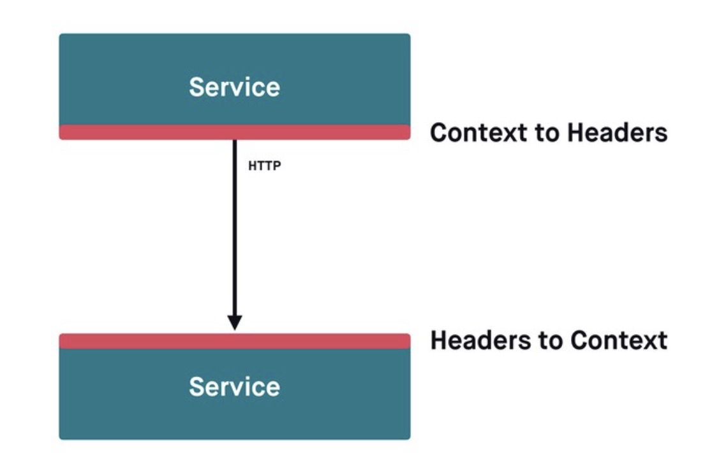
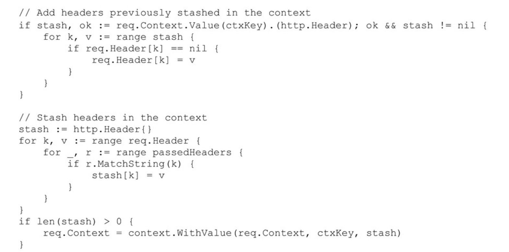

1. 服务发现、负载平衡、故障处理和可见性等核心通信职责是使用“linkerd”透明代理（现在由CNCF管理）实现的。

   + 服务发现

   + 负载均衡

   + 超时和过期

   + 重试

   + rate limiting: 速率限制

   + 连接池

   + failure detection: 故障检测

   + interrupts: 中断,断路器

   + Context Propagation: 上下文传播

   + metrics and tracing:指标和追踪

     https://opentracing.io/

     https://prometheus.io/

   + request cancellation: 取消请求

   

   

2. 后端服务打包在Docker镜像中，并部署到Kubernetes上。应用广泛使用事件驱动架构范式，通过上下文传播共享核心请求信息。

3. 分布式追踪

   Monzo 开源“phosphor”应用程序用于分布式跟踪（以类似于 Google 的 Dapper 或 Open Zipkin 的方式）。这允许通过系统可视化请求的路径，并有助于调试:

   

   + traceId:

      

   + 传递traceId 到每个service 中

      

   + 通过放到header 中传递traceId

      

      