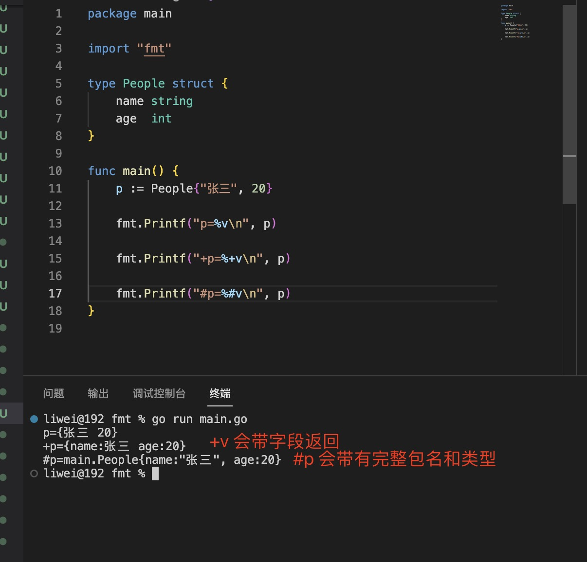

1. Println: 输出字符串到终端,带有换行

   

   >os.Stdout 为控制台输出

2. Printf(format string,...arg)：输出格式化字符串到控制台

   format 格式化：

   + %d: 数字类型

   + %f：浮点类型

   + %t: bool 类型

   + %c: rune 类型

   + %s: 字符串类型

   + %p: 指针类型

   + %T: 返回类型

   + %v: 比如slice, map, struct

   + %+v: 打印map 会带有字段

   + %#v: 会带有完整包名的

   

3. Sprintf: 返回格式化字符串

        var a string =fmt.Sprintf("b is %d",2)