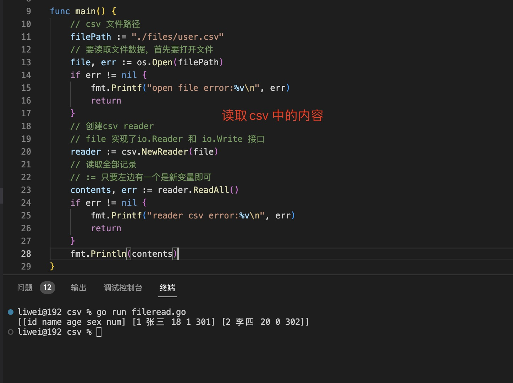
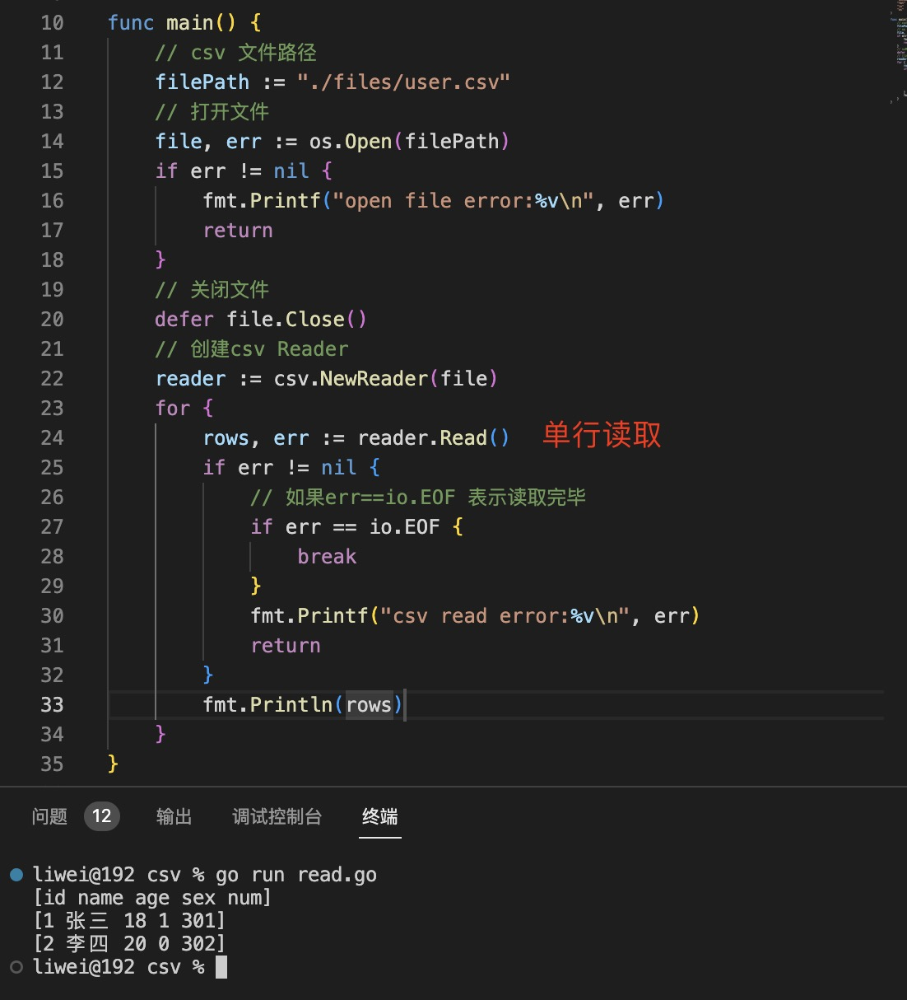
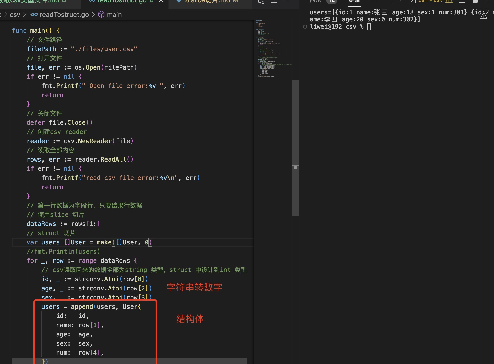
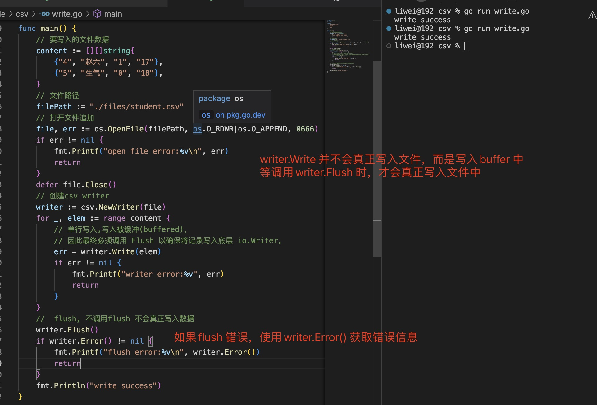
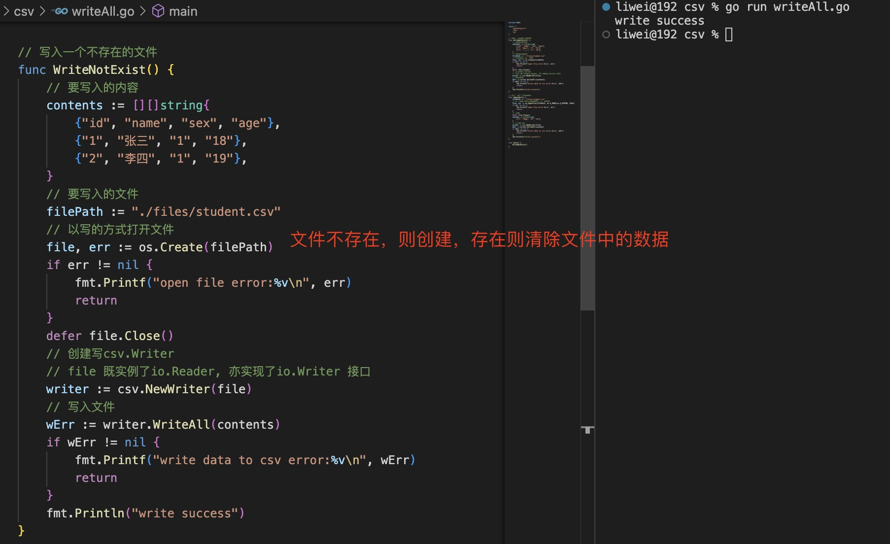
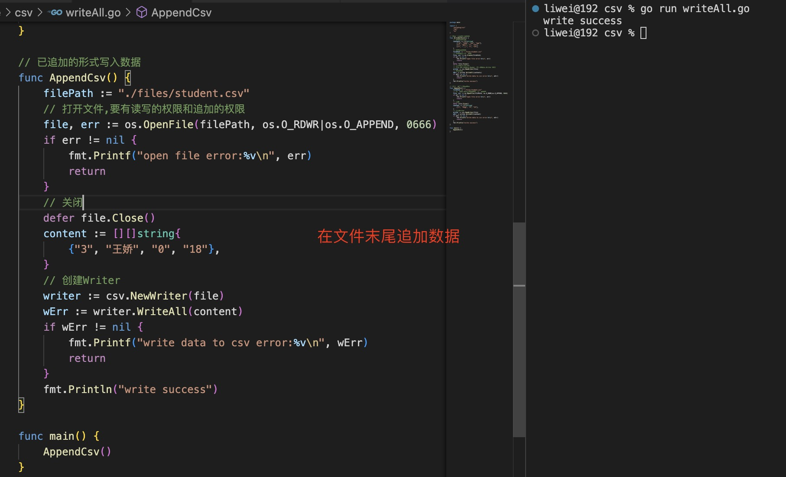

1. 创建csv Reader

   ```go
    csv.NewReader(r io.Reader) *Reader

   ```
   可以从string Reader 中，亦可以从file Reader 中

2. ReadAll(): 读取csv 文件中所有行的数据

   

3. Read() : 单行读取，当err 为io.EOF 表示读取完毕

   

4. 读取csv 文件到struct 中

   

5. reader.Comma = ';' // 设置csv 文件中字段之间的分割符

6. reader.Comment = '#' // 设置以# 开头的会被忽略

7. 写入csv 文件csv.Writer

+ Write: 当行写入

   

+ WriteAll：一次性写入

  + 创建文件并写入
    
    

  + 以追加的方式写入数据

   