1. encoding/json: 解析json 

+ 数组： 对应go 语言中数组和切片

+ 对象： 对应go语言中的map 和 struct

2. json 数组

+ 将go 语言中的数组转成json 数组字符串

  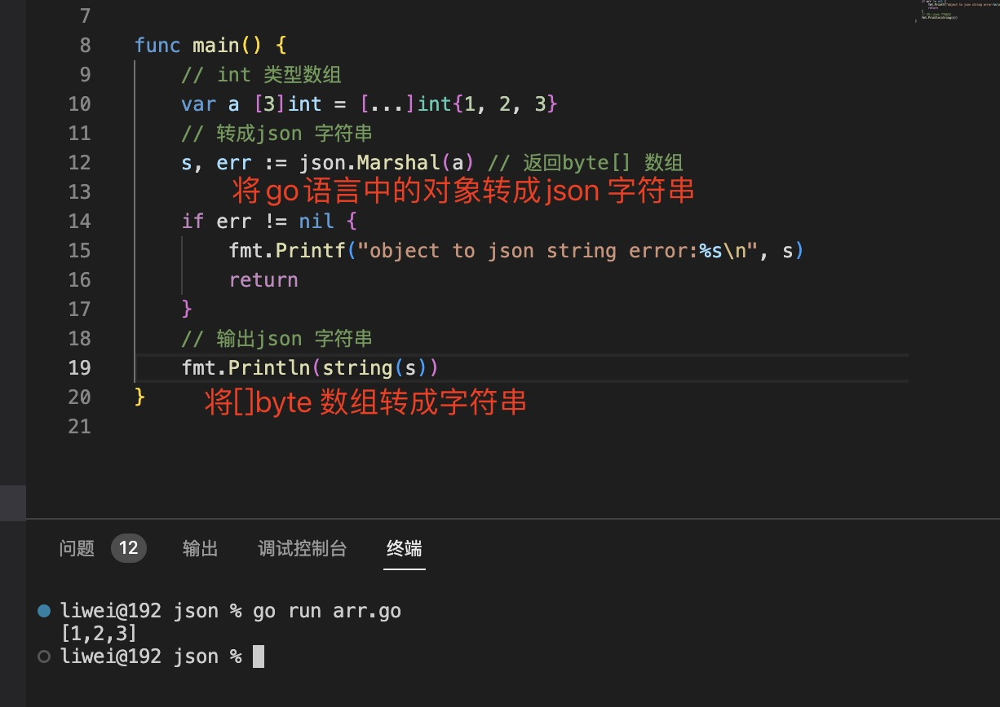

+ 将go 语言中的slice 转成json 数组字符串

  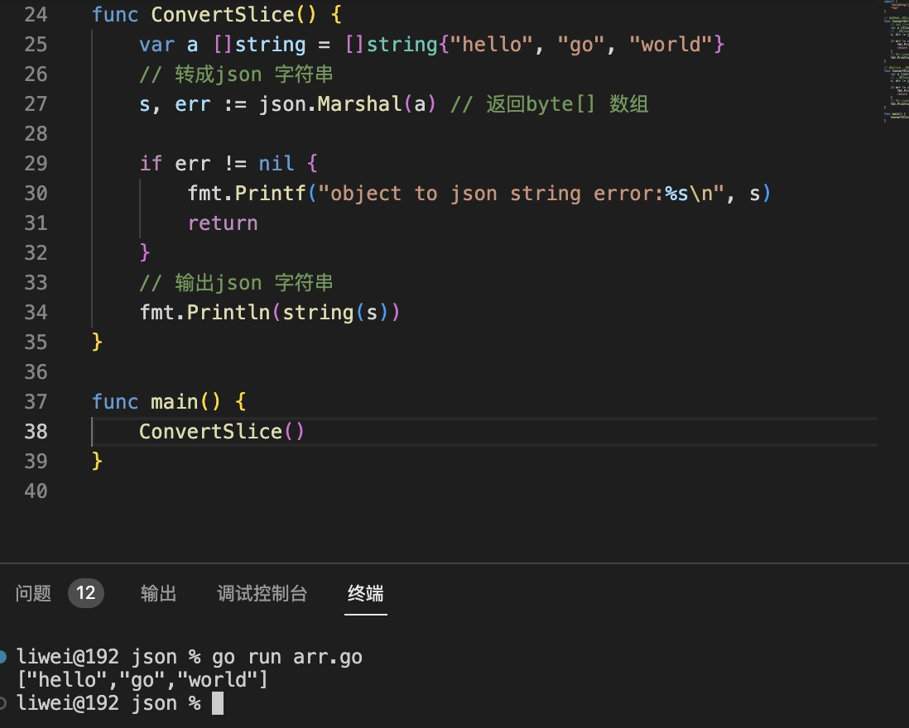

3. json 对象

+ map 对象转成json 对象格式

  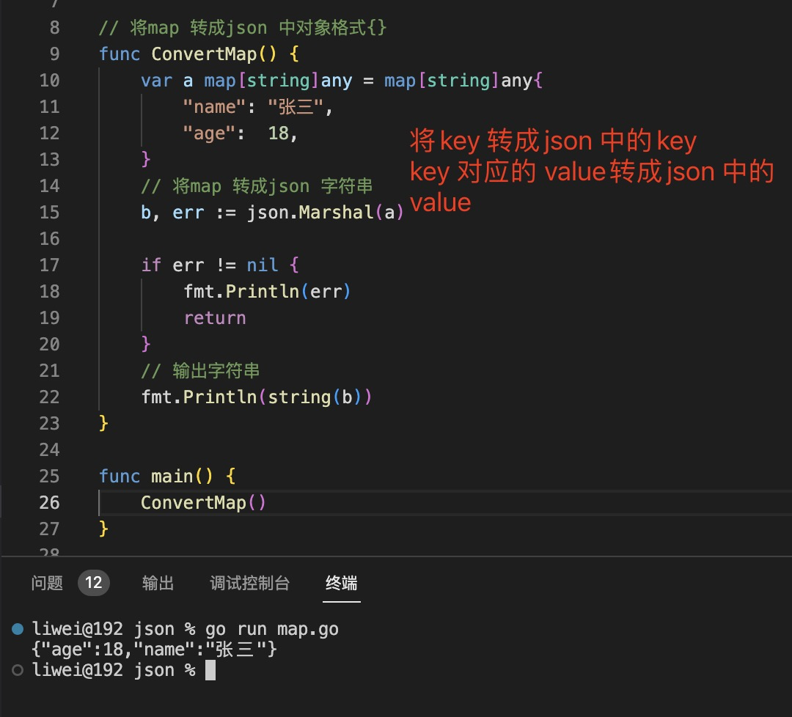

+ struct 对象转成json 对象格式

   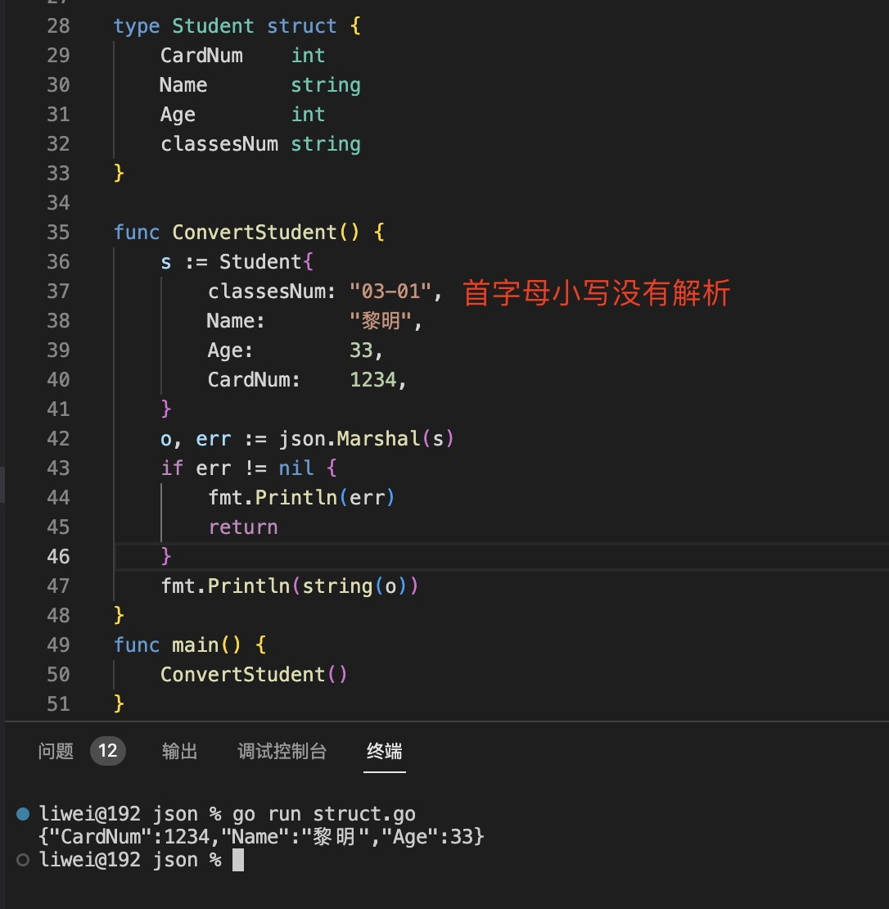

   > `struct 中属性名首字母小写在解析成json 字符串时，不解析`

   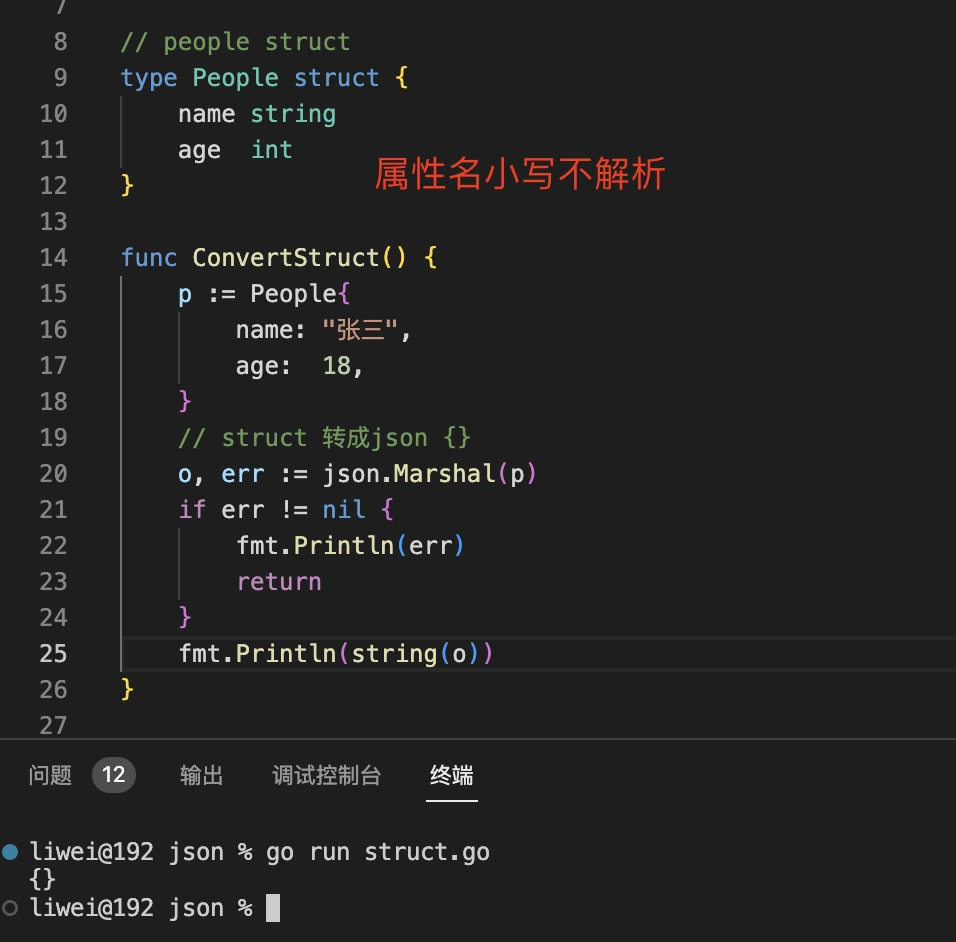

   > 使用struct json 标签设置json 中的属性名

   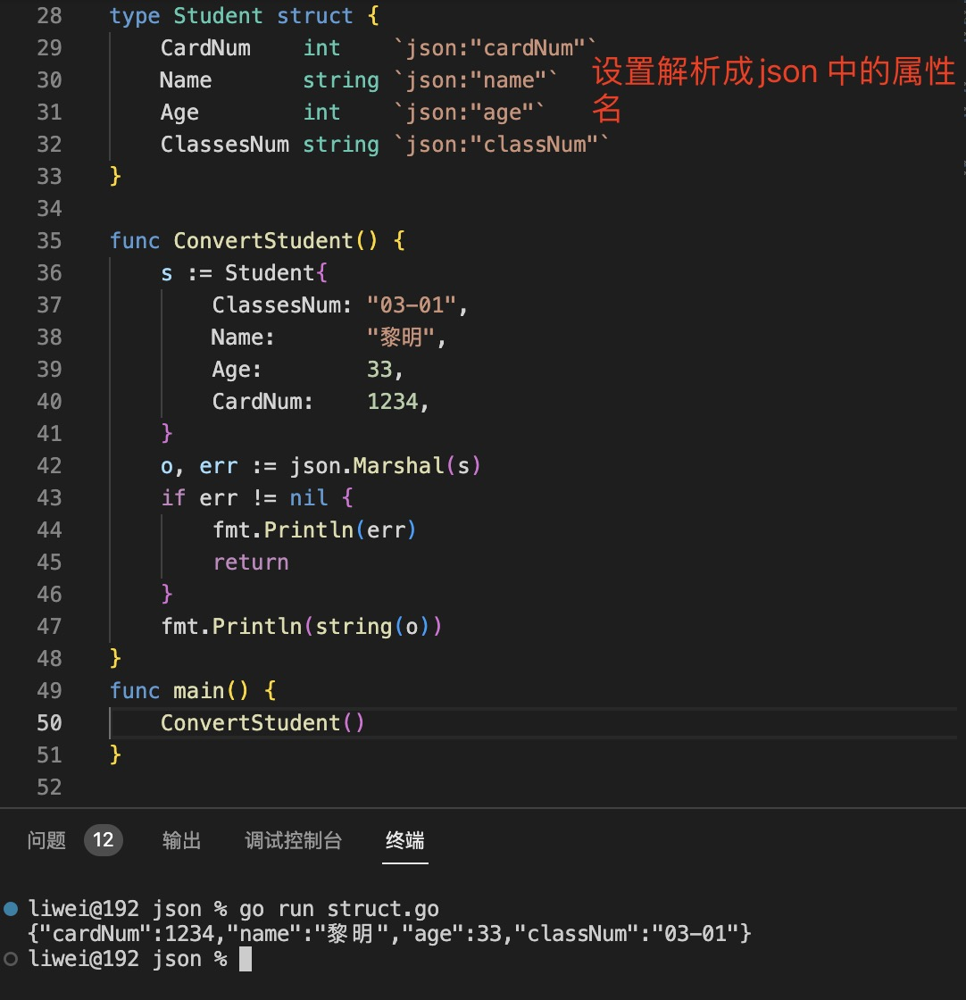

   + \`json:"myName"\`: struct 标签

   + omitempty：指定如果字段具有空值（定义为 false、0、nil 指针、nil 接口值以及任何空数组、切片、映射或字符串），则应从编码中省略该字段。

        ```

        `json:"myName,omitempty"`

        ```

   + "-": 如果字段标记为“-”，则该字段始终被省略

     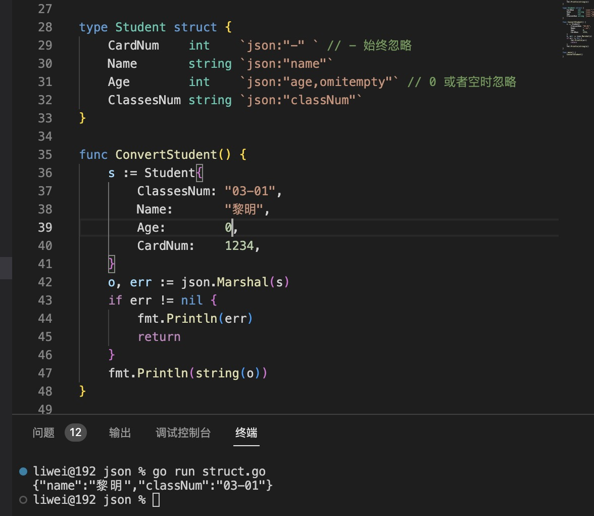
    
4. json 字符串解析成go 语言中数据结构

   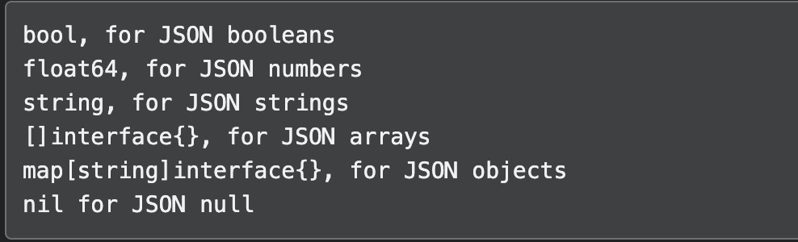

+ 数组或slice 解析

   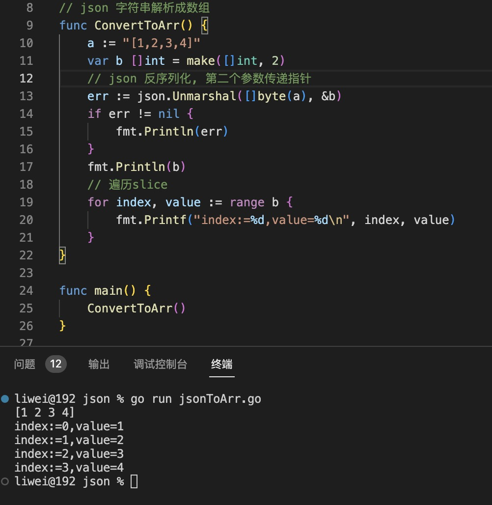

+ 解析成map

   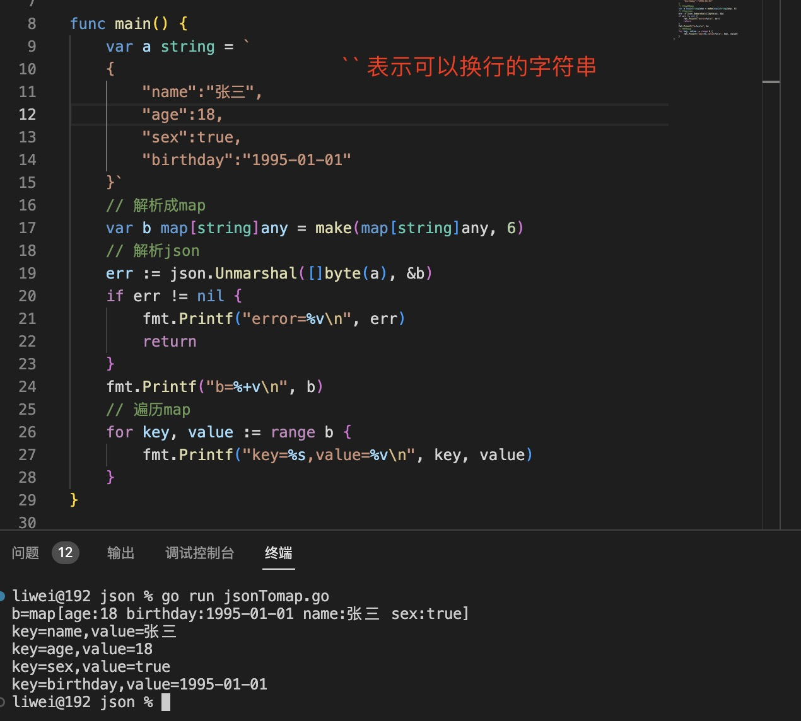

+ 解析成struct

   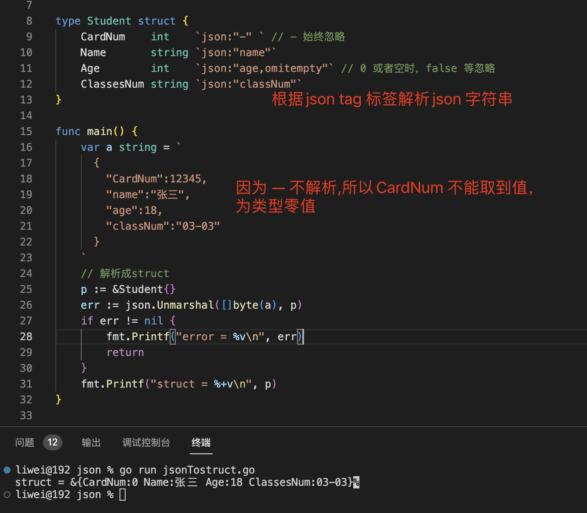
