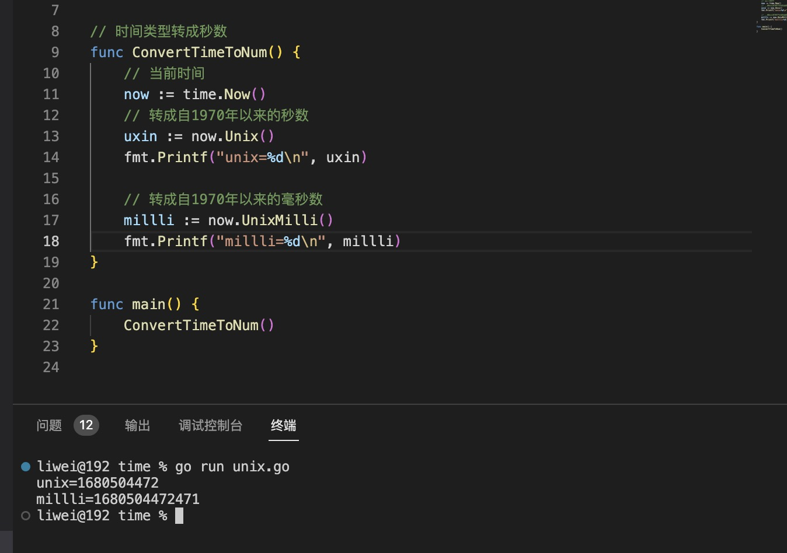
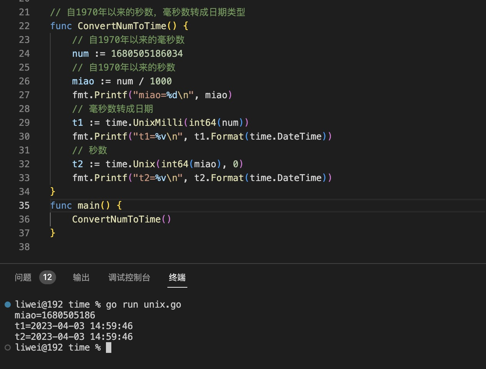

1. time 包中包括日期，时间，week 等

+ time.sleep(d Duration): Duration 是一个int64 的别名

   休息多长时间

+ time.Now(): Time 当前时间

+ time 包中的常量

   + time.DateTime: 格式化(Format) 模版"2006-01-02 15:04:05"

   + time.DateOnly: 只保留日期"2006-01-02“

   + time.TimeOnly: 只保留时间"15:04:05"

   + time.Hour: 一小时的


2. time 包中的Time 结构体

   方法：

+ 获取当前时间 time.Now()， 返回Time 结构体

  

+ 当前年份  time.Now().Year()

  

+ 月份: time.Now().Month()

   

+ 日期 time.Now().Day()

   

+ 小时： time.Now().Hour()

   

+ 分钟： time.Now().Minute()

   

+ 秒数： time.Now().Second()

   

 

3. Duration： Duration 是int64 的一个别名,两个时间相减返回的差值

   ```go
    type Duration int64
   ```

   方法：

   + Since(t Time) : 是time.Now().sub(t) 的简写

   + Hours(): 返回小时数量

   + Minutes(): 返回分钟数量

   + Seconds(): 返回秒数

   + Millseconds(): 返回毫秒数

   + Microseconds() : 返回微秒数

   + Nanoseconds(): 返回纳秒数

4. Month: Month 是int 类型的别名

   

+ string() 方法：返回Month 的字符串

   ```go
   func (m Month) String() string
   ```
   String returns the English name of the month ("January", "February", ...).

   > 因为Month 是int 类型的别名，可以使用int 转为数字

   

5. 时间类型转换

 + `时间转字符串类型，使用Format(layout) ,layout 是格式化模版`

    

+  字符串转时间类型

     
   
+ 时间类型转自1970年1月1日的秒数,毫秒数，微秒数，纳秒数

   + Time.unix(): 自1970 年以来的秒数

   + Time.UnixMillli() : 自1970 年以来的毫秒数

   + Time.UnixMicro():  自1970 年以来的微秒数

   + Time.UnixNano(): 自1970 年以来的纳秒数

    

+ 秒数,毫秒数，微秒数，纳秒数 转时间类型

   > 使用time库的函数

   + time.Unix(秒数,nsec(纳秒数))

   + time.UnixMicro(微秒数)

   + time.UnixMilli(毫秒)

   

   > `注意：是使用的time 对应的秒数,毫秒数方法`

6. 时间类型的加减

+ Sub(t): 返回Duration 类型

+ Add(t): 返回Duration 类型

7. 定时器

+ time.NewTimer(时间)： 类似于JavaScript中的setTimeout

   + Reset(): 重启Timer

   + Stop(): 结束

+ time.NewTicker(): 类似于JavaScript中的setInterval

   + Stop(): 结束

   
   