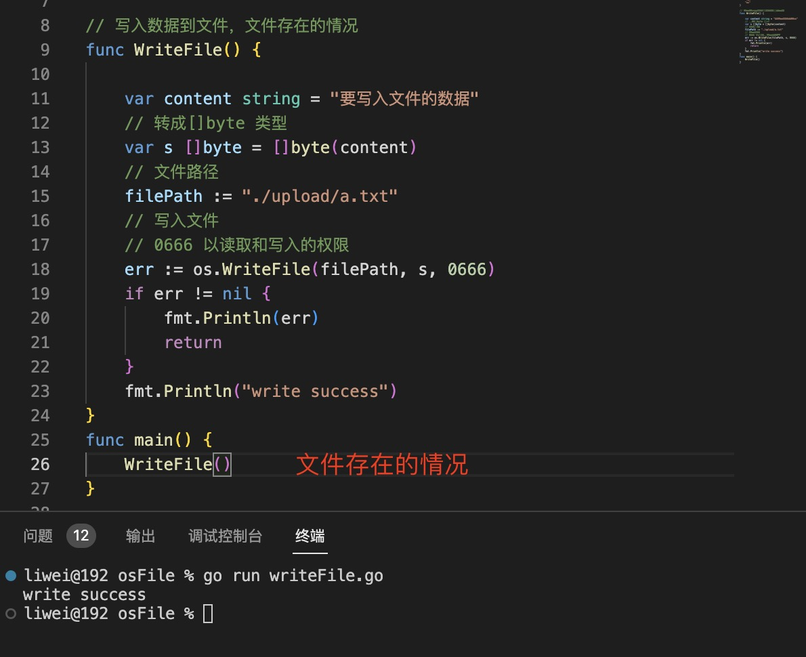

1. State() : 返回文件或目录信息

   

   > 通过Stat() 和 Stat 返回的错误类型判断文件是否存在，使用os.IsNotExist 或 errors.Is(err,os.ErrNotExist)

   

2. 删除文件，使用os.Remove(filePath string) error

   

3. 打开文件

   

+ os.Open(path string) (*File,error): `是以只读的方式打开文件，只能读取文件中的内容，而不能向文件写入数据`

   

4. os.Create(path string) (FileInfo,error)：创建文件

   

   + 文件已存在

   

   + 不是文件类型

   

   > 没有文件后缀名亦可以创建成功

   + 创建文件

   

5. os.OpenFile 是Open 和 Create 的底层方法，实现了自定义打开文件的方式和权限

   

   

6. 获取文件句柄(文件id)

   

> 以下使用File 结构读取文件数据和写入文件数据，关闭文件

+ file.Close(): 关闭文件

6. 文件操作权限

   

7. 读取文件数据 File.Read(b []byte): 按字节读取

   1). 打开文件 

     + os.Open(path string)

     + os.OpenFile(path string,flag int,perm FileMode): 必须有读的模式

   2). 读取数据: func (f *File) Read(b []byte) (n int, err error)

      读入len(b) 长度的数据，并存储在b 变量中，n 为读取的数据长度。 最后n 返回0 ，表示读取完毕

     

     > `注意：虽然当n==0 读取完毕时，读取的字节仍然有值`

     

     > 使用字节中文乱码的情况

     

   3). 关闭文件

8. 写入数据到文件

   1). 打开文件

   > 不能以只读的方式打开文件，不然会报错“bad file descriptor”

      

   > 自定义写入方式，使用OpenFile 方法，返回FileInfo 和 error,

   2). 使用FileInfo.Write(w []byte) (n int, error)

      

      > n 返回写入的字节数量

   3). 关闭文件 FileInfo.Close()

9. os.ReadFile（path string)([]byte,error): 一次读取全部内容，读完error 返回io.EOF.

   

   > 使用io.ReadAll

   

10. os.WriteFile(name string, data []byte, perm FileMode) error 向文件写入数据

+ 文件存在的情况下，写入数据

    

    > WriteFile 会把原来文件中的内容用新写入的内容替换掉

    

    

+ 文件路径不存在，则使用perm 创建文件，并且写入数据

    
   