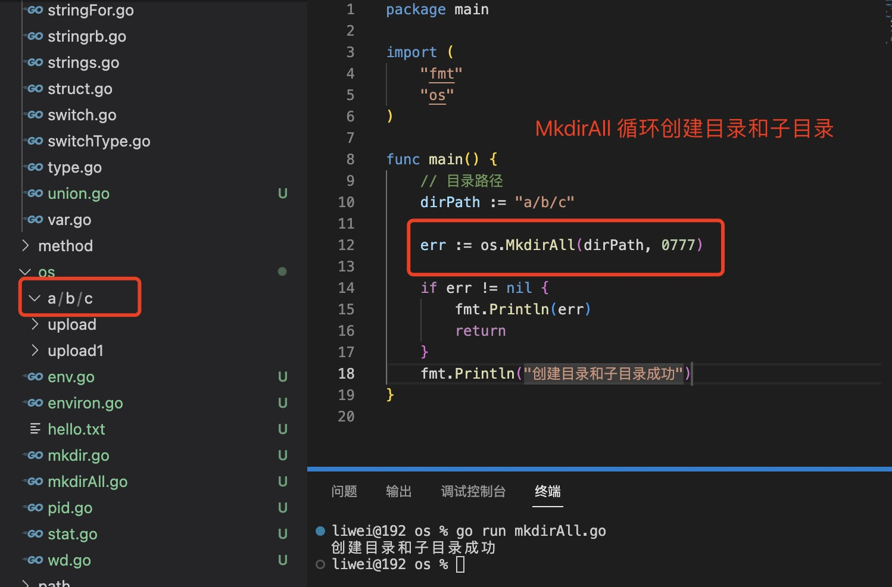

1. 目录创建

+ os.Mkdir(path string,perm )

   

+ os.MkdirAll(path string, mode FileMode) error: 循环创建目录

   

2. os.Chmod(path string,mode FileMode): 更改文件和目录的权限

   ```go
    func Chmod(name string, mode FileMode) error
   ```

   > Linux/Unix 的档案存取权限分为三级 : 档案拥有者、群组、其他。利用 chmod 可以藉以控制档案如何被他人所存取。

3. os.Chown(name string,uid,gid int) error: 更改目录和文件的所有者和所属组

+ name: 文件或目录路径

+ uid: 用户id

+ gid: 用户所属组id

4. os.Getuid(): 返回caller 的用户id

5. os.Getgid() 返回用户所属组的gid

6. os.Remove(name string) error: 删除文件或者空目录

+ 删除目录不是一个空目录，报错directory not empty

   

+ 删除一个空目录

   

+ 删除文件

   

7. os.RemoveAll(name string) error: 会删除目录和目录中的所有文件，

    比如： 在upload1 中有两个文件
    

    删除目录upload1:

    

8. os.Stat(name string) (FileInfo,error)

   FileInfo 定义：

   

   

   + Name(): 获取目录名称

   + Size()： 获取目录大小

   + Mode(): 获取权限

   + IsDir(): 是否是目录

   > 当给定的路径不存在时，返回info 为nil

     

6. 判断目录是否存在

   

7. 读取目录中的文件或目录

   方法定义：

   

   DirEntiy目录实体信息：

   

   示例：

   