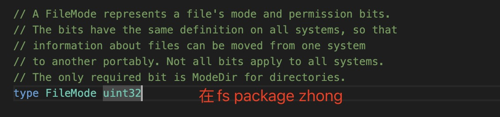
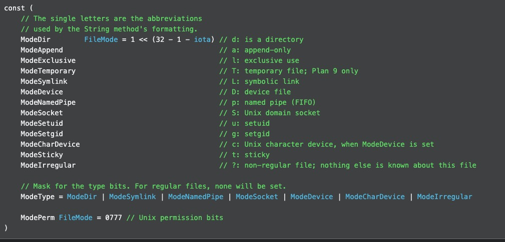
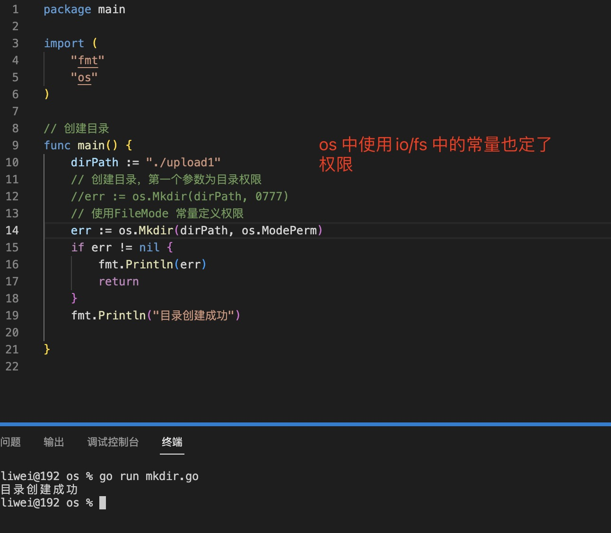
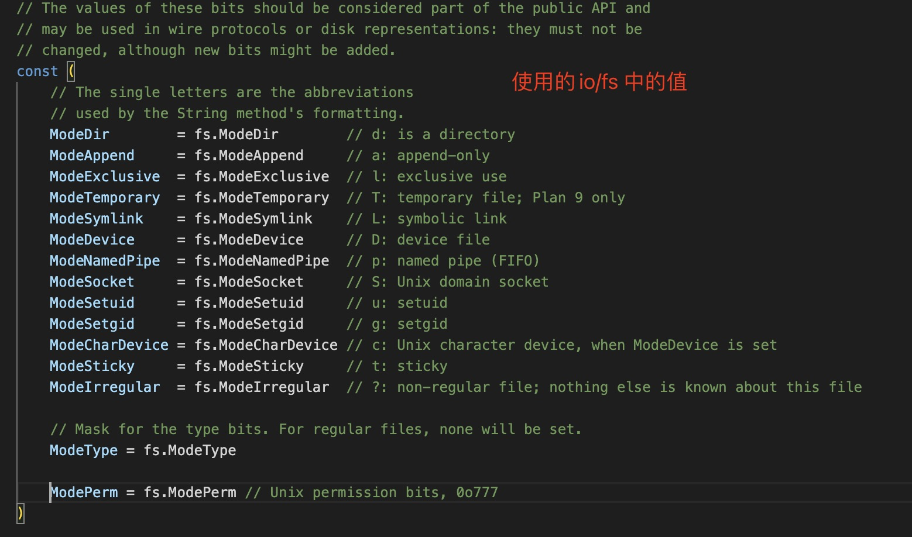

1. io/fs 中FileMode 目录和文件的权限

   

   > 在go 语言中，FileMode 是一个8进制数，比如：0777，0 代表八进制。

   目录文件的权限有两种表达方式，一种是rwx 一种是数字

   文件和目录权限分三组，rwx rwx rwx 

   + 第一组代表文件和目录创建者

   + 第二组代表创建者所属组

   + 第三组代表其他所有用户

   + r: read, 值为4 

   + w: write, 值为2

   + x: execute(可执行)，值为1

   + 没有权限为0

   > 使用三个值的和确定一组的权限，比如0770，表示创建者和所属组拥有可读可写可执行的权限，其他用户没有权限

   > 0666: 表示三组都只有可读和可写的权限，没有可执行的权限

2. 在go 语言中定义了FileMode 类型的一组常量

   

   

   > os 中也定义了常量

   