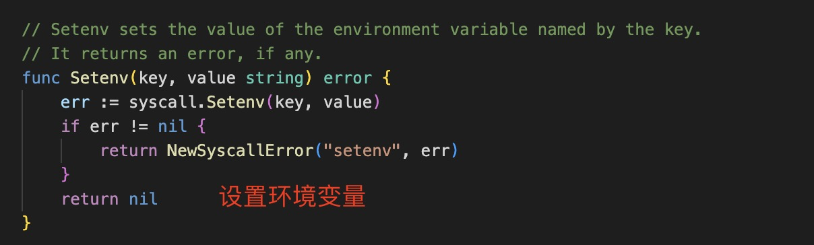
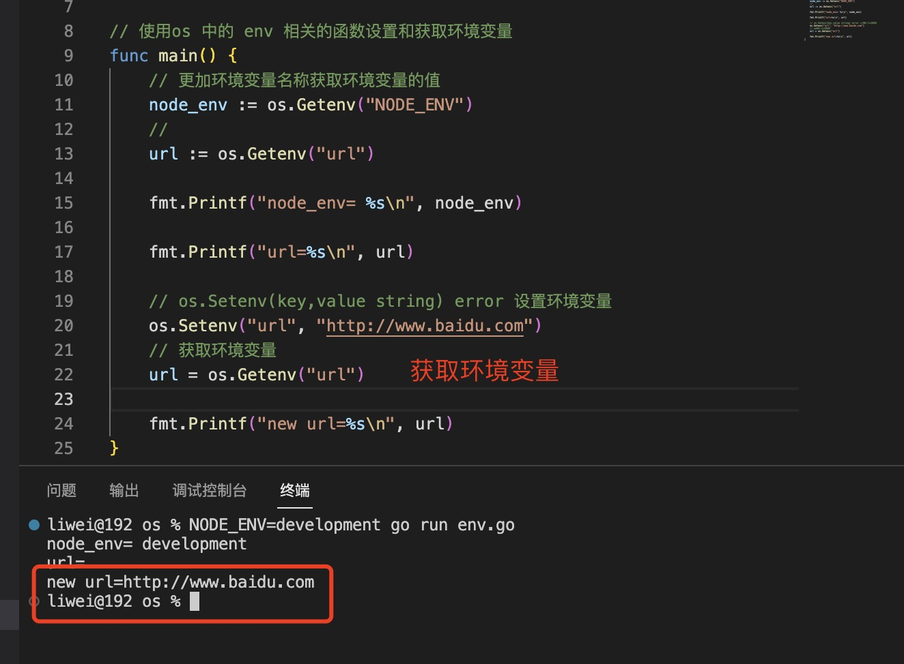
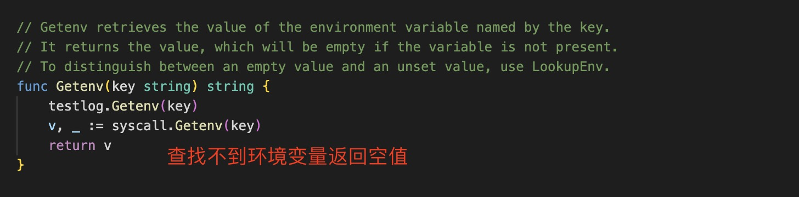
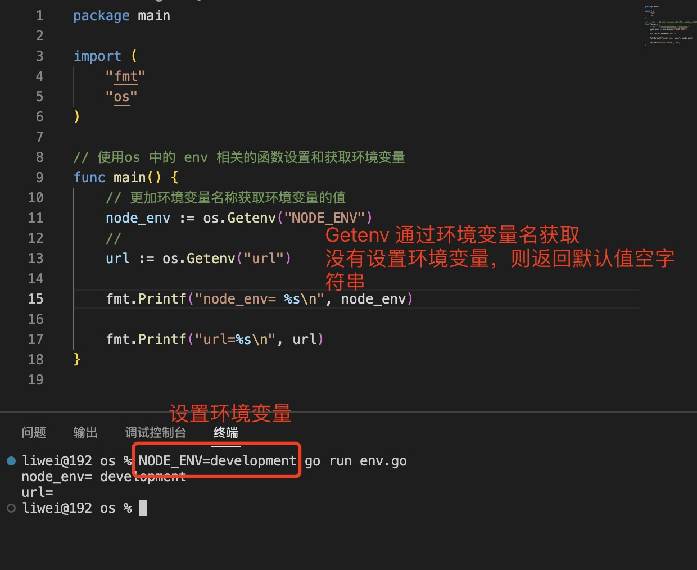
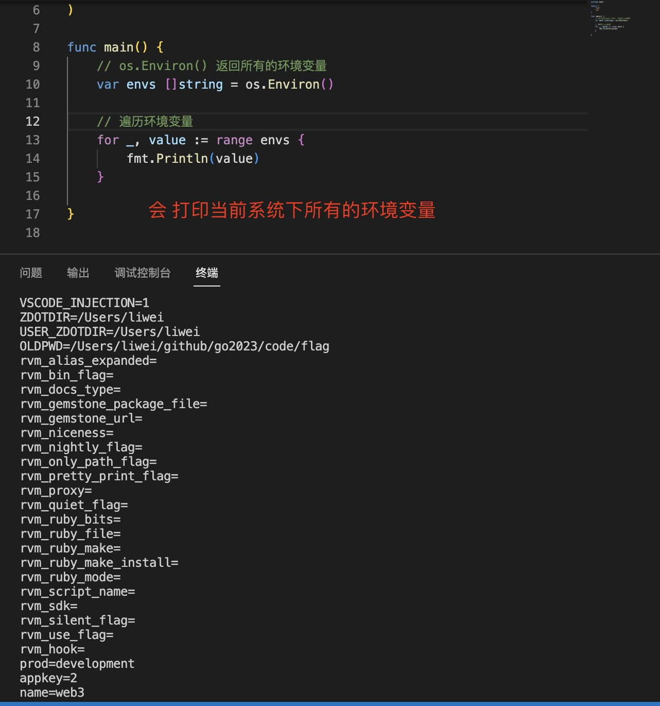
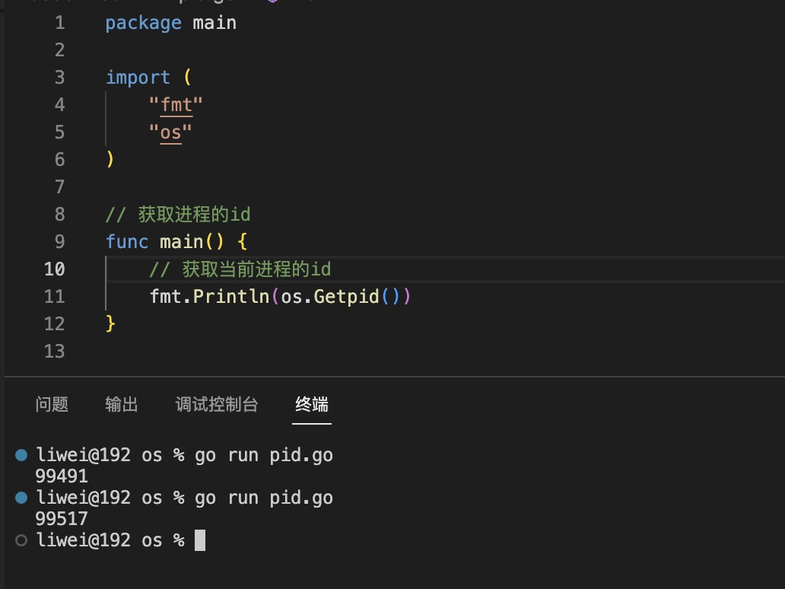
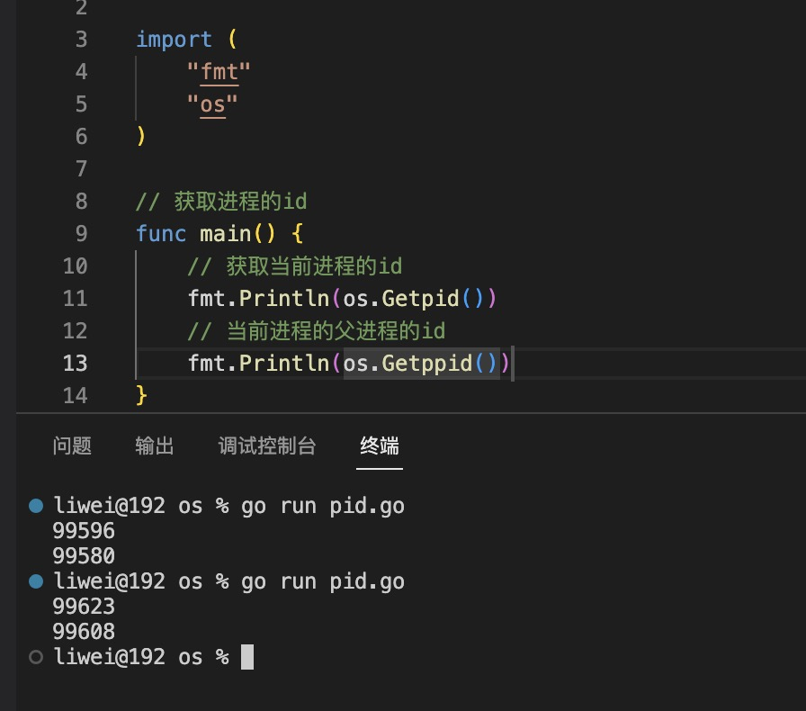
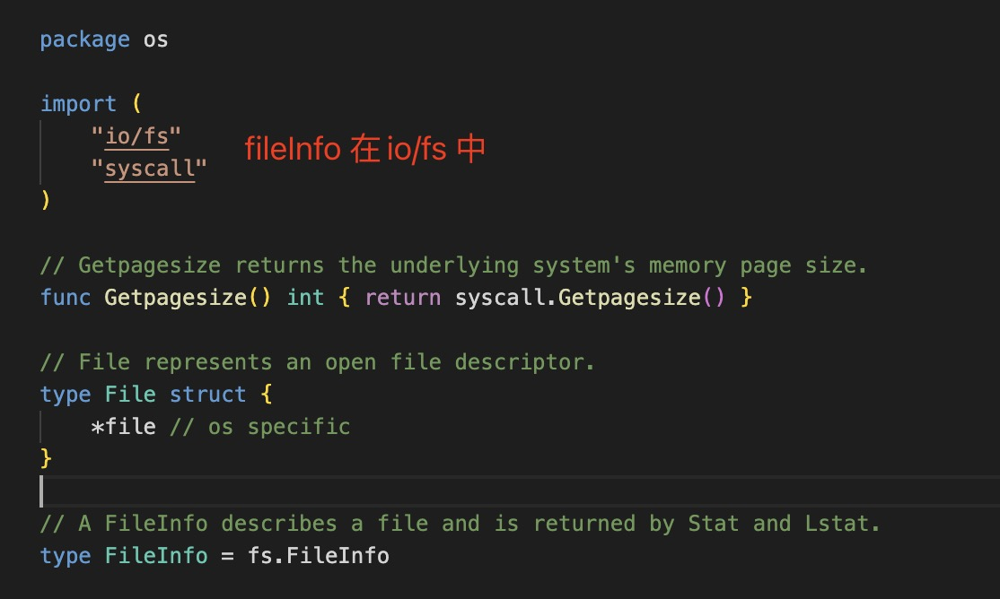
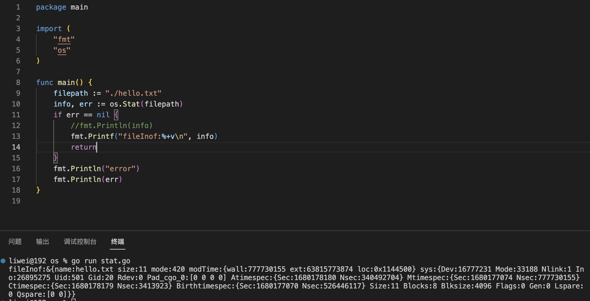

0. Package os 为操作系统功能提供了一个独立于平台的接口

1. 环境变量 os.Setenv  和 os.Getenv 和 os.Environ

+ os.Setenv(key,value string) error

   

   

+ os.Getenv(name string) string: 通过环境变量名称获取设置的值

   方法源码定义：

   

   示例：

   

+ os.Environ() []string ： 返回所有的环境变量

   `Environ 以“key=value”的形式返回代表环境的字符串副本`。

   

+ os.Clearenv(): 清除所有环境变量

2. os.Exit(code int) 退出程序

   Exit 导致当前程序以给定的状态代码退出。按照惯例，代码零表示成功，非零表示错误。程序立即终止；延迟函数不运行

3. func Getpid() int： 返回当前进程的id

   

4. func Getppid() int: 返回当前进程的父进程的id

   

5. os.Getwd(): 获取当前文件的目录

   

6. os.Stat(name string) (FileInfo,error)

    

    