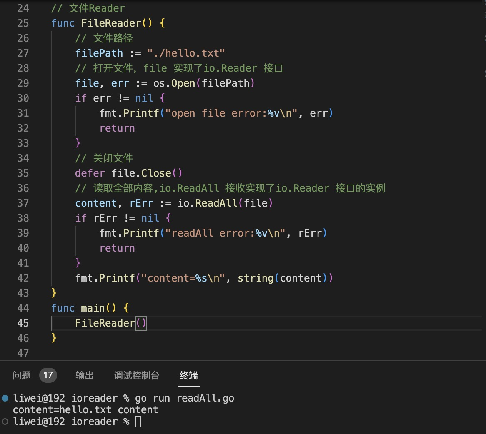

1. func ReadAll(r io.Reader) ([]byte, error): ReadAll 从 r 读取直到出现错误或 EOF 并返回它读取的数据。成功的调用返回 err == nil，而不是 err == EOF。因为 ReadAll 被定义为从 src 读取直到 EOF，所以它不会将 Read 的 EOF 视为要报告的错误。

   >读取Reader 里面所有的数据，比如string Reader 或者 fileReader ,或者网络连接Conn 等

+ 字符串Reader

   

+ fileReader:

    

+ net.Conn: 网络连接

    

2. io.WriteString(w io.Writer,s string) (n int,err error): WriteString 将字符串 s 的内容写入 w，w 接受一个字节片。如果 w 实现了 StringWriter，则直接调用其 WriteString 方法。否则，w.Write 只被调用一次。

3. pipe() 管道，创建一个读(io.Reader)，一个写(io.Writer)

   ```go
   r, w := io.Pipe()
   ```

4. io.Copy():

   ```go
   func Copy(dst Writer , src Reader ) (written int64 , err error )
   ```