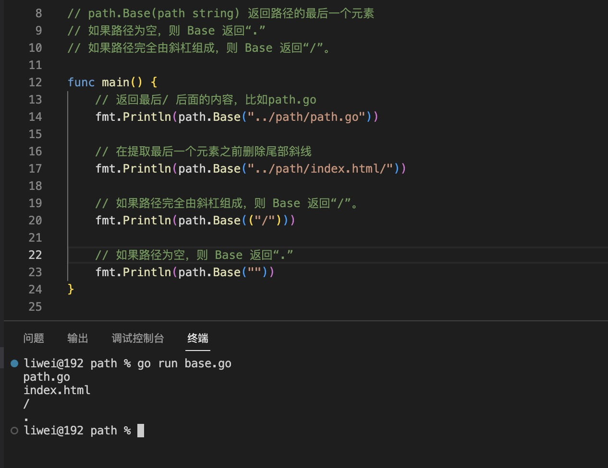

1. path 提供路径的操作

   + Dir(path string) : 返回当前目录

   + Ext(path string): 返回当前文件的后缀名

   + isAbs(path string): 是否为绝对路径

   + join(ele ...string): 合并多个路径

   + Split(path string) (dir,file string): 分割成目录和file

   + Base(path string): 返回最后部分，如果最后为"/", 则返回“/", 如果path  是空字符串，则返回.(点)

     