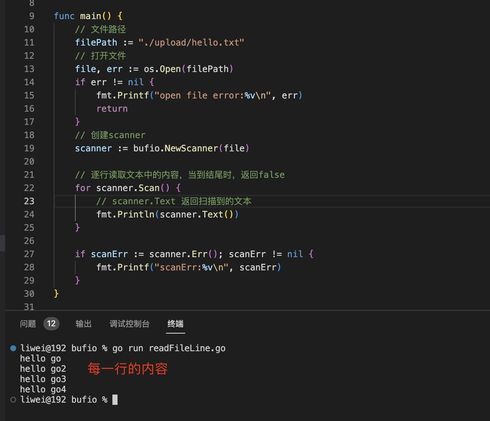

1. bufio 实现了buffered i/o. 包括io.Reader 和 oi.Writer 对象

+ Scanner：Scanner 提供了一个方便的接口来读取数据，例如以换行符分隔的文本行文件。对 Scan 方法的连续调用将遍历文件的“标记”，跳过标记之间的字节。令牌的规范由类型为 SplitFunc 的拆分函数定义；默认的 split 函数将输入分成多行，并去除行终止符。此包中定义了拆分函数，用于将文件扫描成行、字节、UTF-8 编码符文和空格分隔的单词。客户端可以改为提供自定义拆分功能。

   `扫描在 EOF、第一个 I/O 错误或令牌太大而无法放入缓冲区时不可恢复地停止`。当扫描停止时，阅读器可能已经前进到超过最后一个标记的任意远处。需要更多地控制错误处理或大令牌的程序，或者必须在阅读器上运行顺序扫描的程序，应该改用 bufio.Reader。

+ Reader

+ Writer:

2. Scanner: 

+ Err(): Err 返回扫描程序遇到的第一个非 EOF 错误。

+ Scan() // Scan 将 Scanner 前进到下一个令牌，然后可以通过 Bytes 或 Text 方法获得该令牌。当扫描停止时，它返回 false，无论是到达输入末尾还是出现错误。Scan 返回 false 后，Err 方法将返回扫描期间发生的任何错误，除非是 io.EOF，Err 将返回 nil。如果 split 函数在没有推进输入的情况下返回太多空标记，则扫描会出现恐慌。这是扫描仪的常见错误模式

+ Text() string

   Text 将调用 Scan 生成的最新标记返回为保存其字节的新分配字符串。

+ Bytes() []byte:Bytes 返回调用 Scan 生成的最新令牌。底层数组可能指向将被后续调用 Scan 覆盖的数据。它没有分配。

+ NewScanner(r io.Reader) 创建扫描仪

   