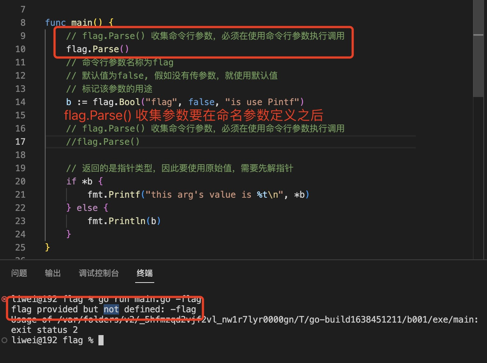

1. flag 包主要用来解析命令行参数

   在go 中main 函数没有参数，但是在运行main 时可在命令行添加参数

2. flag.Parse(): 收集命令行参数

   没有调用flag.Parse() 收集参数会报错

   


+ 命名参数：使用flag.Type(name string, value type, usage string) *type 

   或者使用Flag.TypeVar(variable *type,name stirng,value type, usage string )  

   flag.Parse() 收集要在命名参数定义之后，命名参数使用之前调用
   

+ 位置参数：没有命名的参数，使用flag.Args()

   `flag.Args() 收集没有命名的参数，但是只有在flag.Parse() 之后才能收集到参数`

   


3. Flag.Bool: 返回bool 类型指针，要使用其值，需要解指针*b

   方法定义：

   ```go
   func Bool(name string, value bool, usage string) *bool {
	  return CommandLine.Bool(name, value, usage)
   }

   ```

   参数说明：

   + name: 运行时，命令行传递的参数的名称

   + value: 如果没有传递参数，使用的默认值

   + usage: 标识改参数的用途

   

   

4. Flag.BoolVar: 同Flag.Bool 类似，`不同的是BoolVar 通过第一个参数传递一个bool 类型变量的指针，来存储命令行参数的值`

   方法定义：

   

   示例：

   

5. Flag 还支持其他类型的方法，比如Flag.Int,Flag.Uint,Flag.String 等，每一种类型都有一个对应的TypeVar 方法

   