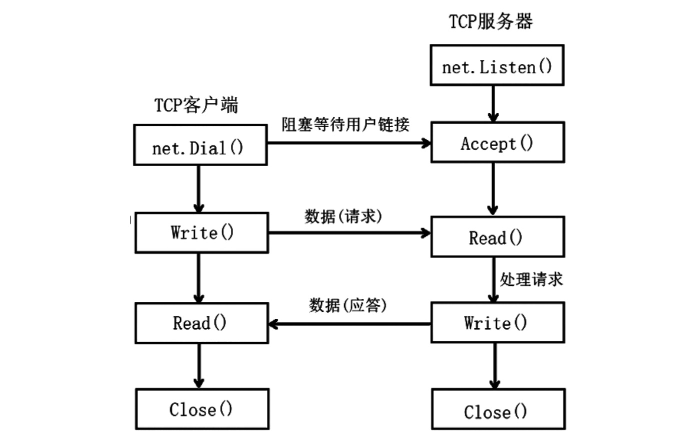

1. tcp 传输流程

   

2. net.Listen(network,address string): (Listener,error)

+ network: 网络协议，只能是tcp,tcp4,tcp6, udp，udp4,udp6,ip,ip4,ip6

+ address: 对于tcp 和 udp 协议来说，他是host:port 或者[host:]port

3. 等他客户端的链接 Listener.Accept()

   Accept用于实现Listener接口的Accept方法，它会等待下一个呼叫，并返回一个该呼叫的Conn接口。

4. 建立链接以后就可以读取和向客户端发送数据,每一个连接都返回一个Conn 结构，读取客户端的数据使用Conn.Read，向客户端写入数据使用Conn.Write

+ 读取客户端数据 Conn.Read

+ 向客户端写入数据 Conn.Write

5. 关闭连接