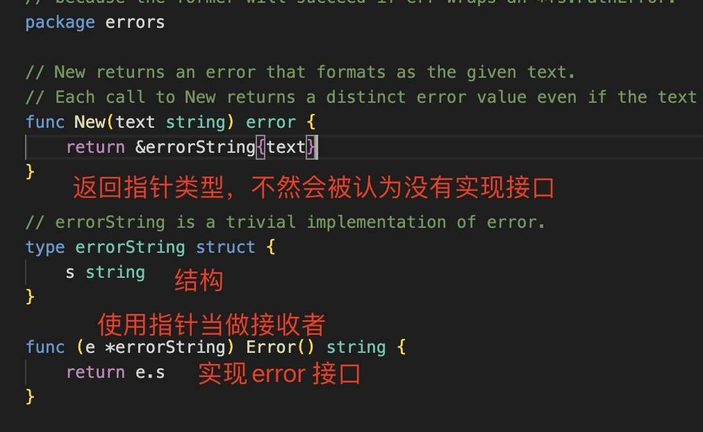
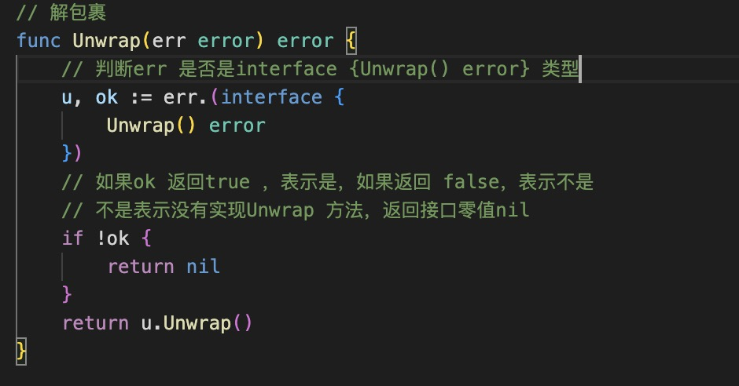

1. errors 错误库

2. 创建Error，Error 是go 语言内部接口

   ```go
   type error interface {
	Error() string
   }
   ```

   errors 库中实现了error 接口

   

3. 自定义error

   

4. errors.Join(err ...error) error: 连接多个错误类型，把错误里面的字符串使用\n 连接起来，返回一个新的 error 类型

   
   

5. errors.Unwrap:

   

6. errors.Is(err,target error) bool: 判断err 是否是target error

   比如文件操作的时候判断是否是os.IsNotExist

   