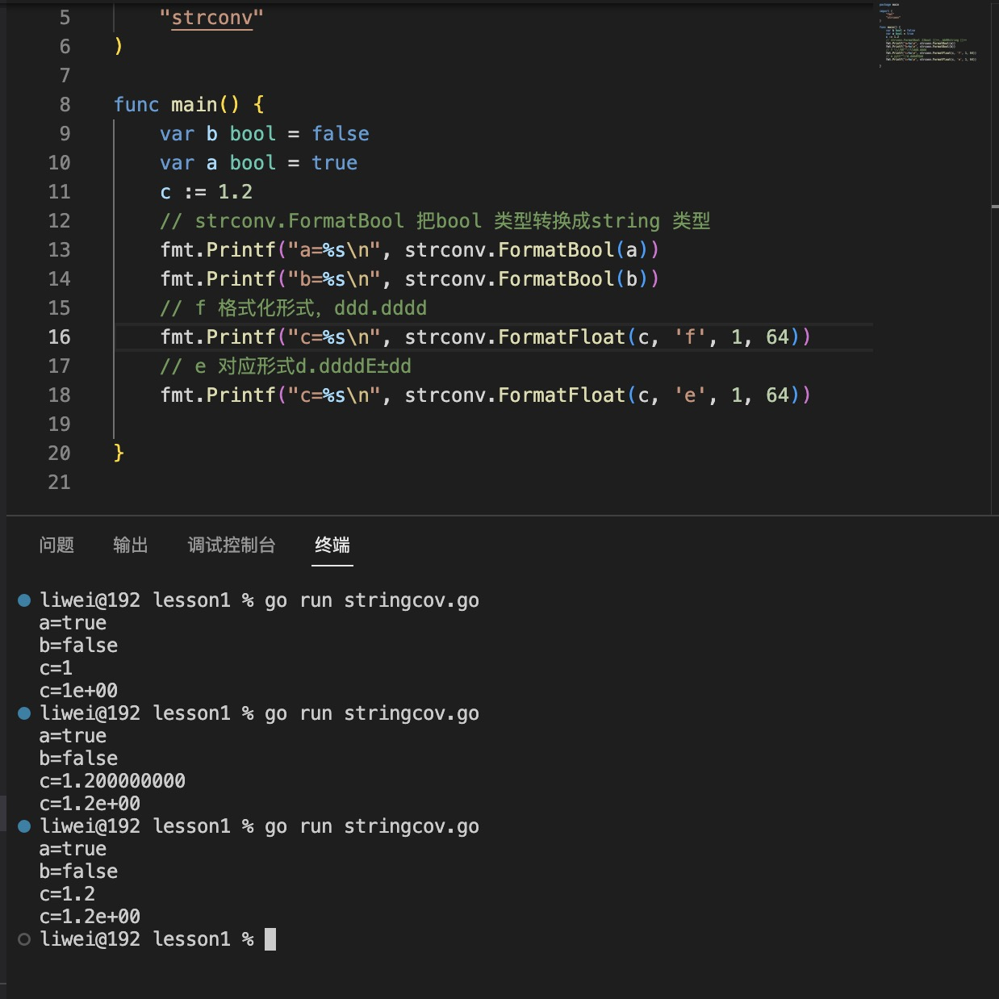

0. strconv 包主要是操作字符串和其他类型的转换，`其他类型都可以转换成字符串，但是字符串转其他类型，不一定能转成功，因此字符串转其他类型都会返回一个error`

   

1. 字符串和数字互转，Atoi 和 Itoa

   

2. strconv.FormatFloat: 把float 类型转换成字符串

   方法定义：

   ```go
   func FormatFloat(f float64, fmt byte, prec, bitSize int) string
   ```
   参数解析：

+ f: 要转换的float 类型数值

+ fmt：转换格式

   ```
   'b' (-ddddp±ddd, a binary exponent),
   'e' (-d.dddde±dd, a decimal exponent),
   'E' (-d.ddddE±dd, a decimal exponent),
   'f' (-ddd.dddd, no exponent),
   'g' ('e' for large exponents, 'f' otherwise),
   'G' ('E' for large exponents, 'f' otherwise),
   'x' (-0xd.ddddp±ddd, a hexadecimal fraction and binary exponent), or
   'X' (-0Xd.ddddP±ddd, a hexadecimal fraction and binary exponent).
   
   ```

+ prec: 小数点位数，如果是0，只保留整数部分

+ bitSize: 32 对应float32,64 对应float64

3. Parse 系列将字符串转成其他类型，但字符串转其他类型不一定会成功

+ func ParseBool(str string) (value bool, err error)

   返回字符串表示的bool值。它接受1、0、t、f、T、F、true、false、True、False、TRUE、FALSE；否则返回错误。

+ func ParseInt(s string, base int, bitSize int) (i int64, err error)
   
   返回字符串表示的整数值，接受正负号。

   + base指定进制（2到36），如果base为0，则会从字符串前置判断，"0x"是16进制，"0"是8进制，否则是10进制；

   + bitSize指定结果必须能无溢出赋值的整数类型，0、8、16、32、64 分别代表 int、int8、int16、int32、int64；
   
   + 返回的err是*NumErr类型的，如果语法有误，err.Error = ErrSyntax；如果结果超出类型范围err.Error = ErrRange。

+ func ParseFloat(s string, bitSize int) (f float64, err error)

   解析一个表示浮点数的字符串并返回其值。

   + 如果s合乎语法规则，函数会返回最为接近s表示值的一个浮点数（使用IEEE754规范舍入）。
   
   + bitSize指定了期望的接收类型，32是float32（返回值可以不改变精确值的赋值给float32），64是float64；
   
   + 返回值err是*NumErr类型的，语法有误的，err.Error=ErrSyntax；结果超出表示范围的，返回值f为±Inf，err.Error= ErrRange。

   