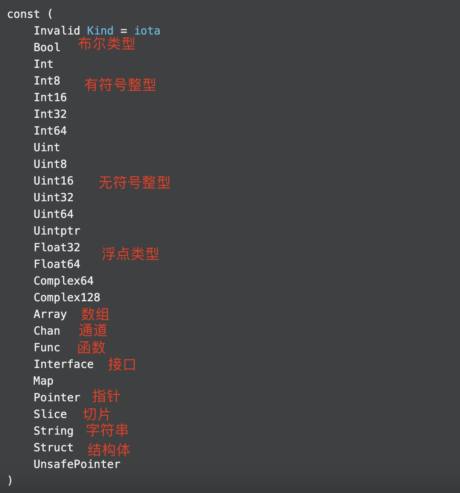

1. reflect 反射，在运行时获取变量类型或成员。

   包 reflect 实现运行时反射，允许程序操作任意类型的对象

   典型的用途是获取一个静态类型interface{}的值，并通过调用 TypeOf 提取其动态类型信息，返回一个 Type。

   对 ValueOf 的调用返回一个表示运行时数据的值。零采用类型并返回表示该类型的零值的值

2. 常量

+ 数据类型

   

3. reflect 有很多解析各个类型的方法，比如函数类型，接口类型，结构体(fileds,tags),map,slice,array 