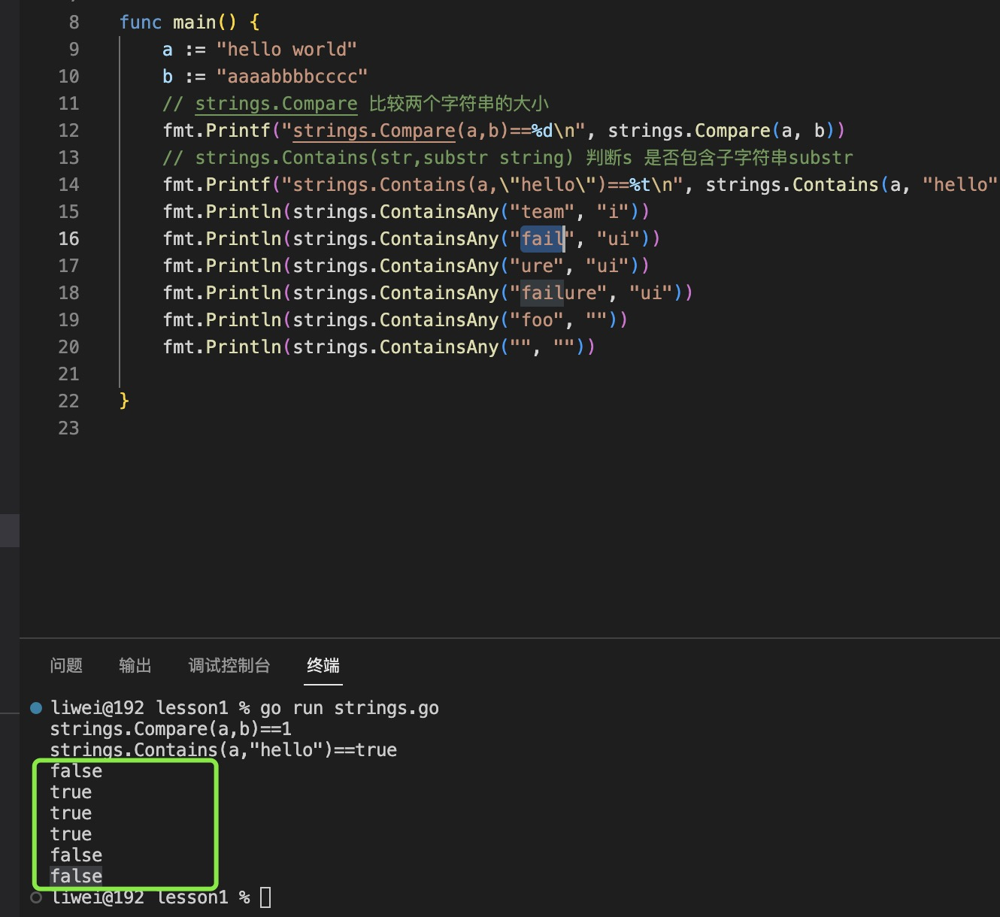
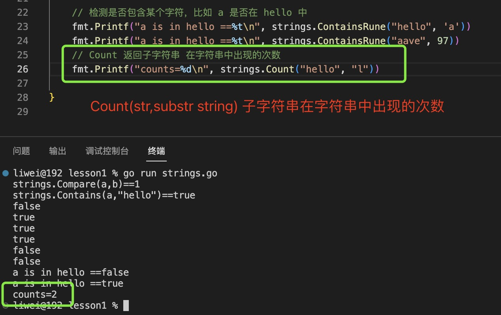

1. 在go 语言中，字符串操作放到了strings 库中，

2. clone(s): 复制字符串

    ```
    func Clone(s string ) string
    ```

    复制字符串，返回一个字符串

3. Compare(a,b string) int: 比较两个字符串的大小

   + a==b:  返回0

   + a \<b: 返回-1

   + a>b: 返回1

   

4. Contains(s,sub string) bool: 检查一个变量是否包含另一个字符串，返回true/false

   

5. ContainsAny(s, chars string) bool: ContainsAny 检查chars 中是否有任何 Unicode 代码点在 s 内。

   比如: fail 中包含 ui 中i

   

6. func ContainsRune(s string , r rune ) bool : 检查字符串中是否包含某个字符

   

7. func Count(s, substr string ) int: 返回子字符串(substr)在字符串中出现的次数

    

8. func HasPrefix(s, prefix string) bool：判断字符串s 是否已prefix 开头

    

9. func HasSuffix(s, suffix string) bool: 判断字符串s 是否已prefix 结尾

   

10. func IndexAny(s, chars string) int: 返回chars 在s 首次出现的位置，找不到返回-1

11. func LastIndexAny(s, chars string) int： 返回chars 在s 最后出现的位置，找不到返回-1

12. func ToLower(s string) string： 返回字符串的小写

13. func ToUpper(s string) string： 返回字符串的大写

14. func Split(s, sep string) []string：把字符串切割成slice

15. func Join(elems []string, sep string) string: 把slice 通过分隔符连成字符串

16. func Replace(s, old, new string, n int) string： 用新字符串替换字符串的某些字符串，替换几次

17. func ReplaceAll(s, old, new string) string： 全部替换

18. Trim(): 去除空格

19. TrimLeft(): 左边空格

20. TrimRight: 右边

21. TrimSpace()
   